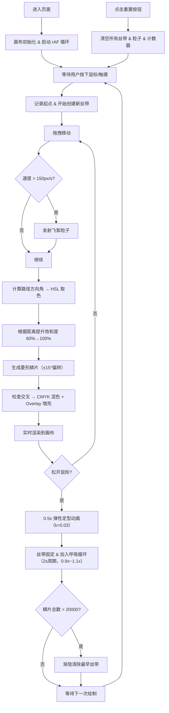

## 1. 产品概述

「虹纹织机」是一款基于 HTML5 Canvas 的交互式数字艺术创作工具，用户通过鼠标或手指拖拽在虚拟织机上编织色彩斑斓的织锦图案。

- 核心目的：让用户以直观的拖拽方式体验传统织造艺术，创作出独一无二的数字织锦作品
- 目标用户：艺术爱好者、设计师、手工文化爱好者、普通休闲用户
- 市场价值：将传统织锦工艺数字化、游戏化，降低艺术创作门槛，兼具文化传播与娱乐价值

## 2. 核心特性

### 2.1 功能模块

1. **织锦画布**：核心绘制区域，支持实时丝带生成与鳞片渲染
2. **丝带编织系统**：由菱形鳞片组成的动态丝带，支持方向取色、速度变宽
3. **粒子飞絮系统**：高速拖拽时产生散射纤维碎屑粒子
4. **颜色混合引擎**：CMYK 色彩混合 + Overlay 亮度叠加的交叉混色算法
5. **呼吸动画系统**：固定丝带的缓慢脉动与弹性定型动画
6. **状态与控制 UI**：丝线计数、颜色计数、重置按钮

### 2.2 页面详情

| 页面名称 | 模块名称 | 功能描述 |
|-----------|-------------|---------------------|
| 主画布页 | 麻布背景层 | 米白粗麻布 CSS 纹理背景，营造古朴工坊氛围 |
| 主画布页 | 木质织机边框 | 深褐色渐变装饰条（box-shadow 实现），宽 8px |
| 主画布页 | Canvas 绘制区 | 实时渲染丝带、鳞片、粒子，支持鼠标/触摸拖拽 |
| 主画布页 | 重置按钮 | 圆形 #8B4513 半透明按钮，悬停变亮，点击缩放动画 |
| 主画布页 | 状态面板 | 显示当前丝线数量与总颜色数量，serif 字体 |

## 3. 核心流程

## 4. 用户界面设计

### 4.1 设计风格

- **整体氛围**：古朴织造工坊，温暖手作感
- **主色**：米白麻布底（#F5F0E6）、深褐木框（#8B4513 → #5C3317 渐变）
- **强调色**：HSL 色相环全色谱（由拖拽方向动态决定）
- **按钮风格**：圆形、半透明、悬停去透明+阴影、点击 0.2s 缩放
- **字体**：Georgia / "Times New Roman" / serif 衬线字体族
- **布局风格**：画布居中 + 木框包裹 + 右下悬浮控件
- **视觉细节**：CSS 生成麻布纹理、box-shadow 木框立体感、呼吸微动画

### 4.2 页面设计概述

| 页面名称 | 模块名称 | UI 元素 |
|-----------|-------------|-------------|
| 主画布页 | 麻布背景 | repeating-linear-gradient + radial-gradient 模拟粗麻布经纬纹理 |
| 主画布页 | 织机边框 | 内外多层 box-shadow 模拟木质深浅渐变，8px 宽 |
| 主画布页 | 画布区域 | 居中自适应，最大尺寸随窗口调整 |
| 主画布页 | 重置按钮 | 圆形 fixed 定位右下，#8B4513 半透明，:hover/:active 动画 |
| 主画布页 | 状态文字 | fixed 定位右下按钮旁，serif 字体，深褐色，两行信息 |

### 4.3 响应式

- 桌面优先设计，Canvas 尺寸按窗口宽高自适应（保留内边距以显示木框）
- 触摸设备支持 touchstart/touchmove/touchend 事件，保证移动端可用
- 按钮与文字尺寸固定，避免过小难以点击

### 4.4 性能设计

- 渲染循环统一由 requestAnimationFrame 驱动，目标 60 FPS
- 鳞片总数上限 20000，超出 FIFO 渐隐最早丝带
- 粒子生命周期短（0.4s），自动回收对象池
- 离屏计算与渲染分离，避免每帧频繁 DOM 操作
