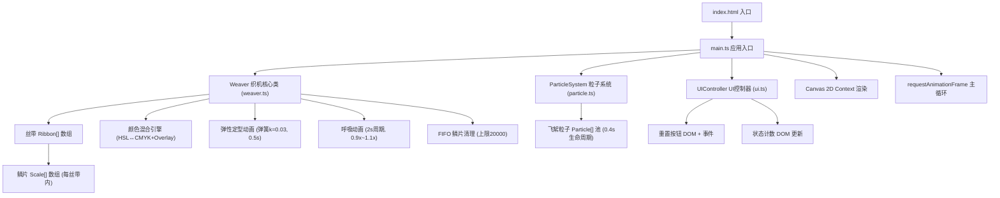

## 1. 架构设计



## 2. 技术选型

- **前端框架**：原生 TypeScript（无 React/Vue，因单页纯 Canvas 渲染无复杂 DOM 交互）
- **构建工具**：Vite 5.x
- **语言**：TypeScript 5.x，strict 模式，target ES2020
- **渲染层**：HTML5 Canvas 2D API（单层画布，每帧重绘；或双缓冲优化）
- **样式**：内联 CSS（style 标签），无预处理器
- **无后端/无数据库/无外部服务**：纯前端静态项目

## 3. 文件结构

```
auto265/
├── package.json
├── vite.config.js
├── tsconfig.json
├── index.html
└── src/
    ├── main.ts        # 入口：画布初始化、事件监听、rAF 主循环
    ├── weaver.ts      # Weaver 类：丝带/鳞片/颜色混合/动画
    ├── particle.ts    # ParticleSystem 类：飞絮粒子管理
    └── ui.ts          # UIController 类：重置按钮+状态显示
```

## 4. 核心数据结构与类型定义

### 4.1 颜色与鳞片

```typescript
// weaver.ts 内定义
interface HSL { h: number; s: number; l: number; a: number }
interface CMYK { c: number; m: number; y: number; k: number }

interface Scale {
  x: number; y: number;          // 中心坐标
  size: number;                  // 基础尺寸 8~12px
  angle: number;                 // 相对路径角度 + ±15°偏转
  color: HSL;
  ribbonId: number;
  // 动画状态
  settlingOffsetX: number; settlingOffsetY: number; // 弹性定型偏移
  settled: boolean;
  fadeAlpha: number;             // FIFO 渐隐用，1→0
}

interface Ribbon {
  id: number;
  scales: Scale[];
  path: { x: number; y: number; t: number }[]; // 路径点历史用于弹性
  settling: boolean;
  settleProgress: number;        // 0→1，0.5s 内完成
  createdAt: number;             // 用于 FIFO
  hue: number;                   // 基础色相
}
```

### 4.2 粒子

```typescript
// particle.ts 内定义
interface Particle {
  x: number; y: number;
  vx: number; vy: number;        // 30~60 px/s
  size: number;                  // 1~3 px
  hue: number; brightness: number; // 色相接近丝带，亮度更高
  life: number; maxLife: number; // 0.4s
  active: boolean;
}
```

### 4.3 Weaver 公开接口

```typescript
class Weaver {
  constructor(canvas: HTMLCanvasElement)
  startStroke(x: number, y: number): void
  moveStroke(x: number, y: number, dt: number): { emitParticles: boolean; point: {x,y,hue} }
  endStroke(): void
  update(dt: number): void           // 每帧调用：弹性+呼吸+FIFO
  render(): void                     // 每帧调用：绘制所有鳞片
  reset(): void
  readonly ribbonCount: number
  readonly totalScales: number
  readonly uniqueColors: number
}
```

## 5. 颜色算法

### 5.1 HSL ↔ CMYK 互转

- `hslToCmyk(h,s,l)`：先转 RGB → CMY → 加 K 通道
- `cmykToHsl(c,m,y,k)`：反向转换
- 混色：两色 CMYK 分量加权平均，K 取较大值

### 5.2 方向角→色相映射

- 路径方向 θ = atan2(dy, dx)，单位度，归一化到 [0, 360)
- 0°→红(0°)、90°→绿(120°)、180°→蓝(240°)、270°→紫(300°)
- 线性映射：`hue = (θ * 2/3) % 360`，保证均匀覆盖色相环

### 5.3 饱和度渐变

- 记录本丝带累积拖拽距离 `totalDist`
- `saturation = 60 + Math.min(40, totalDist / 20)`（60%→100%）

### 5.4 Overlay 增亮

- 检测鳞片 AABB 重叠（空间哈希网格优化）
- 重叠区域新建「高光鳞片」或对现有鳞片 `l += 15%`，叠加一层半透明浅色

## 6. 性能优化策略

1. **空间哈希网格**：将画布分 32×32px 网格，鳞片注册所在格，交叉检测仅查相邻 9 格
2. **对象池**：Particle 预先分配 300 个，`active` 标志复用，避免 GC
3. **每帧重绘**：单缓冲直接重绘，20000 个菱形填充在现代 GPU 上可轻松 60fps
4. **路径采样间隔**：移动距离 < 4px 不生成新鳞片，防止密集点
5. **FIFO 渐隐**：总鳞片 > 20000 时，最早丝带 `fadeAlpha` 每帧 −0.02，<0 移除

## 7. 动画实现要点

### 7.1 弹性定型（松手后 0.5s）

- 对每个鳞片，记录其「理想位置」：沿路径按等弧长重新采样的位置
- 每帧 `offset += (idealOffset - offset) * k * (1 - progress)`，k=0.03
- 同时轻微旋转鳞片角度至 ±0°（减小偏转，使排列更紧密）

### 7.2 呼吸动画（全局 2s 周期）

- `t = performance.now() / 1000`
- `breath = 0.9 + 0.1 * (sin(π * t) + 1) / 2`  → [0.9, 1.1]
- 渲染时每个鳞片 `size *= breath`

### 7.3 飞絮粒子

- 高速帧（>150px/s）每帧发射 2~5 个粒子
- 初速度方向 = 路径法向随机 + 前向小量
- life 线性递减，alpha 同步递减；超出画布立即回收

## 8. UI 交互

- **重置按钮**：`<button id="resetBtn">`，CSS 类控制样式；JS 监听 click → `weaver.reset()` + 0.2s `transform: scale(0.92)` 动画
- **状态计数**：两个 `<span>` 每帧（或 ribbon 数变化时）更新文本
- **事件监听**：
  - `mousedown / touchstart` → `startStroke`
  - `mousemove / touchmove`（带 rAF 节流）→ `moveStroke`
  - `mouseup / touchend / mouseleave` → `endStroke`
  - `resize` → 调整 canvas 分辨率（devicePixelRatio）并重排木框
