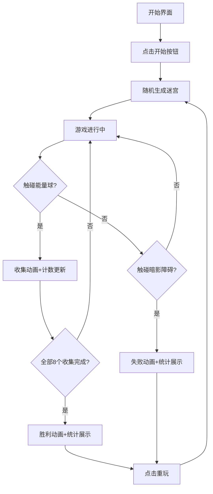

## 1. 产品概述

「光羽织梦」是一款运行于浏览器中的2D解谜游戏，玩家操控由光粒子构成的蝴蝶穿越幽暗森林中的动态发光藤蔓迷宫，通过收集不同颜色的能量球解锁光路，同时躲避漂浮的暗影障碍。目标用户为独立游戏爱好者、休闲解谜游戏玩家，产品市场价值在于打造沉浸式奇幻森林视觉体验与轻量级解谜玩法的结合。

## 2. 核心功能

### 2.1 用户角色
| 角色 | 注册方式 | 核心权限 |
|------|----------|----------|
| 玩家 | 无需注册，直接进入游戏 | 操控蝴蝶、收集能量球、通关或重玩 |

### 2.2 功能模块
1. **游戏主界面**：Canvas游戏画布、HUD信息显示、操作提示
2. **玩家控制模块**：键盘/触摸输入处理、蝴蝶粒子身体渲染、移动与变色动画
3. **迷宫系统模块**：动态藤蔓路径生成、能量球分布、暗影障碍移动
4. **特效系统模块**：拖尾粒子、收集光环、胜利闪烁、失败消散
5. **音效系统模块**：振翅声、收集音、失败音
6. **状态管理模块**：开始/进行中/胜利/失败状态切换、计时与统计

### 2.3 页面详情
| 页面名称 | 模块名称 | 功能描述 |
|----------|----------|----------|
| 游戏主页面 | Canvas画布 | 1000x800px游戏视口，径向渐变深蓝到深紫背景，100颗随机星光闪烁 |
| 游戏主页面 | HUD面板 | 左上角收集进度（圆形图标+数字），右上角计时器（保留1位小数），底部操作提示 |
| 游戏主页面 | 藤蔓迷宫 | 半透明青绿渐变（#00FFCC→#00FF00）宽度30px曲线段，2秒周期±10%亮度脉动 |
| 游戏主页面 | 能量球 | 8色能量球（红橙黄绿青蓝紫白）固定于藤蔓分岔口，直径25px，1.5秒周期呼吸发光 |
| 游戏主页面 | 暗影障碍 | 4个40x40px深紫色半透明矩形，沿固定路径40px/s移动，每帧0-2px随机抖动 |
| 游戏主页面 | 光之蝴蝶 | 13粒7-10px发光粒子组成，颜色随收集数渐变（蓝→紫→金），移动速度120px/s |
| 游戏主页面 | 开始界面 | 游戏标题、开始按钮、操作说明 |
| 游戏主页面 | 胜利界面 | 全屏白闪3次，显示用时、收集路径长度、重玩按钮 |
| 游戏主页面 | 失败界面 | 蝴蝶粒子消散，显示已收集数、用时、重玩按钮 |

## 3. 核心流程

玩家点击开始按钮 → 迷宫随机生成（藤蔓路径、8个能量球、4个暗影障碍） → 蝴蝶出现在起点 → 玩家通过方向键/触摸滑动控制蝴蝶移动 → 蝴蝶触碰能量球触发收集动画（变色+光环爆发+粒子飞散+音效） → HUD更新收集数 → 蝴蝶触碰暗影障碍触发失败 → 收集全部8个能量球触发胜利动画 → 胜利/失败界面可选择重玩

## 4. 用户界面设计

### 4.1 设计风格
- **主色调**：深蓝 #0B0B2B、深紫 #1A0A3E、青绿 #00FFCC、金色 #FFD700
- **辅助色**：红 #FF4500、橙 #FFA500、黄 #FFD700、绿 #32CD32、青 #00CED1、蓝 #1E90FF、紫 #8A2BE2、白 #F0F8FF
- **发光特效**：所有游戏元素使用 canvas shadowBlur 实现发光效果
- **字体**：使用系统无衬线字体，HUD文字白色20px，标题文字金色加粗
- **布局**：全屏Canvas居中展示，HUD固定在四角，开始/结束界面为半透明覆盖层
- **动画风格**：全部使用 Canvas 2D 逐帧渲染，粒子系统实现流畅过渡效果

### 4.2 页面设计概览
| 页面名称 | 模块名称 | UI元素 |
|----------|----------|--------|
| 游戏主页面 | 背景 | 径向渐变深蓝→深紫，100颗星光1-2px随机分布缓慢闪烁 |
| 游戏主页面 | 藤蔓路径 | 宽度30px半透明曲线，#00FFCC到#00FF00渐变，透明度0.7，2秒周期亮度±10%脉动 |
| 游戏主页面 | 能量球 | 直径25px圆形，shadowBlur发光，1.5秒周期亮度0.6-1.0呼吸效果 |
| 游戏主页面 | 暗影障碍 | 40x40px深紫矩形，透明度0.5，每帧0-2px抖动 |
| 游戏主页面 | 蝴蝶 | 13粒发光粒子，颜色渐变：0-2球蓝#00A5FF，3-5球紫#9B59B6，6-8球金#FFD700 |
| 游戏主页面 | HUD | 左上收集进度（黑底透明度0.4，白色20px字），右上计时器，底部操作提示 |
| 开始界面 | 覆盖层 | 半透明黑底，金色标题"光羽织梦"，白色开始按钮，操作说明 |
| 胜利界面 | 覆盖层 | 白色闪烁3次后显示金色"胜利"，统计用时与路径长度，重玩按钮 |
| 失败界面 | 覆盖层 | 暗红标题"失败"，统计已收集数与用时，重玩按钮 |

### 4.3 响应式设计
- 桌面端优先设计，Canvas固定1000x800px居中显示
- 移动端支持触摸滑动控制，Canvas自适应屏幕宽度等比缩放
- HUD元素在移动端适当缩小字号确保可读性
- 触摸滑动区域覆盖整个Canvas，支持8方向移动

### 4.4 性能优化
- 游戏循环使用 requestAnimationFrame，目标60fps
- 粒子系统在性能降低时自动减少70%粒子数量
- Canvas分层渲染：背景层、藤蔓层、游戏实体层、特效层、HUD层
- 碰撞检测采用圆形-矩形算法，每帧O(n)复杂度
