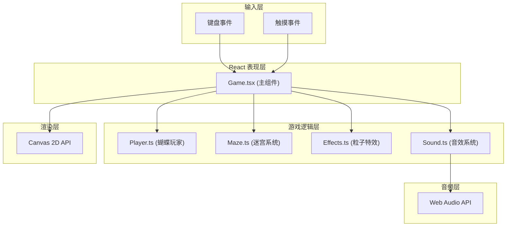

## 1. 架构设计



**数据流向说明**：
1. 输入事件（键盘/触摸）→ Game.tsx 接收并解析为移动向量
2. Game.tsx → 调用 Player.update(dt, velocity) 更新蝴蝶位置
3. Game.tsx → 调用 Maze.checkCollision(player, orbs, obstacles) 检测碰撞
4. 碰撞事件触发：
   - 收集能量球 → Effects.spawnCollectEffect() + Sound.playCollectSound() + Player.changeColor()
   - 触碰障碍 → Effects.spawnDeathEffect() + Sound.playDeathSound() → 切换到失败状态
   - 全部收集 → Effects.spawnVictoryFlash() → 切换到胜利状态
5. 每帧 Game.tsx 按顺序渲染：背景 → 藤蔓 → 能量球 → 障碍 → 蝴蝶 → 特效 → HUD

## 2. 技术描述

- **前端框架**：React 18 + TypeScript（严格模式）
- **构建工具**：Vite 5 + @vitejs/plugin-react
- **渲染引擎**：Canvas 2D API（requestAnimationFrame 驱动）
- **音频引擎**：Web Audio API（原生实现，无需第三方库）
- **状态管理**：React useState/useRef（游戏内状态，无需 zustand）
- **样式方案**：内联样式 + 全局 CSS（少量UI组件样式）
- **无后端**：纯前端游戏，所有数据内存存储

## 3. 路由定义
| 路由 | 用途 |
|------|------|
| / | 游戏主页（单页面应用，无其他路由） |

## 4. 模块接口定义

### 4.1 Player 类接口
```typescript
interface Particle {
  x: number;
  y: number;
  offsetX: number;
  offsetY: number;
  size: number;
  baseSize: number;
}

class Player {
  x: number;
  y: number;
  particles: Particle[];      // 13个粒子组成身体
  currentColor: string;       // 当前蝴蝶颜色
  collectedCount: number;     // 已收集能量球数
  velocity: { x: number; y: number };

  constructor(startX: number, startY: number);
  update(dt: number, inputVec: { x: number; y: number }): void;
  render(ctx: CanvasRenderingContext2D): void;
  changeColor(color: string): void;     // 收集能量球时变色
  incrementCollected(): void;
  getRadius(): number;                   // 用于碰撞检测
  die(): Particle[];                     // 死亡时返回扩散粒子
}
```

### 4.2 Maze 模块接口
```typescript
interface VineSegment {
  points: { x: number; y: number }[];   // 贝塞尔曲线控制点
  width: number;
}

interface EnergyOrb {
  id: number;
  x: number;
  y: number;
  color: string;
  colorName: 'red' | 'orange' | 'yellow' | 'green' | 'cyan' | 'blue' | 'purple' | 'white';
  frequency: number;    // 对应音效频率
  collected: boolean;
  breathPhase: number;  // 呼吸动画相位
}

interface ShadowObstacle {
  x: number;
  y: number;
  width: number;
  height: number;
  path: 'horizontal' | 'vertical' | 'circle';
  speed: number;
  centerX: number;
  centerY: number;
  range: number;
  phase: number;
  jitterX: number;
  jitterY: number;
}

interface MazeData {
  vines: VineSegment[];
  orbs: EnergyOrb[];
  obstacles: ShadowObstacle[];
  startPos: { x: number; y: number };
}

function generateMaze(seed?: number): MazeData;
function checkCollision(
  player: { x: number; y: number; radius: number },
  orbs: EnergyOrb[],
  obstacles: ShadowObstacle[]
): {
  collectedOrb: EnergyOrb | null;
  hitObstacle: ShadowObstacle | null;
};
function updateObstacles(obstacles: ShadowObstacle[], dt: number): void;
```

### 4.3 Effects 模块接口
```typescript
interface TrailParticle {
  x: number; y: number;
  vx: number; vy: number;
  life: number; maxLife: number;
  size: number; color: string;
}

interface RingEffect {
  x: number; y: number;
  radius: number; maxRadius: number;
  life: number; maxLife: number;
  color: string;
}

interface BurstParticle {
  x: number; y: number;
  vx: number; vy: number;
  life: number; maxLife: number;
  size: number; color: string;
}

interface VictoryFlash {
  phase: number;
  cycles: number;
  maxCycles: number;
}

class ParticleSystem {
  trailParticles: TrailParticle[];
  ringEffects: RingEffect[];
  burstParticles: BurstParticle[];
  deathParticles: BurstParticle[];
  victoryFlash: VictoryFlash | null;
  performanceScale: number;  // 1.0或0.7

  constructor();
  spawnTrail(x: number, y: number, color: string): void;
  spawnCollectEffect(x: number, y: number, color: string): void;
  spawnDeathEffect(particles: { x: number; y: number; size: number }[]): void;
  triggerVictoryFlash(): void;
  update(dt: number): void;
  render(ctx: CanvasRenderingContext2D): void;
  setPerformanceScale(scale: number): void;
}
```

### 4.4 Sound 模块接口
```typescript
class SoundManager {
  audioContext: AudioContext | null;
  enabled: boolean;
  wingTimer: number;

  constructor();
  init(): void;                                    // 首次用户交互时初始化
  playWingSound(): void;                           // 振翅声 1800Hz 0.05s
  playCollectSound(frequency: number): void;      // 收集音 440-1047Hz 0.3s
  playDeathSound(): void;                          // 失败音 150Hz 0.5s
  updateWing(dt: number, isMoving: boolean): void; // 每0.2s触发振翅声
}
```

## 5. 文件结构与调用关系
```
project-root/
├── package.json
├── vite.config.ts
├── tsconfig.json
├── index.html
└── src/
    ├── main.tsx          (入口，挂载Game组件)
    ├── App.tsx           (应用根组件，包装Game)
    ├── Game.tsx          (★核心：主循环、状态机、输入分发、渲染调度)
    ├── Player.ts         (Player类：粒子身体、移动、变色)
    ├── Maze.ts           (迷宫生成、碰撞检测、障碍物更新)
    ├── Effects.ts        (ParticleSystem类：所有粒子特效)
    ├── Sound.ts          (SoundManager类：Web Audio音效)
    └── index.css         (全局样式：body背景、居中布局)
```

**调用关系**：
- `main.tsx` → `import App from './App'`
- `App.tsx` → `import Game from './Game'`
- `Game.tsx` → `import { Player } from './Player'`
- `Game.tsx` → `import { generateMaze, checkCollision, updateObstacles } from './Maze'`
- `Game.tsx` → `import { ParticleSystem } from './Effects'`
- `Game.tsx` → `import { SoundManager } from './Sound'`
- 各模块之间无交叉依赖，仅通过 Game.tsx 协调

## 6. 性能约束实现方案
1. **帧率检测**：Game.tsx 记录最近10帧平均耗时，若 >19ms（<52fps）则 ParticleSystem.setPerformanceScale(0.7)
2. **粒子池**：所有特效粒子采用对象池复用，避免频繁GC
3. **离屏渲染**：背景星光与藤蔓路径每帧缓存，不变时不重绘
4. **碰撞优化**：每帧先做AABB粗筛再精确检测
5. **渲染分层**：按 z-order 批量绘制同类元素，减少状态切换
