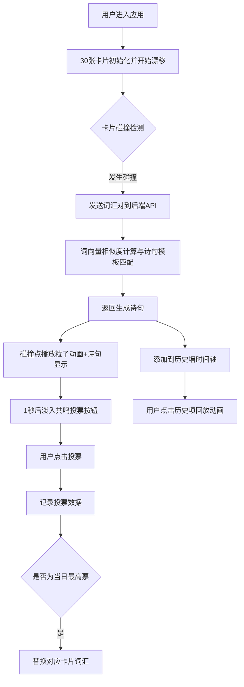

# 悬浮词典 - 产品需求文档 (PRD)

## 1. 产品概述

悬浮词典是一款运行在浏览器中的诗意联想网络构建工具，用户通过拖拽和碰撞漂浮的文字卡片来创造独特的诗句联想体验。

- **核心价值**：将中性词汇通过词向量算法融合，生成富有诗意的联想句子，让用户在互动中感受语言的艺术魅力
- **目标用户**：文学爱好者、创意工作者、诗歌创作者、寻求灵感的普通用户
- **产品定位**：兼具艺术性与交互性的创意工具类Web应用

## 2. 核心功能

### 2.1 功能模块

1. **主画布区域**：30张悬浮文字卡片、碰撞检测与物理动画、诗句粒子特效
2. **碰撞诗句生成系统**：圆形碰撞检测、词向量匹配算法、诗句模板召回
3. **投票与进化机制**：共鸣投票按钮、每日重置、最高票替换卡片词汇
4. **历史墙时间轴**：底部固定栏、最近20次碰撞记录、动画回放

### 2.2 页面详情

| 页面名称 | 模块名称 | 功能描述 |
|----------|----------|----------|
| 主页面 | 悬浮卡片画布 | 30张卡片随机漂移，边界反弹，卡片间弹性碰撞，Canvas实时渲染 |
| 主页面 | 碰撞诗句特效 | 金色粒子扩散动画，诗句缩放入场，持续1.5秒 |
| 主页面 | 投票按钮 | 显示1秒后淡入，0.2秒弹性反馈，每人每诗限投1次 |
| 主页面 | 历史墙时间轴 | 底部固定栏，时间倒序，点击回放碰撞动画 |

## 3. 核心流程

### 3.1 主交互流程

用户进入应用后，看到30张悬浮的词汇卡片在渐变背景中缓慢漂移。当两张卡片发生碰撞时：
1. 系统触发圆形碰撞检测
2. 前端将两个词汇发送到后端API
3. 后端基于词向量余弦相似度匹配最佳诗句模板
4. 匹配生成的诗句以金色粒子流形式从碰撞点弹出
5. 1秒后出现「共鸣」投票按钮供用户投票
6. 投票数据记录，最高票诗句定期替换对应碰撞卡片词汇
7. 所有碰撞记录进入底部历史墙，支持点击回看动画

### 3.2 流程图

## 4. 用户界面设计

### 4.1 设计风格

- **主色调**：深蓝(#0a0a1f)到紫罗兰(#2d1b69)的径向渐变背景
- **辅助色**：金色(#FFD700)用于粒子特效和重点高亮
- **卡片样式**：半透明圆角矩形，rgba(255,255,255,0.05)背景，1px HSL(260°, 80%, 60%)发光边框
- **字体**：使用衬线体搭配现代无衬线体，营造诗意氛围
- **动效**：流畅的物理动画、粒子扩散、弹性缩放反馈

### 4.2 页面设计概览

| 页面名称 | 模块名称 | UI元素 |
|----------|----------|--------|
| 主页面 | 背景区域 | 深蓝→紫罗兰径向渐变，全屏Canvas |
| 主页面 | 悬浮卡片 | 半透明白色圆角矩形，紫色发光边框，文字居中 |
| 主页面 | 卡片悬停态 | 放大1.1倍，边框亮度增强，光晕粒子 |
| 主页面 | 诗句弹出 | 0.5x→1.2x弹性缩放，金色粒子飞散 |
| 主页面 | 投票按钮 | 金色描边按钮，弹性缩放反馈，延迟淡入 |
| 主页面 | 历史墙 | 底部半透明固定栏，横向滚动卡片列表 |

### 4.3 响应式设计

- 桌面优先，适配1920x1080及以下分辨率
- 窄屏下自动缩小卡片尺寸与间距，保持30张卡片完整可见
- 历史墙支持横向滚动触控
- 触摸设备优化点击区域

### 4.4 性能指标

- 帧率稳定在55fps以上
- 每帧卡片漂移计算不超过0.5ms
- 使用Canvas 2D进行硬件加速渲染
- 粒子对象池复用，避免频繁GC

## 5. 技术约束

- 前端：React + TypeScript + Canvas 2D + Vite
- 后端：Express + TypeScript
- 前后端通信：Axios REST API
- 碰撞算法：圆形碰撞检测 + 弹性物理反弹
- 词向量：内置预定义词汇特征向量 + 余弦相似度计算
