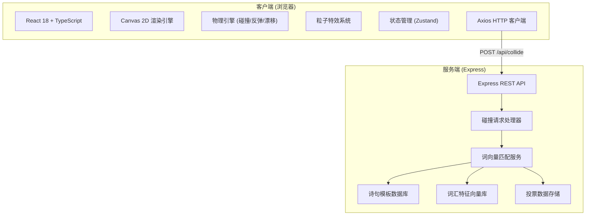
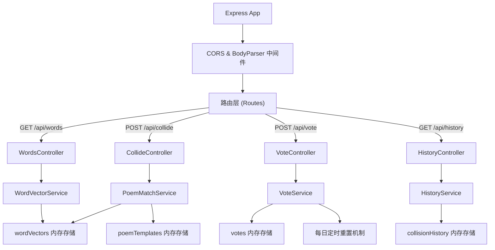
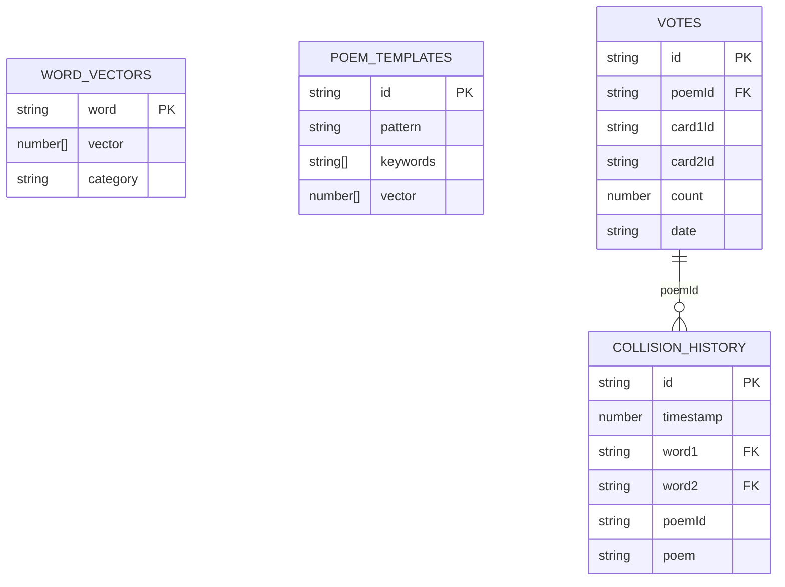

# 悬浮词典 - 技术架构文档

## 1. 架构设计



## 2. 技术说明

- **前端框架**: React 18 + TypeScript（严格模式）
- **构建工具**: Vite + @vitejs/plugin-react（开发端口 3000）
- **渲染技术**: Canvas 2D API（硬件加速）
- **状态管理**: Zustand（轻量级store）
- **HTTP通信**: Axios
- **后端框架**: Express 4 + TypeScript（ESM格式）
- **ID生成**: uuid
- **跨域处理**: cors + body-parser

## 3. 路由定义

| 路由 | 方法 | 用途 |
|------|------|------|
| /api/words | GET | 获取初始词汇列表和30张卡片数据 |
| /api/collide | POST | 处理卡片碰撞，返回匹配诗句 |
| /api/vote | POST | 提交投票，返回当前最高票状态 |
| /api/top-poems | GET | 获取当日最高票诗句列表 |
| /api/history | GET | 获取最近碰撞历史 |

## 4. API 定义

### 4.1 TypeScript 类型定义

```typescript
// 卡片实体
interface Card {
  id: string;
  word: string;
  x: number;
  y: number;
  vx: number;
  vy: number;
  radius: number;
}

// 词汇特征向量
interface WordVector {
  word: string;
  vector: number[]; // 128维特征向量
  category: string; // 语义分类
}

// 诗句模板
interface PoemTemplate {
  id: string;
  pattern: string; // 如 "{word1}的{word2}，如梦境般交织"
  keywords: string[]; // 触发关键词
  vector: number[]; // 模板语义向量
}

// 碰撞请求
interface CollideRequest {
  word1: string;
  word2: string;
  card1Id: string;
  card2Id: string;
  collisionPoint: { x: number; y: number };
}

// 碰撞响应
interface CollideResponse {
  success: boolean;
  poemId: string;
  poem: string;
  word1: string;
  word2: string;
  similarity: number;
  templateId: string;
}

// 投票请求
interface VoteRequest {
  poemId: string;
  card1Id: string;
  card2Id: string;
}

// 投票响应
interface VoteResponse {
  success: boolean;
  newVoteCount: number;
  isTopPoem: boolean;
  replacement?: {
    cardId: string;
    newWord: string;
  };
}

// 碰撞历史
interface CollisionHistory {
  id: string;
  timestamp: number;
  word1: string;
  word2: string;
  poem: string;
  votes: number;
}
```

### 4.2 请求/响应示例

**POST /api/collide 请求:**
```json
{
  "word1": "月光",
  "word2": "潮汐",
  "card1Id": "a1b2c3",
  "card2Id": "d4e5f6",
  "collisionPoint": { "x": 960, "y": 540 }
}
```

**POST /api/collide 响应:**
```json
{
  "success": true,
  "poemId": "p001",
  "poem": "月光轻抚潮汐面，星河入梦夜阑珊",
  "word1": "月光",
  "word2": "潮汐",
  "similarity": 0.87,
  "templateId": "tpl_nature_042"
}
```

## 5. 服务端架构图



## 6. 数据模型

### 6.1 数据模型定义（ER图）



### 6.2 初始数据

**词汇库（示例，共60+中性词汇）**：
- 自然类：月光、潮汐、星辰、山川、溪流、微风、云朵、薄雾、晚霞、清泉
- 时间类：黎明、黄昏、子夜、流年、往昔、瞬间、永恒、刹那、四季、朝夕
- 情感类：思念、追忆、憧憬、孤寂、欢愉、静谧、惆怅、缱绻、悠然、清欢
- 物像类：纸鸢、琥珀、琉璃、锦瑟、铜铃、书卷、烛火、铜镜、玉佩、风铃
- 空间类：天涯、咫尺、归途、彼岸、云端、巷陌、庭前、檐下、渡口、长亭

**诗句模板（示例，共50+模板）**：
```
{word1}摇曳{word2}边，一帘幽梦落人间
{word1}不解{word2}意，化作相思满画栏
{word2}深处{word1}落，岁月无声染山河
```

## 7. 核心算法

### 7.1 圆形碰撞检测
```
两张卡片A、B，半径均为r：
dx = B.x - A.x
dy = B.y - A.y
distance = sqrt(dx² + dy²)
碰撞条件：distance < 2r
```

### 7.2 弹性碰撞响应
```
法线方向: nx = dx/distance, ny = dy/distance
切线方向: tx = -ny, ty = nx
相对速度: dvx = B.vx - A.vx, dvy = B.vy - A.vy
法线相对速度: vn = dvx*nx + dvy*ny
若 vn < 0 则发生碰撞：
  冲量系数: restitution = 0.95
  A.vx += vn * nx * restitution / 2
  A.vy += vn * ny * restitution / 2
  B.vx -= vn * nx * restitution / 2
  B.vy -= vn * ny * restitution / 2
```

### 7.3 余弦相似度
```
cosθ = (v1·v2) / (||v1|| × ||v2||)
其中 v1·v2 = Σ(v1i × v2i)
||v|| = √(Σvi²)
```

## 8. 项目文件结构

```
.
├── package.json
├── vite.config.js
├── tsconfig.json
├── index.html
├── src/
│   ├── App.tsx
│   ├── Card.tsx
│   ├── components/
│   │   ├── HistoryWall.tsx
│   │   ├── VoteButton.tsx
│   │   └── PoemDisplay.tsx
│   ├── hooks/
│   │   ├── useCanvasRenderer.ts
│   │   ├── useCollisionSystem.ts
│   │   └── useParticleSystem.ts
│   ├── store/
│   │   └── useAppStore.ts
│   ├── types/
│   │   └── index.ts
│   └── utils/
│       ├── physics.ts
│       └── api.ts
└── server/
    ├── index.ts
    ├── wordVector.ts
    ├── services/
    │   ├── poemMatchService.ts
    │   └── voteService.ts
    └── data/
        ├── words.ts
        └── poemTemplates.ts
```
