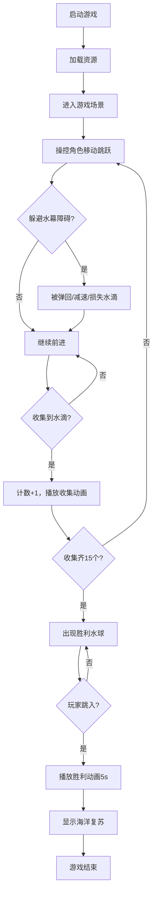

## 1. 产品概述

「潮汐回响」是一款2D平台跳跃冒险HTML5游戏。玩家操控一只由水元素构成的半透明水滴小精灵，在漂浮岛屿与流动水幕构成的动态关卡中跳跃穿行，通过收集散落的"回声水滴"来恢复一片被冻结的幻想海洋。

- 核心玩法：平台跳跃 + 收集探索 + 障碍躲避
- 目标用户：休闲游戏爱好者、网页游戏玩家
- 产品价值：提供沉浸感强的水下氛围游戏体验，操作简单但关卡富有挑战性

## 2. 核心特性

### 2.1 玩家角色

| 属性 | 描述 |
|------|------|
| 形态 | 半透明蓝色水滴（半径20px） |
| 移动控制 | 方向键/WASD左右移动（最大250px/s） |
| 跳跃 | 空格/W键跳跃（跳跃力-450），支持二段跳 |
| 变形动画 | 跳跃时拉伸变扁，下落时拉长，平滑过渡（0.2-0.4s） |
| 落地特效 | 脚部生成6个淡蓝色粒子（2-4px）向两侧扩散，0.3s后消失 |

### 2.2 关卡与平台系统

| 模块 | 功能描述 |
|------|----------|
| 浮动平台 | 10个平台（80x16px），正弦上下浮动（幅度30px，周期1.5-2.5s随机） |
| 颜色渐变 | 顶部浅蓝（HSL 180,60%,60%）→ 底部深蓝（HSL 240,80%,50%） |
| 关卡通路 | 平台间隔100-150px形成跳跃通路 |
| 隐藏区域 | 顶部连续台阶通往隐藏区，含2个额外收集物 |

### 2.3 障碍与收集物系统

| 模块 | 功能描述 |
|------|----------|
| 水幕障碍 | 3道垂直水幕（30x200px），半透明条纹流动，触碰弹回+减速2s/损失1收集物 |
| 水幕间歇 | 部分水幕出现1.5s消失1s循环 |
| 回声水滴 | 15个收集物（半径10px），淡蓝辉光，缓慢旋转 |
| 收集动画 | 触碰触发水波扩散，计数+1，数字短暂放大闪烁 |

### 2.4 胜利系统

| 模块 | 功能描述 |
|------|----------|
| 胜利触发 | 收集全部15个回声水滴 |
| 胜利水球 | 屏幕中央出现大水球（半径80px），内含旋转发光核心 |
| 胜利画面 | 全屏蓝色粒子升腾3s → 显示"海洋复苏"文字 → 收集物扩散光点动画5s |

### 2.5 UI与反馈系统

| 模块 | 功能描述 |
|------|----------|
| 收集计数 | 左上角"水滴：X/15"（白色20px，发光阴影，半透明圆角底） |
| 计时器 | 左上角精确到0.1秒 |
| 跳跃音效 | WebAudio合成（440Hz，0.1s） |
| 死亡重置 | 掉落出屏→深蓝闪屏1s→从当前位置重开，计数清零 |

## 3. 核心流程

玩家启动游戏 → 加载资源 → 进入游戏场景 → 操控水滴精灵左右移动跳跃 → 躲避水幕障碍 → 收集回声水滴 → 探索隐藏区域获取额外收集物 → 收集全部15个水滴 → 触发胜利水球 → 玩家跳入胜利水球 → 胜利动画播放 → 游戏结束

## 4. 用户界面设计

### 4.1 设计风格

- **主色调**：深蓝到深紫渐变背景（HSL 240° → 270°）
- **辅色调**：淡蓝色水滴和平台（HSL 200°, 70%, 80%）
- **发光描边**：平台边缘亮度10%，透明度0.3
- **收集物辉光**：淡蓝到白色径向渐变
- **UI容器**：半透明深蓝圆角矩形（透明度0.5）
- **字体**：无衬线字体，白色为主
- **动效节奏**：所有过渡动画0.2-0.4秒，流畅平滑

### 4.2 页面设计概述

| 页面/场景 | 模块 | UI元素 |
|-----------|------|--------|
| 游戏场景 | 背景层 | 深蓝→深紫线性渐变（上→下） |
| 游戏场景 | 游戏层 | 玩家水滴、浮动平台、水幕、收集物 |
| 游戏场景 | UI层 | 左上角计数面板、计时器面板 |
| 胜利画面 | 粒子层 | 全屏蓝色粒子升腾 |
| 胜利画面 | 文字层 | "海洋复苏"48px白色水波纹理文字 |

### 4.3 响应式适配

- **设计策略**：桌面优先，画布自适应容器
- **画布尺寸**：宽度占满容器（最大800px），高度按16:9自动缩放
- **缩放机制**：Phaser ScaleMode FIT模式保持宽高比
- **性能要求**：帧率≥55FPS，粒子总数≤100个

## 5. 性能指标

| 指标 | 要求 |
|------|------|
| 帧率 | ≥55 FPS |
| 粒子上限 | 水花+胜利粒子 ≤100个 |
| 动画流畅度 | 无明显卡顿 |
| 响应延迟 | 按键响应 ≤50ms |
