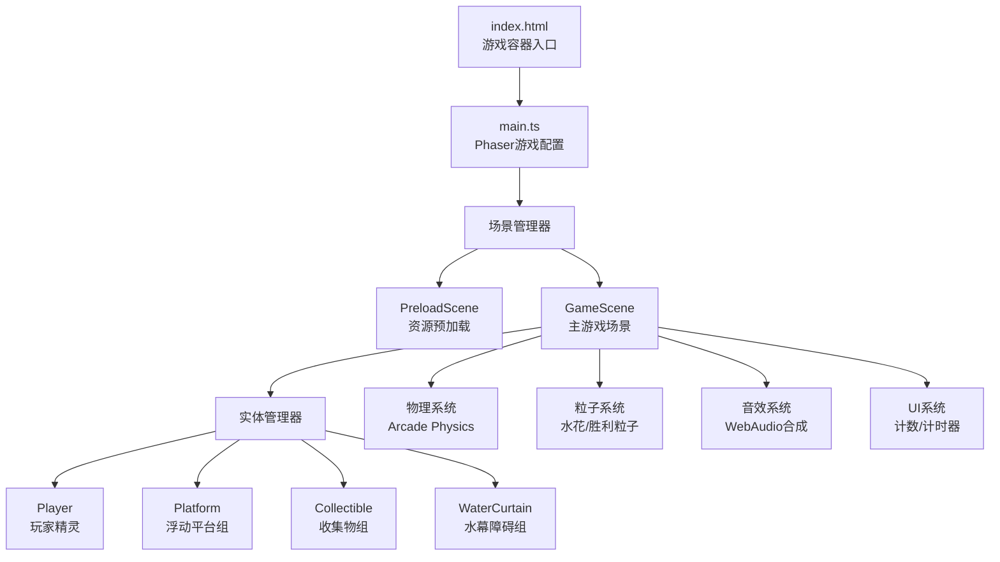

## 1. 架构设计



## 2. 技术选型说明

| 分类 | 技术 | 版本要求 | 用途说明 |
|------|------|----------|----------|
| 构建工具 | Vite | ^5.0.0 | 项目构建、开发服务器（端口3000）、热更新 |
| 开发语言 | TypeScript | ^5.0.0 | 严格模式（strict:true），target ES2020，类型安全 |
| 游戏引擎 | Phaser 3 | ^3.70.0 | 游戏循环、物理碰撞、动画系统、粒子系统 |
| 样式 | CSS3 | - | 页面渐变背景、容器居中布局 |
| 音频 | Web Audio API | 浏览器内置 | Phaser合成音效，440Hz跳跃音 |

## 3. 项目文件结构

```
auto276/
├── package.json              # 依赖配置（phaser、vite、typescript）
├── vite.config.js            # Vite构建配置（端口3000）
├── tsconfig.json             # TS配置（严格模式，ES2020）
├── index.html                # 入口页面（渐变背景+游戏容器居中）
└── src/
    ├── main.ts               # Phaser Game配置、场景注册、启动PreloadScene
    └── scenes/
    │   └── GameScene.ts      # 主游戏场景（玩家/平台/水幕/收集物/UI管理）
    └── entities/
        ├── Player.ts         # 玩家水滴精灵类
        ├── Platform.ts       # 浮动平台类
        └── Collectible.ts    # 回声水滴收集物类
```

## 4. 核心类与接口定义

### 4.1 玩家类 Player

```typescript
interface PlayerConfig {
  scene: Phaser.Scene;
  x: number;
  y: number;
}

class Player extends Phaser.Physics.Arcade.Sprite {
  // 物理属性
  public readonly maxSpeed = 250;      // px/s
  public readonly jumpForce = -450;    // 跳跃力
  public readonly acceleration = 800;  // 加速度
  public readonly drag = 1200;         // 阻力
  
  // 跳跃状态
  private canDoubleJump: boolean;
  private jumpCount: number;
  
  // 视觉状态
  private baseScaleX = 1;
  private baseScaleY = 1;
  private targetScaleX = 1;
  private targetScaleY = 1;
  
  // 输入引用
  private cursors: Phaser.Types.Input.Keyboard.CursorKeys;
  private keyW: Phaser.Input.Keyboard.Key;
  private keyA: Phaser.Input.Keyboard.Key;
  private keyD: Phaser.Input.Keyboard.Key;
  private keySpace: Phaser.Input.Keyboard.Key;
  
  // 方法
  constructor(config: PlayerConfig);
  update(time: number, delta: number): void;
  private handleInput(): void;
  private handleJump(): void;
  private updateSquashStretch(delta: number): void;
  private createLandingParticles(): void;
  private playJumpSound(): void;
}
```

### 4.2 平台类 Platform

```typescript
interface PlatformConfig {
  scene: Phaser.Scene;
  x: number;
  y: number;
  baseY: number;
  width: number;        // 默认80
  height: number;       // 默认16
  color: number;        // HSL转换的十六进制颜色
  floatAmplitude: number;    // 正弦幅度，默认30
  floatPeriod: number;       // 周期1.5-2.5秒随机
  phase: number;             // 正弦相位偏移
}

class Platform extends Phaser.Physics.Arcade.Sprite {
  private baseY: number;
  private amplitude: number;
  private period: number;
  private phase: number;
  private startTime: number;
  
  constructor(config: PlatformConfig);
  update(time: number): void;
  // 根据正弦公式计算当前Y: y = baseY + amplitude * sin(2π * t / period + phase)
}
```

### 4.3 收集物类 Collectible

```typescript
interface CollectibleConfig {
  scene: Phaser.Scene;
  x: number;
  y: number;
}

class Collectible extends Phaser.Physics.Arcade.Sprite {
  public isCollected = false;
  private readonly radius = 10;
  private rotationSpeed = 0.02;     // 每帧旋转速度
  
  constructor(config: CollectibleConfig);
  update(time: number): void;
  collect(): void;  // 触发水波扩散动画，标记已收集
}
```

### 4.4 主场景 GameScene

```typescript
class GameScene extends Phaser.Scene {
  // 实体引用
  private player: Player;
  private platforms: Phaser.Physics.Arcade.StaticGroup;
  private collectibles: Phaser.Physics.Arcade.Group;
  private waterCurtains: Array<WaterCurtainData>;
  
  // 游戏状态
  private score = 0;
  private readonly totalCollectibles = 15;
  private elapsedTime = 0;
  private gameWon = false;
  private victorySphere: Phaser.GameObjects.Graphics | null;
  
  // UI元素
  private scoreText: Phaser.GameObjects.Text;
  private scoreBackground: Phaser.GameObjects.Graphics;
  private timerText: Phaser.GameObjects.Text;
  private timerBackground: Phaser.GameObjects.Graphics;
  
  // 音效引用
  private jumpSound: Phaser.Sound.BaseSound | null;
  
  constructor();
  preload(): void;       // 预加载资源（本游戏纯Graphics生成）
  create(): void;        // 创建实体、物理、碰撞、UI
  update(time: number, delta: number): void;  // 主循环
  private createBackground(): void;
  private createPlatforms(): void;
  private createCollectibles(): void;
  private createWaterCurtains(): void;
  private createUI(): void;
  private onCollectibleOverlap(
    player: Player,
    collectible: Collectible
  ): void;
  private onWaterCurtainHit(): void;
  private checkFallDeath(): void;
  private respawnPlayer(): void;
  private triggerVictory(): void;
  private checkVictorySphereEntry(): void;
  private playVictoryAnimation(): void;
}
```

## 5. 物理与碰撞系统

| 系统 | 配置 |
|------|------|
| 物理引擎 | Phaser Arcade Physics（2D AABB碰撞） |
| 重力 | world.gravity.y = 600（适合平台跳跃手感） |
| 玩家碰撞体 | 圆形碰撞体（半径18，略小于视觉半径） |
| 平台碰撞体 | 矩形静态碰撞体（80x16） |
| 收集物碰撞体 | 圆形传感器（半径12，触发而非阻挡） |
| 水幕碰撞体 | 矩形传感器（30x200，部分水幕间歇性开关） |

碰撞矩阵：

| 物体A | 物体B | 类型 | 回调 |
|-------|-------|------|------|
| Player | Platform | 碰撞（collider） | 平台上站立/反弹 |
| Player | Collectible | 重叠（overlap） | onCollectibleOverlap |
| Player | WaterCurtain | 重叠（overlap） | onWaterCurtainHit |

## 6. 粒子系统配置

### 6.1 落地水花粒子

| 参数 | 值 |
|------|-----|
| 发射器位置 | 玩家脚部（player.x, player.y+18） |
| 粒子数量 | 每次落地6个 |
| 生命周期 | 300ms |
| 尺寸 | 2-4px（随机） |
| 颜色 | 淡蓝色 HSL(200, 70%, 80%) |
| 速度X | ±80 ~ ±120 向两侧扩散 |
| 速度Y | -30 ~ 0 略微上扬 |
| 重力 | 200 下落 |
| 透明度 | 线性衰减 1→0 |

### 6.2 收集水波粒子

| 参数 | 值 |
|------|-----|
| 发射器位置 | 收集物位置 |
| 粒子类型 | 环形扩散（Graphics圆形scale up） |
| 数量 | 1个圆环 |
| 持续时间 | 400ms |
| 初始半径 | 5 → 60 |
| 线宽 | 2 → 0（衰减） |
| 透明度 | 1 → 0 |

### 6.3 胜利粒子

| 参数 | 值 |
|------|-----|
| 上限 | 80个（总粒子≤100） |
| 发射率 | 每100ms发射一批 |
| 生命周期 | 1500-3000ms |
| 颜色 | 蓝白渐变 |
| 速度Y | -100 ~ -200 升腾 |
| 速度X | ±50 随机飘移 |
| 尺寸 | 2-6px随机 |

## 7. 关卡布局坐标规范

画布基准尺寸：800×450（16:9）

### 7.1 平台坐标（10个主平台 + 隐藏区台阶）

```
主通路平台（从下到上）：
P1: (80, 380)    P2: (220, 340)   P3: (360, 300)
P4: (500, 260)   P5: (640, 220)   P6: (480, 180)
P7: (320, 160)   P8: (180, 200)   P9: (100, 260)
P10: (260, 120)

隐藏区台阶（顶部连续）：
S1: (360, 80)    S2: (440, 60)    S3: (520, 40)
S4: (600, 30)    S5: (680, 30)
```

### 7.2 水幕坐标（3道）

```
W1: x=300, y=150~350  (高度200，间歇型：出现1.5s，消失1s)
W2: x=450, y=100~300  (高度200，常驻型)
W3: x=580, y=180~380  (高度200，间歇型)
```

### 7.3 收集物坐标（15个，其中2个在隐藏区）

```
主通路13个：
(110, 350), (250, 310), (390, 270), (530, 230), (670, 190),
(510, 150), (350, 130), (210, 170), (130, 230), (290, 90),
(160, 290), (420, 350), (600, 340)

隐藏区2个：
(550, 20),  (680, 10)
```

## 8. 构建与开发配置

### 8.1 Vite 配置要点

```javascript
// vite.config.js
export default {
  base: './',
  server: {
    port: 3000,
    open: false
  },
  build: {
    target: 'es2020',
    minify: 'esbuild',
    sourcemap: false
  }
}
```

### 8.2 tsconfig 要点

```json
{
  "compilerOptions": {
    "target": "ES2020",
    "module": "ESNext",
    "strict": true,
    "moduleResolution": "bundler",
    "skipLibCheck": true,
    "forceConsistentCasingInFileNames": true
  },
  "include": ["src"]
}
```

### 8.3 开发脚本

| 命令 | 用途 |
|------|------|
| `npm run dev` | 启动Vite开发服务器（端口3000） |
| `npm run build` | 构建生产版本到dist/ |
| `npm run preview` | 预览构建结果 |
| `npm run check` | TypeScript类型检查（如配置） |
