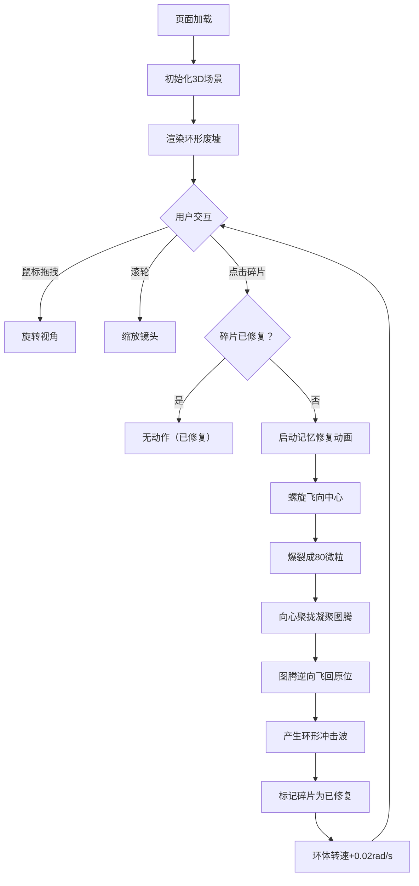

## 1. 产品概述

「归墟之环」是一个基于 WebGL（Three.js）的交互式3D艺术装置项目，构建一个悬浮在虚空中的三维环形废墟，通过用户的点击交互触发"记忆修复"动画，营造神秘而宁静的氛围。

- 核心价值：提供沉浸式的互动艺术体验，通过精美的3D视觉效果和流畅的动画过渡，让用户在探索中获得宁静与疗愈感
- 目标用户：艺术爱好者、Web3D交互体验探索者

## 2. 核心功能

### 2.1 用户角色

此项目为单用户体验型项目，无需角色区分。

### 2.2 功能模块

1. **3D场景渲染模块**：深空背景、星尘粒子层、环形废墟主体、光影系统
2. **环体碎片系统**：5块扇形拱门碎片、程序化石纹纹理、断裂边缘、修复状态管理
3. **发光裂纹系统**：碎片间的动态流动裂纹、脉动效果、修复前后的颜色/亮度变化
4. **交互与动画状态机**：
   - 鼠标拖拽旋转视角、滚轮缩放
   - 点击触发碎片螺旋飞行→爆裂→图腾凝聚→飞回修复的完整动画链
5. **特效系统**：螺旋轨迹粒子、爆裂微粒、图腾形状、环形冲击波
6. **环境音效模块**：低沉的空间音效（可选，通过Web Audio API实现）

### 2.3 功能详情

| 模块名称 | 子模块 | 功能描述 |
|---------|--------|----------|
| 3D场景渲染 | 深空背景 | 色相从240度到280度的蓝紫渐变背景 |
| 3D场景渲染 | 星尘粒子层 | 底部缓慢飘移的150个粒子，大小0.01-0.03，透明度0.2-0.5 |
| 3D场景渲染 | 环形废墟主体 | 5块碎片拼成的环形结构，缓慢自旋（0.02rad/s起，最大0.1rad/s） |
| 环体碎片系统 | 几何生成 | 每块72度弧长，厚度0.3单位，高度外圈1.5→内圈0.8渐变 |
| 环体碎片系统 | 纹理生成 | 程序化噪声生成石纹，边缘随机锯齿断裂（振幅0.05） |
| 环体碎片系统 | 状态管理 | 修复前暗灰色，修复后持续金色微光 |
| 发光裂纹系统 | 动态效果 | 红橙色（色相15-40度渐变），脉动频率0.5Hz |
| 发光裂纹系统 | 状态切换 | 修复后亮度60%→20%，变为金色（色相50度） |
| 交互动画 | 视角控制 | OrbitControls拖拽旋转，滚轮缩放 |
| 交互动画 | 螺旋飞行 | 三维螺旋路径（螺距0.3，2圈），2秒飞向中心，残留30粒子/帧 |
| 交互动画 | 爆裂凝聚 | 80个微粒飞散→向心聚拢→0.3单位图腾（4种随机形状） |
| 交互动画 | 修复飞回 | 1秒逆向飞回原位置，产生环形冲击波，环体转速+0.02rad/s |
| 特效系统 | 螺旋轨迹粒子 | 大小0.02，生命周期0.8秒，红橙→透明渐变 |
| 特效系统 | 环形冲击波 | 半径0.2→1.5扩散，0.6秒持续，金色 |
| 特效系统 | 图腾形状 | 随机4叉星/螺旋/三角/菱形，ExtrudeGeometry生成 |

## 3. 核心流程

用户进入页面后，首先看到悬浮于深空的环形废墟在缓慢自旋。用户可通过鼠标拖拽自由观察各个角度，滚轮调整观察距离。

当用户点击任意一块碎片时，该碎片触发"记忆修复"流程：碎片沿螺旋轨迹飞向中心→爆裂成发光微粒→微粒凝聚成图腾→图腾飞回原位修复碎片→产生冲击波、环体加速。已修复的碎片会持续发出金色光芒，用户可继续点击其他未修复碎片直至全部修复完毕。

## 4. 用户界面设计

### 4.1 设计风格

- **主色调**：深空蓝紫（色相240-280度）作为背景主调
- **强调色**：
  - 未修复裂纹：红橙色（色相15-40度渐变），亮度60%
  - 修复后裂纹/碎片：金色（色相50度），亮度20%/持续微光
  - 粒子/冲击波：红橙渐变、金色
- **质感**：石质碎片（暗灰粗糙质感+细密石纹）、发光裂纹（自发光辉光效果）
- **动效风格**：所有动画均使用 easeInOutCubic 缓动，流畅优雅
- **字体**：极简无衬线字体（如需文字UI），字号适中，低调融入背景

### 4.2 页面设计概述

| 区域 | 模块 | UI元素与风格 |
|------|------|--------------|
| 全屏 | 3D渲染容器 | 纯黑背景，Canvas铺满全屏，无多余UI元素 |
| 背景层 | 深空渐变 | 色相240→280度径向/线性渐变 |
| 前景层 | 星尘粒子 | 底部缓慢飘移，营造深度感 |
| 中心主体 | 环形废墟 | 视觉焦点，缓慢自旋，碎片裂纹脉动发光 |
| 交互层 | 鼠标指针 | 默认指针，悬停可点击碎片时变手型（cursor: pointer） |

### 4.3 响应式

- 全屏自适应渲染，Canvas尺寸随窗口 resize 自动调整
- 桌面端：鼠标拖拽旋转、滚轮缩放、左键点击交互
- 移动端（可选兼容）：单指拖拽旋转、双指捏合缩放、轻点点击

### 4.4 3D场景指引

- **环境与氛围**：纯深空背景，无HDRI，使用多盏点光源/聚光灯营造局部光感，碎片裂纹使用自发光材质产生辉光
- **光照设置**：
  - 环境光：低强度冷色（蓝紫调），提供基础照明
  - 主光：暖色方向光，模拟远处光源打亮环体一侧
  - 辅助点光：环体中心放置弱光，增强空间感
- **相机设置**：PerspectiveCamera，初始位置距离环体约5-6单位，观察高度略高于环体平面，OrbitControls启用阻尼效果
- **构图**：环体居中，占据画面视觉中心（约50-60%画面面积），预留足够负空间体现虚空感
- **交互与动画**：所有动画时间节点精确控制（飞行2s、爆裂1s+聚拢0.5s、飞回1s、冲击波0.6s），缓动函数统一 easeInOutCubic
- **后处理效果**：可选 UnrealBloomPass 实现辉光效果，增强发光裂纹和粒子的视觉冲击力
- **性能预算**：帧率≥50fps，总面数控制在合理范围，使用 BufferGeometry，粒子系统用 Points/InstancedMesh 优化
