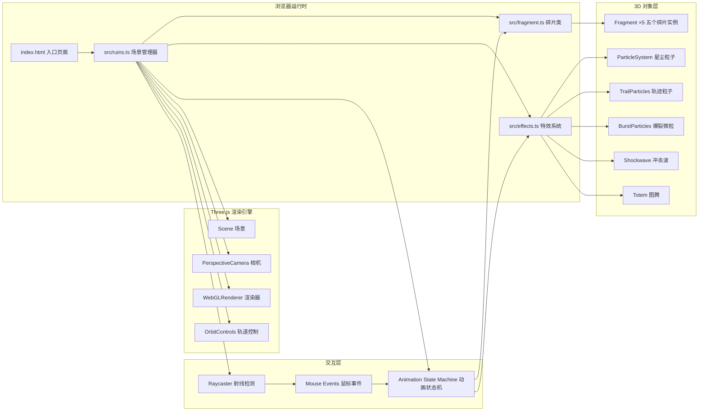

## 1. 架构设计



## 2. 技术栈说明

- **前端框架**：无框架，原生 TypeScript + Three.js（面向对象封装）
- **构建工具**：Vite 5.x（快速冷启动、HMR热更新、原生ES模块）
- **语言**：TypeScript 5.x（严格模式 strict:true，target ES2020）
- **3D引擎**：Three.js 0.160+（含 examples/jsm 模块：OrbitControls、BufferGeometryUtils、ShapeUtils 等）
- **初始化方式**：手动创建项目文件（用户指定了精确的文件结构），不使用 vite 脚手架模板

## 3. 目录结构与文件职责

```
auto278/
├── index.html                    # 入口页面，挂载渲染容器
├── package.json                  # 依赖声明（three、vite、typescript）
├── vite.config.js                # Vite 构建配置（端口3000）
├── tsconfig.json                 # TypeScript 配置（严格模式、ES2020）
└── src/
    ├── ruins.ts                  # 核心场景管理器（Ruins 类）
    │                             #   - 初始化场景/相机/渲染器/轨道控制
    │                             #   - 管理5个碎片实例的创建与布局
    │                             #   - 射线检测与点击事件分发
    │                             #   - 动画状态机调度（空闲/飞行中/爆裂/凝聚/飞回）
    │                             #   - 环体整体自旋与加速
    │                             #   - 星尘背景粒子层管理
    │
    ├── fragment.ts               # 单个碎片类（Fragment 类）
    │                             #   - 生成扇形拱门几何体（72度弧长）
    │                             #   - 程序化石纹纹理（顶点扰动 + 噪声）
    │                             #   - 边缘断裂锯齿（随机顶点偏移，振幅0.05）
    │                             #   - 材质：暗灰石质 + 裂纹发光层（双层材质或单材质shader）
    │                             #   - 修复状态：isRepaired 标志，颜色/发光切换
    │                             #   - 原始位置/旋转记录，供飞回动画使用
    │
    └── effects.ts                # 特效系统（Effects 命名空间或多个独立类）
                                  #   - SpiralPath: 三维螺旋路径计算工具
                                  #   - TrailParticleSystem: 螺旋轨迹粒子（每帧30个）
                                  #   - BurstParticleSystem: 中心爆裂微粒（80个）
                                  #   - TotemFactory: 图腾生成（4种随机形状，ExtrudeGeometry）
                                  #   - Shockwave: 环形冲击波特效
                                  #   - StardustSystem: 背景星尘粒子（150个）
                                  #   - 缓动工具函数：easeInOutCubic
```

## 4. 关键数据结构与类型定义

### 4.1 Fragment 状态

```typescript
// fragment.ts 中定义
enum FragmentState {
  Idle = 'idle',           // 空闲
  FlyingToCenter = 'flying_to_center',   // 螺旋飞向中心
  Bursting = 'bursting',   // 爆裂中（碎片隐藏，微粒飞散）
  Coalescing = 'coalescing', // 凝聚图腾中
  FlyingBack = 'flying_back', // 图腾飞回原位置
  Repaired = 'repaired',   // 已修复
}

interface FragmentConfig {
  index: number;           // 0-4，第几个碎片
  arcAngle: number;        // 72度 = 2π/5
  ringInnerRadius: number; // 环内半径
  ringOuterRadius: number; // 环外半径
  thickness: number;       // 0.3
  outerHeight: number;     // 1.5
  innerHeight: number;     // 0.8
}
```

### 4.2 动画参数常量

```typescript
// ruins.ts 中统一定义
const ANIMATION = {
  FLY_TO_CENTER_DURATION: 2000,   // ms，飞向中心时长
  BURST_DURATION: 1000,           // ms，爆裂飞散时长
  COALESCE_DURATION: 500,         // ms，凝聚时长
  FLY_BACK_DURATION: 1000,        // ms，飞回时长
  SHOCKWAVE_DURATION: 600,        // ms，冲击波时长
  SPIRAL_PITCH: 0.3,              // 螺距
  SPIRAL_TURNS: 2,                // 圈数
  TRAIL_PARTICLES_PER_FRAME: 30,  // 每帧轨迹粒子数
  BURST_PARTICLE_COUNT: 80,       // 爆裂微粒数
  RING_BASE_ROTATION_SPEED: 0.02, // rad/s，基础自旋速度
  RING_MAX_ROTATION_SPEED: 0.1,   // rad/s，最大自旋速度
  RING_SPEED_INCREMENT: 0.02,     // rad/s，每次修复加速增量
} as const;
```

### 4.3 特效数据

```typescript
// effects.ts 中定义
type TotemShapeType = 'fourPointStar' | 'spiral' | 'triangle' | 'diamond';

interface ParticleData {
  position: THREE.Vector3;
  velocity: THREE.Vector3;
  life: number;       // 0-1，剩余生命周期比例
  maxLife: number;    // ms
  size: number;
  colorStart: THREE.Color;
  colorEnd: THREE.Color;
}
```

## 5. 核心算法与实现思路

### 5.1 扇形拱门几何体生成（Fragment）

```
思路：使用自定义 BufferGeometry 构建
1. 环的径向截面：从内半径 r1 到外半径 r2
2. 环的角度范围：θ_start 到 θ_end（跨度72度）
3. 高度随半径线性渐变：h(r) = h2 - (r-r1)/(r2-r1) * (h2-h1)
   （外圈高1.5，内圈高0.8）
4. 厚度方向（z轴）：-0.15 到 +0.15（总厚0.3）
5. 顶点分布：
   - 径向分段：N=约16段（保证曲面平滑）
   - 角度分段：M=约12段
   - 厚度分段：K=2段（简单长方体厚度即可）
6. 断裂边缘处理：在碎片的两个角度端边（θ_start和θ_end）以及内外圈边缘，
   对顶点添加随机偏移（振幅0.05）模拟不规则断裂
7. 石纹纹理：对所有顶点的法向量或位置添加高频低幅的噪声扰动（Perlin/Simplex噪声），
   或通过自定义 ShaderMaterial 在片元着色器中实现 procedural stone texture
```

### 5.2 三维螺旋路径（SpiralPath）

```
参数方程：给定起点 P_start（碎片中心位置）和终点 P_end = (0,0,0)
使用圆柱坐标系 + 线性插值：

对于归一化时间 t ∈ [0,1]（easeInOutCubic 缓动后）：
  r(t) = lerp(r_start, 0, t)                  // 半径线性缩小
  θ(t) = θ_start + 2π * SPIRAL_TURNS * t      // 角度增加 2 圈（4π）
  y(t) = lerp(y_start, 0, t) + SPIRAL_PITCH * sin(π*t)
         或使用 θ 关联的高度螺旋

转换为笛卡尔坐标：
  x(t) = r(t) * cos(θ(t))
  z(t) = r(t) * sin(θ(t))
  y(t) = y(t) + (可选) small vertical oscillation

飞回时 t 从1→0，或反向定义路径（从中心到原位置），使用相同参数方程即可逆向
```

### 5.3 动画状态机（Ruins 中管理）

每个碎片有独立的状态，Ruins 在每帧 update(deltaTime) 中遍历：

```
对于每个正在动画的 fragment：
  switch (fragment.state):
    case FlyingToCenter:
      更新飞行进度 t，计算螺旋位置
      每帧生成30个轨迹粒子在当前位置
      t>=1 时 → 切换到 Bursting，隐藏碎片 mesh，触发爆裂粒子
    case Bursting:
      更新80个爆裂微粒（匀速向外飞散）
      进度 t_burst>=1 时 → 切换到 Coalescing，开始向心聚拢
    case Coalescing:
      对每个爆裂微粒施加向心加速度（朝向中心）
      同时逐渐缩小粒子尺寸，增加透明度
      t_coalesce>=1 时 → 粒子全部消失，生成图腾 mesh，切换 FlyingBack
    case FlyingBack:
      图腾沿逆向螺旋路径飞回原位置
      t>=1 时 → 销毁图腾，重新显示碎片 mesh（切换为修复后材质），
                触发冲击波特效，环体转速+0.02，标记 state = Repaired
```

### 5.4 发光裂纹效果实现思路

两种方案（优先选方案1，性能友好）：

**方案1：双层 Mesh（推荐）**
- 基础 Mesh：石质材质（MeshStandardMaterial，暗灰色，粗糙Rough=0.9，Metalness=0.1）
- 裂纹 Mesh：使用相同 Geometry，但仅渲染边缘（EdgesGeometry + LineSegments），
  材质使用 LineBasicMaterial + 顶点颜色 或自定义 ShaderMaterial
  （根据 time uniform 实现脉动流动效果：HSL 色相15-40渐变，亮度0.6*sin(2π*0.5*t)）
- 修复后：边缘 Line 颜色切换为金色（HSL色相50度），亮度0.2

**方案2：单 ShaderMaterial**
- 在片元着色器中根据 UV 或世界坐标判断是否为裂纹区域（距离碎片边缘<阈值），
  裂纹区域叠加发光色，其余区域渲染石纹

### 5.5 图腾形状生成

```typescript
// 4种随机形状，使用 THREE.Shape 定义2D轮廓，然后 ExtrudeGeometry 挤出

// 4叉星
function createFourPointStarShape(): THREE.Shape {
  const shape = new THREE.Shape();
  // 内外半径交替的8个点
  for (let i = 0; i < 8; i++) {
    const angle = (i / 8) * Math.PI * 2 - Math.PI / 2;
    const r = i % 2 === 0 ? 0.3 : 0.12;
    const x = Math.cos(angle) * r;
    const y = Math.sin(angle) * r;
    i === 0 ? shape.moveTo(x, y) : shape.lineTo(x, y);
  }
  shape.closePath();
  return shape;
}

// 三角、菱形同理
// ExtrudeGeometry 深度约 0.06-0.08
```

### 5.6 射线检测与交互

```typescript
// ruins.ts 中
private raycaster = new THREE.Raycaster();
private mouse = new THREE.Vector2();

onMouseClick(event: MouseEvent) {
  // NDC 坐标转换
  this.mouse.x = (event.clientX / window.innerWidth) * 2 - 1;
  this.mouse.y = -(event.clientY / window.innerHeight) * 2 + 1;
  this.raycaster.setFromCamera(this.mouse, this.camera);
  // 仅与状态为 Idle 的碎片 mesh 相交
  const meshes = this.fragments
    .filter(f => f.state === FragmentState.Idle)
    .map(f => f.mesh);
  const intersects = this.raycaster.intersectObjects(meshes, false);
  if (intersects.length > 0) {
    const fragment = this.fragments.find(f => f.mesh === intersects[0].object);
    if (fragment) this.triggerMemoryRepair(fragment);
  }
}
```

## 6. 性能优化要点

1. **Geometry 共享**：5个碎片使用相同基础形状的 Geometry（仅旋转/位移不同），
   可通过 BufferGeometry.clone() 复用，或每个独立生成但共享 Material
2. **粒子系统优化**：所有粒子使用 Points + BufferGeometry，
   position/color/size attributes 每帧更新，避免逐粒子 Mesh
3. **材质复用**：未修复碎片共享 1 个石质 Material，已修复共享 1 个金色 Material；
   裂纹 Line 共享同一种 ShaderMaterial（通过 uniform 区分状态）
4. **面数控制**：碎片径向分段≈16、角度分段≈12，每碎片约2000-3000面，
   5个碎片总面数≤15000，性能充足
5. **后处理酌情**：如开启 UnrealBloom，threshold/strength 调小，避免过度模糊；
   若帧率不足则关闭辉光，改用 emissive 颜色模拟
6. **矩阵更新**：环体用一个 Group 包裹所有碎片，自旋只需旋转 Group，不更新5个 mesh 的世界矩阵
