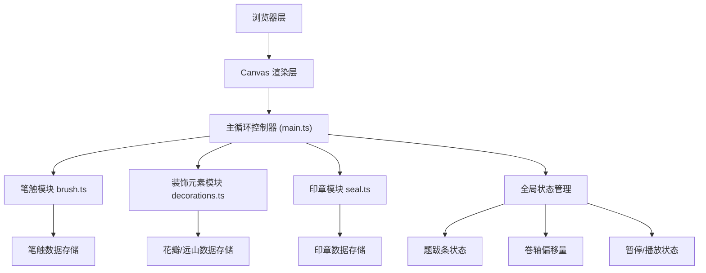

## 1. 架构设计



## 2. 技术说明

- **前端框架**：原生 TypeScript + Canvas API（无React/Vue，追求极致渲染性能）
- **构建工具**：Vite 5.x
- **开发语言**：TypeScript 5.x（严格模式 strict:true，target ES2020）
- **第三方依赖**：uuid（生成唯一ID）
- **开发服务器端口**：3000

## 3. 项目文件结构

```
auto282/
├── package.json          # 项目配置和依赖
├── tsconfig.json         # TypeScript编译配置（严格模式，ES2020）
├── vite.config.js        # Vite构建配置（端口3000）
├── index.html            # 入口HTML（全屏布局，canvas+题跋条div）
└── src/
    ├── main.ts           # 主入口：初始化、渲染循环、全局状态
    ├── brush.ts          # 笔触模块：生成和管理笔触数据
    ├── decorations.ts    # 装饰模块：生成花瓣和远山
    └── seal.ts           # 印章模块：放置和绘制印章
```

## 4. 数据模型定义

### 4.1 笔触数据模型

```typescript
interface BrushPoint {
  x: number;           // 绝对X坐标
  y: number;           // Y坐标
  width: number;       // 笔触点宽度
  opacity: number;     // 透明度 0-1
  hue: number;         // 色相 0-360
  saturation: number;  // 饱和度 0-100
  lightness: number;   // 亮度 0-100
  timestamp: number;   // 时间戳（毫秒）
}

interface BrushStroke {
  id: string;          // 唯一ID
  points: BrushPoint[]; // 点列
  createdAt: number;   // 创建时间
}
```

### 4.2 装饰元素数据模型

```typescript
interface Petal {
  id: string;
  x: number;              // X坐标
  y: number;              // Y坐标
  diameter: number;       // 直径 8-15px
  hue: number;            // 色相 青绿-淡粉
  saturation: number;
  lightness: number;
  opacity: number;        // 半透明
  fallSpeed: number;      // 下落速度 30-50px/s
  rotation: number;       // 当前旋转角度
  angularVelocity: number; // 角速度 0.5rad/s
}

interface Mountain {
  id: string;
  x: number;              // 起始X坐标
  height: number;         // 高度 40-80px
  points: { x: number; y: number }[]; // 轮廓点列
  opacity: number;        // 0.15
  moveSpeed: number;      // 10px/s向左
}
```

### 4.3 印章数据模型

```typescript
interface SealCurve {
  startX: number;         // 起点（相对印章中心，-16~16）
  startY: number;
  cp1X: number;           // 控制点1
  cp1Y: number;
  cp2X: number;           // 控制点2
  cp2Y: number;
  endX: number;           // 终点
  endY: number;
}

interface Seal {
  id: string;
  x: number;              // 世界坐标X（随卷轴平移）
  y: number;              // 画布坐标Y
  size: number;           // 边长 32px
  curves: SealCurve[];    // 3-5条篆体纹理曲线
  scale: number;          // 当前缩放比例（动画用，0→1）
  placedAt: number;       // 放置时间
}
```

### 4.4 全局状态模型

```typescript
interface GlobalState {
  scrollOffset: number;     // 卷轴水平偏移量（持续增加，20px/s）
  isPaused: boolean;        // 是否暂停移动（印章时暂停1秒）
  pauseUntil: number;       // 暂停结束时间戳
  recentSpeeds: { speed: number; time: number }[]; // 最近10秒速度记录
  brushStrokes: BrushStroke[];
  petals: Petal[];
  mountains: Mountain[];
  seals: Seal[];
  currentStroke: BrushStroke | null; // 当前正在绘制的笔触
  lastMousePos: { x: number; y: number } | null;
  lastMouseTime: number;
  lastDecorationTime: number;        // 上次生成装饰的时间
}
```

## 5. 核心算法与渲染管线

### 5.1 渲染循环（每帧执行）

1. **计算时间增量**：`deltaTime = (now - lastFrameTime) / 1000`
2. **更新卷轴偏移**（如未暂停）：`scrollOffset += 20 * deltaTime`
3. **更新所有元素位置**：
   - 花瓣：下落 + 旋转
   - 远山：向左平移
   - 印章：缩放动画
4. **清理出界元素**：左侧X坐标 < -scrollOffset 的元素移除
5. **画境名称计算**：基于最近10秒平均速度
6. **性能优化检查**：元素总数 > 150 时合并旧笔触
7. **渲染所有内容**（顺序：背景→远山→笔触→花瓣→印章）
8. **题跋条DOM更新**

### 5.2 笔触生成算法

```
参数：当前鼠标位置(x,y)、速度v(px/s)
输出：BrushPoint

1. if v < 50:
     width = 20, color = HSL(0, 0%, 30%)  // 深墨
   elif v > 150:
     width = 4, color = HSL(160, 60%, 70%) // 青绿
   else:
     t = (v - 50) / 100  // 0~1插值
     width = 20 - 16*t
     hue = 0 + 160*t
     saturation = 0 + 60*t
     lightness = 30 + 40*t
2. opacity = 0.7~0.9（微随机）
3. 返回 BrushPoint
```

### 5.3 装饰元素生成（每3秒）

1. 取最近5个笔触，计算：
   - 平均方向角度 `avgAngle`
   - 平均透明度 `avgOpacity`（浓度）
2. **生成花瓣**（画面上方随机位置）：
   - X：scrollOffset + canvasWidth * random(0.3, 0.9)
   - Y：canvasHeight * random(0.05, 0.25)
   - 色相：160°~350°（青绿→淡粉）随机
   - 其他参数按规格随机
3. **生成远山**（画面下方）：
   - X：scrollOffset + canvasWidth + 50
   - 高度：40~80随机
   - 轮廓：6~10个锯齿点随机生成，底部对齐下边缘

## 6. 性能优化策略

| 优化项 | 触发条件 | 优化手段 |
|-------|---------|---------|
| 笔触合并 | 元素数 > 150 | 找出透明度平均值 < 0.05 的最旧笔触，合并为单个路径 |
| 离屏清理 | 每帧 | 遍历所有元素，X坐标 < -scrollOffset - 100 的移除 |
| 速度采样 | 每100ms | recentSpeeds数组只保留最近10秒记录 |
| Canvas分层 | 可选优化 | 背景/远山一层，笔触/花瓣/印章一层，减少重绘面积 |

## 7. 用户交互事件映射

| 事件 | 处理逻辑 |
|-----|---------|
| mousedown / touchstart | 开始新笔触：创建 BrushStroke，加入第一点 |
| mousemove / touchmove（按下时） | 计算速度，生成新 BrushPoint 追加到当前笔触 |
| mouseup / touchend / mouseleave | 结束笔触：currentStroke = null |
| 点击"朱印"按钮 | 暂停1秒 → 在按钮点击位置创建 Seal，带缩放动画 |
