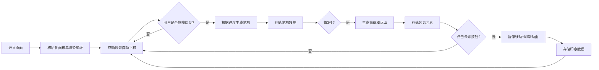

## 1. 产品概述

「光绢画轴」是一款基于 Web 的交互式数字卷轴画应用，用户可通过鼠标/手指在横向卷轴上持续绘制，系统自动生成山水意境装饰元素，营造"人在画中游"的沉浸式创作体验。

- 核心目的：提供一种宁静雅致的数字绘画体验，将传统中国山水画意境与现代交互技术融合
- 目标用户：喜欢艺术创作、追求沉浸式体验的普通用户和艺术爱好者
- 市场价值：填补交互式传统绘画体验的空白，可用于艺术教育、休闲娱乐、文化传播等场景

## 2. 核心功能

### 2.1 功能模块

1. **主画布区域**：笔触绘制、卷轴平移、装饰元素渲染、印章展示
2. **题跋条**：顶部半透明横幅，动态显示当前"画境"名称
3. **朱印按钮**：右下角交互按钮，用于放置红色印章

### 2.2 功能细节

| 页面名称 | 模块名称 | 功能描述 |
|---------|---------|---------|
| 主画布 | 笔触绘制 | 鼠标/触摸拖拽生成宽窄可变笔触，速度低于50px/s时宽20px深墨色，高于150px/s时宽4px青绿色，中间12px渐变 |
| 主画布 | 卷轴平移 | 背景以20px/s横向移动，所有元素随之平移，移出左侧边界自动移除 |
| 主画布 | 装饰生成 | 每3秒根据最近笔触特征生成花瓣（上方飘落）和远山剪影（下方平移） |
| 主画布 | 朱印功能 | 点击按钮暂停移动1秒，放大动画呈现方形朱红印章，随卷轴移动永不消失 |
| 题跋条 | 画境显示 | 根据最近10秒平均笔触速度动态显示"沉幽之境"/"空灵之境"/"远岫之境"，带滚动动画 |
| 界面 | 整体布局 | 全屏卷轴，四周30px留白，宣纸纤维纹理背景 |

## 3. 核心流程

用户进入页面 → 呈现横向卷轴画布和自动移动背景 → 用户按下并拖拽鼠标/手指绘制笔触 → 系统实时根据速度调整笔触粗细和颜色 → 每3秒系统自动生成花瓣与远山装饰 → 用户点击"朱印"按钮放置印章 → 所有元素随卷轴向左移动 → 持续绘制直至满意

## 4. 用户界面设计

### 4.1 设计风格

- **主色调**：宣纸米色（背景）、深墨色（慢速笔触）、青绿色（快速笔触）、朱红色（印章）、墨灰色（远山）、淡粉/青绿（花瓣）
- **色彩系统**：
  - 深墨：HSL(0, 0%, 30%)
  - 青绿：HSL(160, 60%, 70%)
  - 朱红：HSL(0, 100%, 50%)
  - 远山：墨灰色，透明度0.15
  - 浅米色题跋条：透明度0.3
- **字体**：纤细仿宋风格字体，颜色深灰 HSL(0, 0%, 40%)
- **布局**：全屏卷轴式，四周30px留白，顶部题跋条（高50px），右下角朱印按钮
- **整体气质**：宁静、雅致、古朴、留白充裕、意境悠远

### 4.2 页面设计概览

| 页面名称 | 模块名称 | UI元素 |
|---------|---------|---------|
| 主画布 | 宣纸背景 | 微弱纤维纹理、浅米色、四边留白30px |
| 主画布 | 笔触系统 | 贝塞尔曲线平滑、粗细渐变、颜色渐变、透明度自然 |
| 主画布 | 花瓣装饰 | 圆形、直径8-15px、半透明、飘落+旋转动画 |
| 主画布 | 远山剪影 | 不规则锯齿状曲线、底部固定、向左平移 |
| 主画布 | 印章元素 | 方形32px、朱红色、篆体纹理、放大动画出现 |
| 题跋条 | 标题区域 | 半透明浅米色、高50px、文字居中+缓慢滚动动画 |
| 交互区 | 朱印按钮 | 右下角、方形朱红样式、点击有反馈 |

### 4.3 响应性与性能

- **桌面端优先**：全屏布局，支持鼠标拖拽绘制
- **移动端适配**：支持触摸事件，响应式画布尺寸
- **性能目标**：60FPS稳定帧率，绘制响应延迟≤16ms
- **性能优化**：动态元素超过150个时自动合并透明度<0.05的旧笔触
