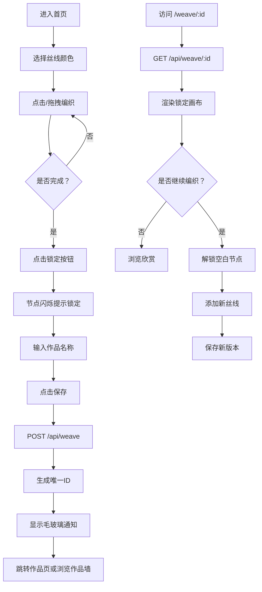

## 1. 产品概述

「织梦工坊」是一个在线手工艺社区的交互式编织工具，让用户通过拖拽虚拟丝线在数字织布机上创作独特的纹理图案，保存为可复用的数字织锦并分享协作。

- 核心目标：提供沉浸式的数字编织体验，激发用户创意，支持作品协作
- 目标用户：手工艺爱好者、数字艺术家、社区创作者
- 产品价值：将传统织布工艺数字化，降低创作门槛，支持多人协作编织

## 2. 核心功能

### 2.1 用户角色

| 角色 | 注册方式 | 核心权限 |
|------|----------|----------|
| 访客用户 | 无需注册 | 浏览作品墙、浏览他人作品、进行编织创作 |

### 2.2 功能模块

1. **首页**：织布机画布、颜色选择面板、工具栏、最近作品展示墙
2. **作品页面**：锁定状态画布展示、继续编织功能、版本管理

### 2.3 页面详情

| 页面名称 | 模块名称 | 功能描述 |
|-----------|-------------|---------------------|
| 首页 | 织布机画布 | 10x14网格画布，支持点击着色和拖拽连线 |
| 首页 | 颜色选择面板 | 8种预设丝线色（HSL间隔分布），点击选中 |
| 首页 | 工具栏 | 锁定按钮、保存按钮、继续编织按钮 |
| 首页 | 作品展示墙 | 展示最近20个作品缩略图，点击跳转 |
| 作品页面 | 锁定画布 | 渲染已保存的编织图案，锁定原始内容 |
| 作品页面 | 继续编织 | 解锁空白节点，支持添加新丝线并保存新版本 |
| 全局 | 保存弹窗 | 命名输入框、生成唯一URL、毛玻璃通知卡片 |

## 3. 核心流程

### 3.1 创作与保存流程

1. 用户进入首页，看到空白织布机画布
2. 选择丝线颜色，点击节点着色，与相邻节点自动生成线段
3. 从已着色节点拖拽到另一节点（≤5格），生成渐变线段
4. 点击锁定按钮，所有已编织内容锁定，节点闪烁提示
5. 弹出命名输入框，用户命名后点击保存
6. 后端生成7位随机ID，返回唯一URL
7. 页面弹出毛玻璃通知卡片，显示作品链接

### 3.2 协作编织流程

1. 用户通过URL进入作品页面
2. 渲染锁定状态的画布（原始内容不可编辑）
3. 点击"继续编织"按钮，解锁空白节点
4. 用户在空白区域添加新丝线
5. 再次保存时生成新版本（ID后缀-v2、-v3...）

### 3.3 Mermaid 流程图

## 4. 用户界面设计

### 4.1 设计风格

- **主色调**：深靛蓝 #1a1a2e（背景）、暗金色 #8B7D3C（网格线）、灰白色 #e0e0e0（文字）
- **点缀色**：8种丝线色（HSL：色相0°-315°，每45°一色，饱和度70%，亮度85%）
  - 0°: HSL(0, 70%, 85%) - 淡红
  - 45°: HSL(45, 70%, 85%) - 淡橙
  - 90°: HSL(90, 70%, 85%) - 淡黄绿
  - 135°: HSL(135, 70%, 85%) - 淡绿
  - 180°: HSL(180, 70%, 85%) - 淡青
  - 225°: HSL(225, 70%, 85%) - 淡蓝
  - 270°: HSL(270, 70%, 85%) - 淡紫
  - 315°: HSL(315, 70%, 85%) - 淡粉紫
- **按钮风格**：圆角矩形，圆角8px，柔和内阴影，悬停背景加深
- **字体**：无衬线字体，优雅现代感
- **布局**：全屏无滚动，画布居中，四周留白，工具栏置于画布下方
- **图标风格**：简洁线条风，锁定图标、保存图标使用线性风格
- **圆角规范**：所有UI元素统一使用8px圆角

### 4.2 页面设计概览

| 页面名称 | 模块名称 | UI元素 |
|-----------|-------------|-------------|
| 首页 | 页面标题 | 居中顶部，大号字体「织梦工坊」，暗金色 |
| 首页 | 织布机画布 | 居中显示，10x14网格（40px/格），暗金半透明网格线 |
| 首页 | 节点样式 | 默认4px灰色圆点，着色后显示对应丝线色，锁定后叠加灰色锁定图标 |
| 首页 | 颜色选择面板 | 2行4列圆形色块（Ø30px），选中白色圆环（2px），悬停外发光（8px） |
| 首页 | 工具栏按钮 | 圆角矩形（#2d2d44→#3d3d55），文字#e0e0e0，锁定/保存并排 |
| 首页 | 保存弹窗 | 毛玻璃效果（rgba(255,255,255,0.1)，模糊10px），输入框+按钮 |
| 首页 | 作品展示墙 | 底部20个缩略图（80×112px Canvas），圆角卡片，悬停轻微放大 |
| 作品页面 | 继续编织按钮 | 与工具栏同风格，位于画布下方 |

### 4.3 响应式设计

- 桌面端优先设计，画布固定像素尺寸
- 中等屏幕：等比缩放画布，工具栏自适应排列
- 小屏幕：单列布局，画布横向滚动或缩小适配

### 4.4 动画与交互

- 锁定生效：节点透明度 1→0.7→1，持续0.5秒
- 颜色选中：白色圆环淡入，色块外发光
- 悬停效果：按钮背景色平滑过渡（150ms），缩略图轻微上浮放大
- 保存成功：通知卡片从下方滑入，显示链接可一键复制
