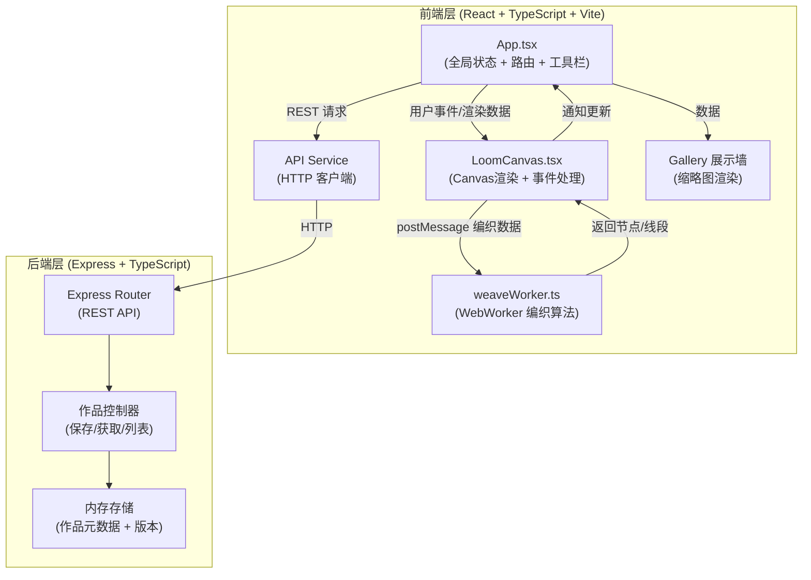
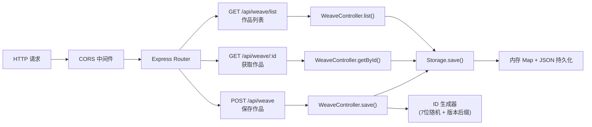
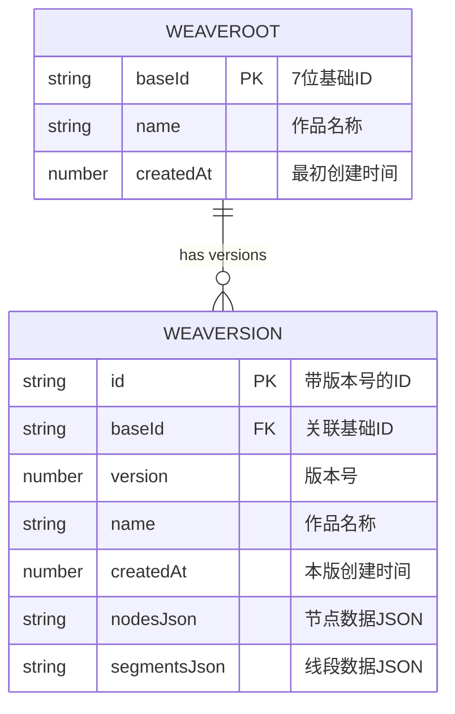

## 1. 架构设计



## 2. 技术说明

### 2.1 前端技术栈
- **框架**：React@18 + TypeScript
- **构建工具**：Vite@5
- **状态管理**：React useState/useReducer（轻量场景，无需额外库）
- **路由**：基于路径解析的轻量路由（hash路由或简单 pathname 解析）
- **渲染**：HTML5 Canvas API
- **多线程**：Web Worker（编织计算专用）
- **样式**：原生 CSS + CSS 变量

### 2.2 后端技术栈
- **框架**：Express@4 + TypeScript
- **CORS 中间件**：cors@2
- **ID 生成**：uuid@9（或自定义 7 位随机 ID 算法）
- **数据存储**：内存存储（开发期）+ JSON 文件持久化
- **类型共享**：前后端共享 TypeScript 类型定义

### 2.3 性能约束实现方案
- **Canvas 渲染 ≥55fps**：使用 requestAnimationFrame，脏矩形优化，仅重绘变化区域
- **WebWorker ≤16ms**：HSL 线性插值 O(1)，线段-网格交点检测 O(n)，批量计算
- **API ≤200ms**：内存级读写，无需数据库 IO

## 3. 路由定义

| 路由 | 用途 |
|-------|---------|
| `/` | 首页：空白画布 + 工具栏 + 最近20作品展示墙 |
| `/weave/:id` | 作品页：锁定画布 + 继续编织按钮 |
| `/weave/:id-vN` | 作品版本页：渲染第N版本 |

## 4. API 定义

### 4.1 数据类型定义

```typescript
// 节点位置
export interface GridNode {
  row: number;       // 0-9 (纬线10行)
  col: number;       // 0-13 (经线14列)
  color: string | null;   // HSL色值或null(未着色)
  colorOpacity: number;   // 透明度 0.6 / 1.0
  locked: boolean;        // 是否锁定
}

// 编织线段
export interface WeaveSegment {
  id: string;
  startRow: number;
  startCol: number;
  endRow: number;
  endCol: number;
  startColor: string;
  endColor: string;
  thickness: number;      // 默认3px
}

// 作品数据
export interface WeaveData {
  nodes: GridNode[];
  segments: WeaveSegment[];
}

// 作品元数据
export interface WeaveWork {
  id: string;             // 7位ID或带版本号
  baseId: string;         // 基础ID（不含版本）
  version: number;        // 版本号 1,2,3...
  name: string;           // 用户命名
  createdAt: number;      // 创建时间戳
  data: WeaveData;        // 编织数据
}

// 保存请求
export interface SaveWeaveRequest {
  name: string;
  data: WeaveData;
  baseId?: string;        // 协作时提供
  version?: number;       // 当前版本号
}

// 保存响应
export interface SaveWeaveResponse {
  success: boolean;
  id: string;
  url: string;            // /weave/:id
}

// 缩略图信息
export interface WeaveThumbnail {
  id: string;
  name: string;
  data: WeaveData;
  createdAt: number;
}
```

### 4.2 API 端点

| 方法 | 路径 | 请求体 | 响应 | 说明 |
|------|------|--------|------|------|
| POST | `/api/weave` | SaveWeaveRequest | SaveWeaveResponse | 保存新作品或新版本 |
| GET | `/api/weave/:id` | - | WeaveWork \| {error: string} | 获取指定作品数据 |
| GET | `/api/weave/list?limit=20` | - | WeaveThumbnail[] | 获取最近作品列表（用于展示墙） |

## 5. 服务端架构图



## 6. 数据模型

### 6.1 ER 模型



### 6.2 存储结构（内存）

```typescript
// 作品存储（按基础ID索引）
const weaveStore: Map<string, WeaveWork[]> = new Map();
// 基础ID索引，便于快速查找
const idIndex: Map<string, string> = new Map(); // fullId -> baseId
```

### 6.3 ID 生成算法

```
基础ID: 7位随机字符 [a-z0-9]，例如 abc1234
版本ID: 基础ID + "-v" + 版本号，例如 abc1234-v2
```

## 7. 文件结构与调用关系

```
.
├── package.json              # 依赖声明 + 启动脚本
├── vite.config.js            # Vite 配置 + API代理到3001
├── tsconfig.json             # TS严格模式 ES2020
├── index.html                # 入口页面，全屏#1a1a2e
├── src/
│   ├── App.tsx               # 主组件：状态/路由/工具栏/展示墙
│   │   ├── 使用 LoomCanvas 组件
│   │   ├── 调用 weaveWorker API
│   │   ├── 调用后端 REST API
│   │   └── 路由解析 / 和 /weave/:id
│   ├── components/
│   │   └── LoomCanvas.tsx    # Canvas组件
│   │       ├── 绘制网格/节点/线段
│   │       ├── 监听鼠标事件
│   │       └── postMessage 给 Worker
│   ├── utils/
│   │   ├── weaveWorker.ts    # WebWorker 编织算法
│   │   │   ├── 节点连接检测
│   │   │   ├── HSL 颜色线性插值
│   │   │   └── 线段-网格交点检测
│   │   ├── api.ts            # API 调用封装
│   │   └── types.ts          # 共享类型定义
│   └── styles/
│       └── global.css        # 全局样式
└── server/
    └── index.ts              # Express 后端
        ├── POST /api/weave
        ├── GET /api/weave/:id
        ├── GET /api/weave/list
        └── 内存存储 + 持久化
```

**数据流向：**
```
用户鼠标 → LoomCanvas事件 → postMessage → weaveWorker计算
                                            ↓
                App更新状态 ← 渲染通知 ← Worker返回
                    ↓
          保存时 → API POST → Express → 内存存储
          加载时 → API GET → Express → 返回作品数据 → LoomCanvas渲染
```

## 8. 核心算法设计

### 8.1 HSL 颜色插值（Worker 中执行）
- 起点色 HSL(h1,s1,l1)，终点色 HSL(h2,s2,l2)
- 对 t∈[0,1]：h=lerp(h1,h2,t), s=lerp(s1,s2,t), l=lerp(l1,l2,t)
- 沿线段每像素计算色值形成渐变

### 8.2 相邻节点连接（Worker 中执行）
- 点击节点着色后，检查上下左右4邻居
- 邻居已着色 → 生成线段，两端颜色为节点色
- 邻居未着色 → 不生成

### 8.3 线段-网格交点检测（Worker 中执行）
- 输入：起点(row1,col1)，终点(row2,col2)
- 距离验证：曼哈顿距离 ≤5
- 使用 Bresenham 或线性采样获取线段经过的所有网格点
- 经过点着色为起点色，透明度0.6

### 8.4 锁定检测（Canvas 中执行）
- 点击/拖拽前检查节点 locked 状态
- 锁定节点不可交互，跳过事件处理
