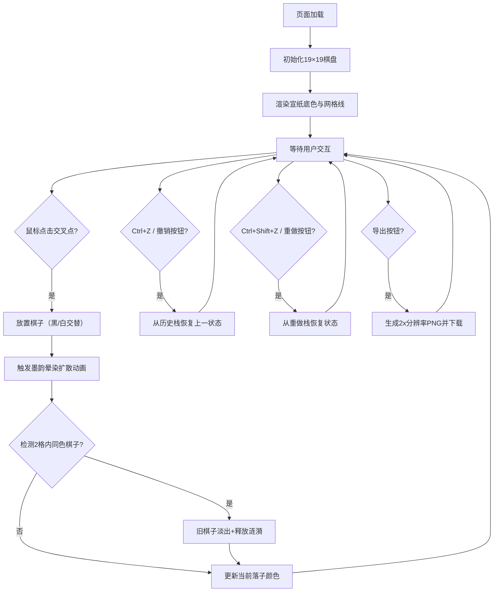

## 1. 产品概述
墨韵棋局是一款将传统围棋与东方水墨画艺术融合的交互式Web应用。用户通过在19×19的围棋棋盘上落子，每一枚棋子都会像墨水滴落在宣纸上一般向四周晕染扩散，最终形成一幅独特的水墨画作品，支持一键导出分享。

- 面向所有对围棋、水墨画艺术或创意交互感兴趣的普通用户与艺术爱好者
- 核心价值：将传统游戏转化为艺术创作工具，降低水墨画创作门槛，提供即时的创作成就感

## 2. 核心功能

### 2.1 用户角色
| 角色 | 注册方式 | 核心权限 |
|------|----------|----------|
| 普通用户 | 无需注册，直接使用 | 落子创作、撤销/重做、导出图片 |

### 2.2 功能模块
1. **主画布区**：全屏Canvas渲染19×19围棋棋盘，支持鼠标点击落子，实时渲染棋子与墨韵晕染效果
2. **交互控制**：
   - 黑白交替落子，黑棋先手
   - 鼠标悬停预览（半透明圆形光标，颜色为当前落子色）
   - 键盘快捷键：Ctrl+Z撤销、Ctrl+Shift+Z重做
3. **浮动工具栏**：页面顶部半透明工具栏，包含撤销、重做、导出三个操作按钮
4. **墨韵渲染引擎**：
   - 落子触发1.5秒晕染扩散动画（半径5→25像素）
   - 晕染叠加使用lighter混合模式，产生水墨交融效果
   - 同色相邻棋子触发0.5秒消散动画与涟漪释放
5. **作品导出**：2x分辨率PNG导出，包含棋盘、棋子与全部晕染效果

### 2.3 页面详情
| 页面名称 | 模块名称 | 功能描述 |
|----------|----------|----------|
| 主页面 | 棋盘画布 | 19×19标准围棋棋盘，网格间距30px，宣纸底色，点击交叉点落子 |
| 主页面 | 浮动工具栏 | 顶部居中，撤销/重做/导出按钮，宋体字体，悬停加深，按压缩放动画 |
| 主页面 | 墨韵晕染层 | 独立渲染层，lighter混合模式，渐变径向扩散 |
| 主页面 | 棋子渲染 | 半径12px圆形，带左上1/3处高光，黑棋高光透明度0.2，白棋0.5 |
| 主页面 | 历史栈管理 | 最多20步撤销/重做记录，完整恢复棋盘与晕染状态 |

## 3. 核心流程
用户打开页面后，看到铺满视口的宣纸色围棋棋盘。鼠标悬停在网格交叉点上时显示当前落子色的半透明预览光标。点击落子后，棋子出现并从中心向外晕染扩散（1.5秒，5px→25px），黑棋晕染为深灰到灰白，白棋为浅灰到米白。若新落子与2格内的同色旧棋子相邻，旧棋子淡出消散（0.5秒）并释放浅色涟漪。用户可通过快捷键或工具栏按钮撤销/重做。完成创作后点击导出按钮，浏览器自动下载2x分辨率的PNG水墨画作品。

## 4. 用户界面设计

### 4.1 设计风格
- **设计主题**：东方水墨、宣纸质感、禅意简约
- **主色调**：宣纸色（HSL: 40°, 10%, 95%），半透明深灰网格线（0°, 0%, 40%, 0.3）
- **辅助色**：墨黑（棋子）、素白（棋子）、深灰渐变晕染、米白渐变晕染
- **按钮风格**：半透明浮层（40°, 5%, 98%, 0.7），圆角8px，宋体文字，悬停加深至0.9透明度，点击0.1秒缩放至0.95倍
- **字体**：正文与按钮使用宋体（SimSun / Songti SC）
- **布局**：全屏Canvas单页应用，工具栏顶部居中浮动，画布居中显示

### 4.2 页面设计概览
| 页面名称 | 模块名称 | UI元素 |
|----------|----------|--------|
| 主页面 | 画布背景 | 宣纸HSL底色（40°,10%,95%），全屏覆盖 |
| 主页面 | 棋盘网格 | 19×19细线，半透明深灰，居中布局，边缘留有边距 |
| 主页面 | 棋子 | 圆形半径12px，径向渐变填充，左上高光 |
| 主页面 | 晕染效果 | 径向渐变，从棋子边缘向四周由深到浅透明化，lighter叠加 |
| 主页面 | 工具栏 | 顶部居中，圆角半透明白，3个按钮水平排列，间距16px，内边距12px 20px |
| 主页面 | 悬停光标 | 18px半透圆形，随鼠标移动，离开棋盘区域消失 |

### 4.3 响应性
- 桌面端优先设计，全屏Canvas自适应视口尺寸
- 棋盘在Canvas内居中，保持正方形比例，最小边距32px
- 当视口小于棋盘最小尺寸（18×30 + 2×32 = 604px）时，棋盘等比缩小

### 4.4 性能指标
- 棋盘渲染帧率：稳定60FPS（requestAnimationFrame驱动）
- 晕染动画刷新率：≥30FPS
- 导出图片生成时间：≤1秒（离屏Canvas绘制，2x缩放）
- 历史记录深度：最多20步（内存优化，仅保存差异状态）
