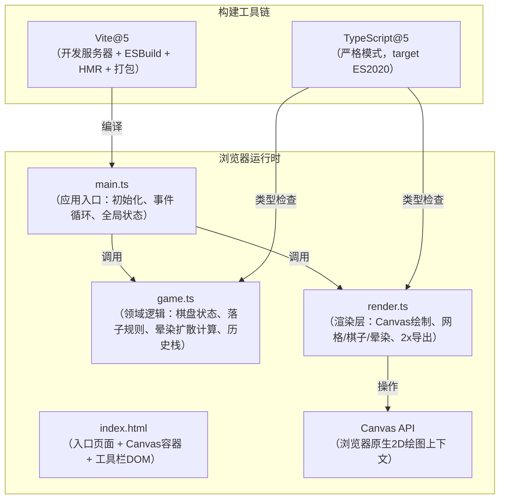

## 1. 架构设计



## 2. 技术描述
- **前端**：原生 TypeScript + Canvas 2D API，无UI框架，直接操作DOM与Canvas
- **构建工具**：Vite 5.x（开发服务器端口3000，HMR热更新，Rollup打包）
- **语言**：TypeScript 5.x（strict: true，target: ES2020，module: ESNext）
- **包管理**：npm
- **后端**：无（纯前端应用，所有逻辑运行在浏览器端）
- **数据库**：无（历史状态保存在内存栈中，最大20条）

## 3. 模块职责与边界

### 3.1 文件结构
| 文件 | 职责 | 关键导出 |
|------|------|----------|
| `index.html` | 页面骨架，全屏Canvas元素，顶部工具栏DOM结构，内联基础样式 | — |
| `package.json` | 依赖（vite、typescript），脚本（dev、build、preview） | — |
| `vite.config.js` | Vite配置（server.port=3000） | — |
| `tsconfig.json` | TypeScript严格模式配置（strict、target=ES2020） | — |
| `src/main.ts` | 应用启动：Canvas尺寸设置、DPR适配、事件绑定（点击/移动/键盘）、requestAnimationFrame主循环、串联game与render | `init()`、主循环闭包 |
| `src/game.ts` | 纯逻辑无DOM：Board数据结构、Stone类、InkDiffusion类、Ripple类、History栈（undo/redo）、落子校验（吸附最近交叉点）、同色相邻检测、晕染时间推进 | `GameEngine` 类 |
| `src/render.ts` | 纯绘制无逻辑：宣纸背景、网格线、棋子（含高光）、晕染径向渐变（lighter合成）、涟漪、自定义悬停光标、离屏Canvas 2x导出PNG | `Renderer` 类 |

### 3.2 核心数据模型（TypeScript接口）
```typescript
// 棋盘坐标（交叉点索引，0-18）
interface GridPos { row: number; col: number; }

// 棋子颜色
type StoneColor = 'black' | 'white';

// 棋子实体
interface Stone {
  pos: GridPos;
  color: StoneColor;
  createdAt: number;        // 落子时间戳(ms)
  fadeStartedAt?: number;   // 消散开始时间，undefined表示正常
  opacity: number;          // 0-1，消散动画中变化
}

// 墨韵晕染
interface InkDiffusion {
  centerX: number;          // 画布像素坐标
  centerY: number;
  color: StoneColor;
  startTime: number;        // 动画开始时间
  duration: number;         // 1500ms
  startRadius: number;      // 5px
  endRadius: number;        // 25px
}

// 消散涟漪
interface Ripple {
  centerX: number;
  centerY: number;
  color: StoneColor;
  startTime: number;
  duration: number;         // 500ms
  startRadius: number;      // 10px
  endRadius: number;        // 40px
}

// 历史快照（用于撤销/重做）
interface HistorySnapshot {
  stones: Stone[];
  diffusions: InkDiffusion[];
  ripples: Ripple[];
  nextColor: StoneColor;
}
```

### 3.3 关键算法
1. **坐标吸附**：鼠标坐标 → 最近交叉点索引 `col = round((mouseX - offsetX) / cellSize)`，判断距离是否 ≤ 吸附阈值（cellSize/2）
2. **晕染半径插值**：线性插值 `r(t) = startR + (endR - startR) * clamp((now-startTime)/duration, 0, 1)`
3. **同色相邻检测**：遍历已有棋子，计算曼哈顿距离 `Δrow + Δcol ≤ 2` 且颜色相同，则标记为消散
4. **历史栈管理**：落子前快照push到undoStack，undo时pop到redoStack，新落子清空redoStack；超出20条丢弃最早记录
5. **2x导出**：创建离屏Canvas = `actualCSSPixel × 2`，设置ctx.scale(2,2)，按渲染流程重绘后 `toDataURL('image/png')` 触发下载

## 4. 渲染管线（每帧执行顺序）
```
1. clearRect() 清空画布
2. 绘制宣纸背景（纯色填充，预留纹理扩展点）
3. 绘制棋盘网格线（38条横线+38条竖线，半透明深灰）
4. 设置 globalCompositeOperation = 'lighter'
5. 遍历所有 InkDiffusion，按当前插值半径绘制径向渐变
6. 设置 globalCompositeOperation = 'source-over'
7. 遍历所有 Stone，按当前opacity绘制棋子+高光
8. 设置 globalCompositeOperation = 'lighter'
9. 遍历所有 Ripple，按当前插值半径绘制描边渐变圆环
10. 设置 globalCompositeOperation = 'source-over'
11. 绘制鼠标悬停预览光标（如果在有效交叉点范围内）
```

## 5. 性能优化策略
- **脏矩形渲染**：未来可扩展（当前全屏重绘因19×19规模小已足够60FPS）
- **动画对象池化**：InkDiffusion与Ripple动画结束后（超过duration）自动从数组中移除，释放引用
- **DPR适配**：Canvas像素尺寸 = CSS尺寸 × `window.devicePixelRatio`，ctx.scale(DPR, DPR) 保证高清屏清晰
- **历史快照浅复制优化**：Stones数组的元素为不可变对象引用，快照只需复制数组引用而非深拷贝；但opacity等可变字段需注意——消散动画中不允许撤销/重做中间状态（仅在落子瞬间产生快照），因此快照时数组元素状态已稳定
- **导出性能**：离屏Canvas一次绘制，避免逐像素操作；`canvas.toBlob` 异步生成PNG，不阻塞主线程（若浏览器支持）

## 6. 浏览器兼容性
- 目标浏览器：最新版 Chrome / Edge / Firefox / Safari
- 依赖API：Canvas 2D（`createRadialGradient`、`globalCompositeOperation='lighter'`）、`requestAnimationFrame`、`navigator.clipboard`（不使用）、ES2020语法（BigInt不使用）
- 降级策略：无降级需求，按现代浏览器标准开发
