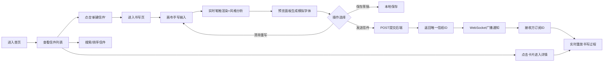

## 1. 产品概述

时光信笺是一款带有复古美感的手写书信Web应用，让用户在虚拟复古信纸上通过手写笔触创作信件，系统自动识别笔迹风格并生成个性化字体预览，支持信件的实时书写重放与分享传递。

- 核心价值：通过数字手写技术还原书信书写的温度，结合笔迹风格分析与实时重放，打造沉浸式的书信体验
- 目标用户：喜欢手写、追求仪式感的年轻用户，书信爱好者，远程通信的亲友

## 2. 核心特性

### 2.1 用户角色
| 角色 | 注册方式 | 核心权限 |
|------|----------|----------|
| 普通用户 | 匿名使用（本地存储 + 临时用户ID） | 书写信件、发送接收、管理历史笔迹、导出数据 |

### 2.2 功能模块
1. **首页（信件列表）**：信件卡片网格、搜索框、排序切换、新建信件入口
2. **书写页**：手写画布区、笔迹风格预览面板、工具栏（清除/发送/保存）
3. **信件详情/重放页**：信纸画布重放书写过程、显示笔迹特征信息
4. **设置页**：历史笔迹特征列表、删除/导出操作、样式推荐

### 2.3 页面详情
| 页面名称 | 模块名称 | 功能描述 |
|----------|----------|----------|
| 首页 | 信件卡片网格 | 展示所有已保存信件，信封样式拟物化设计，悬停上浮动效 |
| 首页 | 搜索排序栏 | 关键词搜索（按ID）、按发送时间排序（最新优先） |
| 书写页 | 手写画布 | 墨蓝笔触、动态宽度、墨水渗化毛边、亚麻纹理背景 |
| 书写页 | 笔迹预览侧栏 | 实时生成笔迹风格模拟字体段落，打字机逐字动画 |
| 书写页 | 工具栏 | 清除画布、保存草稿、发送信件（生成唯一ID） |
| 详情页 | 重放画布 | 按原始速度和路径重放书写过程，1:1时间缩放 |
| 设置页 | 笔迹历史管理 | 最近5次笔迹特征记录，支持删除和JSON导出 |

## 3. 核心流程

## 4. 用户界面设计

### 4.1 设计风格
- **主色调**：米白背景 #F5F0E8，深褐强调 #3A2E20，墨蓝笔触（HSL 210° 60% 40%），酒红悬停 #5C2E1A
- **辅助色**：暖黄文字 #F5D6A8，浅茶边框 #C4A882
- **按钮样式**：圆角矩形 border-radius: 8px，背景由深褐渐变为酒红的悬停过渡（0.3秒）
- **字体**：标题采用衬线复古字体（Georgia/Noto Serif SC），正文采用易读衬线体
- **布局风格**：桌面端双栏布局（书写区80% + 侧栏300px），信纸居中浅茶色边框
- **纹理细节**：信纸亚麻纹理（CSS重复半透明叠加），信封拟物化阴影 2px 2px 8px rgba(0,0,0,0.1)

### 4.2 页面设计概览
| 页面名称 | 模块名称 | UI元素 |
|----------|----------|--------|
| 首页 | 顶部导航 | 复古标题、设置入口、新建按钮、搜索框 |
| 首页 | 信件卡片 | 缩略图、ID、时间、信封阴影、悬停上浮3px |
| 书写页 | 画布区域 | 居中80%宽度、1px #C4A882边框、亚麻纹理背景 |
| 书写页 | 右侧预览面板 | 固定宽300px、深褐背景#3A2E20、暖黄文字#F5D6A8 |
| 书写页 | 底部工具栏 | 清除/保存/发送按钮组、状态提示 |
| 详情页 | 重放画布 | 同书写页样式、播放控制条、进度指示 |
| 设置页 | 笔迹列表 | 卡片式记录、特征数据展示、删除/导出按钮 |

### 4.3 响应式设计
- 桌面优先设计，断点 768px
- <768px：右侧预览面板折叠为底部可滑动抽屉
- 触控设备优化：画布支持触控笔事件，按钮尺寸适当放大
- 画布区域在小屏上占宽100%，边框保留

### 4.4 音效与动效
- 发送成功：短促纸面摩擦声（Web Audio API生成44100Hz采样率噪声脉冲，0.2秒）
- 打字机预览：每字0.2秒逐字显示动画
- 卡片悬停：向上浮动3px + 阴影加深过渡0.2秒
- 页面切换：淡入淡出过渡效果
