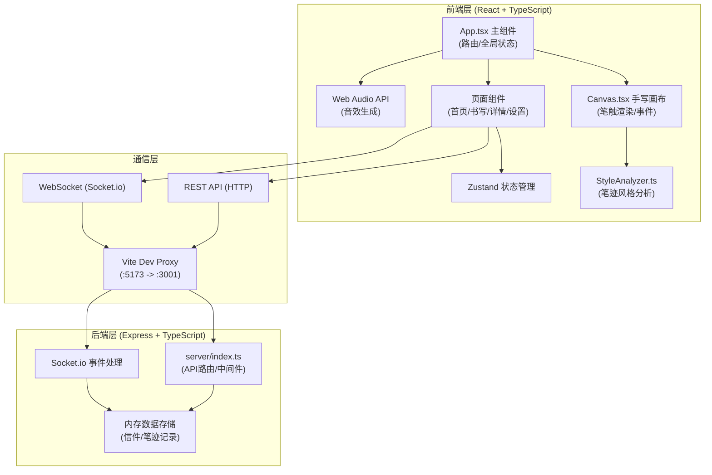
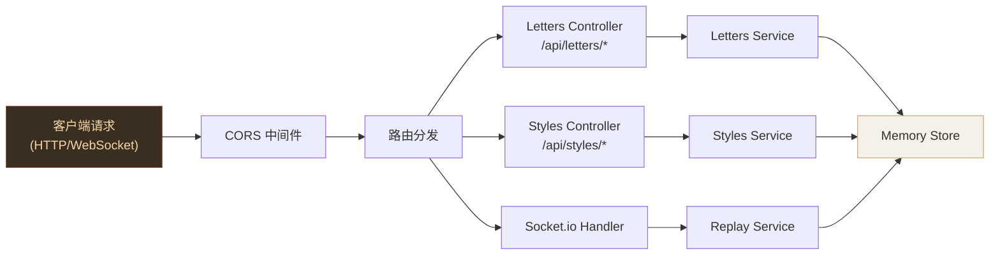
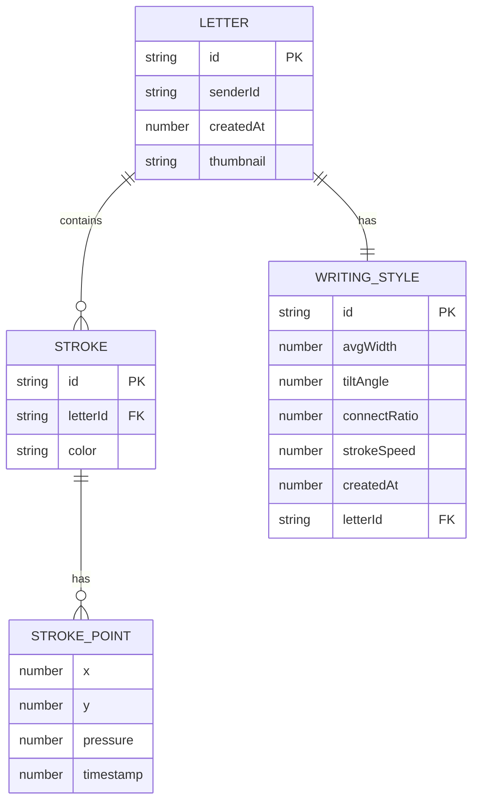

## 1. 架构设计



## 2. 技术选型说明
- **前端框架**：React@18 + TypeScript@5，目标ES2020，严格模式
- **构建工具**：Vite@5，开发端口5173，代理后端至3001
- **路由管理**：react-router-dom@6
- **状态管理**：zustand（轻量全局状态）
- **画布渲染**：原生HTML5 Canvas API + requestAnimationFrame（60fps）
- **实时通信**：socket.io-client@4（前端）+ socket.io@4（后端）
- **后端框架**：Express@4 + TypeScript
- **数据存储**：内存存储（开发阶段）+ localStorage（客户端缓存笔迹历史）
- **项目初始化**：使用 react-express-ts 模板（vite-init）

## 3. 路由定义

| 路由路径 | 页面组件 | 功能说明 |
|----------|----------|----------|
| `/` | `HomePage` | 信件列表首页，搜索排序，新建入口 |
| `/write` | `WritePage` | 手写书写页，画布+预览侧栏 |
| `/letter/:id` | `LetterDetailPage` | 信件详情页，重放书写过程 |
| `/settings` | `SettingsPage` | 笔迹历史管理、导出删除 |

## 4. API接口定义

```typescript
// 笔触路径点
interface StrokePoint {
  x: number;
  y: number;
  pressure: number; // 模拟压力 0-1 (由速度计算)
  timestamp: number; // ms时间戳
}

// 单段笔触
interface Stroke {
  id: string;
  points: StrokePoint[]; // 限制单段 <= 500 点
  color: string; // hsl(210, 60%, 40%)
}

// 笔迹特征
interface WritingStyle {
  avgWidth: number;        // 平均笔画宽度 (2-10px)
  tiltAngle: number;       // 倾斜角度 (-45° ~ 45°)
  connectRatio: number;    // 连笔比例 0-1
  strokeSpeed: number;     // 平均书写速度 px/s
  createdAt: number;
}

// 信件数据
interface Letter {
  id: string;              // 唯一ID (ULID格式)
  strokes: Stroke[];       // 所有笔触数据
  style: WritingStyle;     // 笔迹特征
  senderId: string;        // 发送者临时ID
  createdAt: number;       // 发送时间戳
  thumbnail?: string;      // 缩略图 dataURL
}

// 请求/响应类型
interface CreateLetterRequest {
  strokes: Stroke[];
  style: WritingStyle;
  senderId: string;
  thumbnail?: string;
}

interface CreateLetterResponse {
  success: boolean;
  letterId: string;
  letter: Letter;
}

interface LetterListResponse {
  letters: Letter[];
  total: number;
}

interface WritingStyleHistoryItem {
  id: string;
  style: WritingStyle;
  letterId?: string;
  createdAt: number;
}
```

### REST API 端点

| 方法 | 路径 | 请求体 | 响应 | 说明 |
|------|------|--------|------|------|
| `GET` | `/api/letters` | - | `LetterListResponse` | 获取信件列表（按时间倒序） |
| `GET` | `/api/letters/:id` | - | `{ letter: Letter }` | 获取单封信件详情 |
| `POST` | `/api/letters` | `CreateLetterRequest` | `CreateLetterResponse` | 保存新信件 |
| `DELETE` | `/api/letters/:id` | - | `{ success: boolean }` | 删除信件 |
| `GET` | `/api/styles` | - | `{ styles: WritingStyleHistoryItem[] }` | 获取笔迹历史（最近5条） |
| `POST` | `/api/styles` | `{ style: WritingStyle }` | `{ id: string }` | 保存笔迹特征 |
| `DELETE` | `/api/styles/:id` | - | `{ success: boolean }` | 删除笔迹记录 |

### Socket.io 事件

| 事件名 | 方向 | 数据 | 说明 |
|--------|------|------|------|
| `subscribe:letter` | 客户端→服务端 | `{ letterId: string }` | 订阅信件重放 |
| `unsubscribe:letter` | 客户端→服务端 | `{ letterId: string }` | 取消订阅 |
| `letter:created` | 服务端→客户端 | `{ letter: Letter }` | 新信件创建广播 |
| `stroke:replay` | 服务端→客户端 | `{ letterId, stroke: Stroke, index: number }` | 逐段笔触重放流 |
| `stroke:replay:complete` | 服务端→客户端 | `{ letterId: string }` | 重放完成通知 |

## 5. 服务器架构图



## 6. 数据模型

### 6.1 数据模型ER图



### 6.2 内存存储结构（TypeScript）

```typescript
// 内存存储（server/store.ts）
interface ServerStore {
  letters: Map<string, Letter>;
  styles: Map<string, WritingStyleHistoryItem>;
  userStyles: Map<string, string[]>; // senderId -> styleIds (最多5条)
}

// 初始化
const store: ServerStore = {
  letters: new Map(),
  styles: new Map(),
  userStyles: new Map(),
};
```
