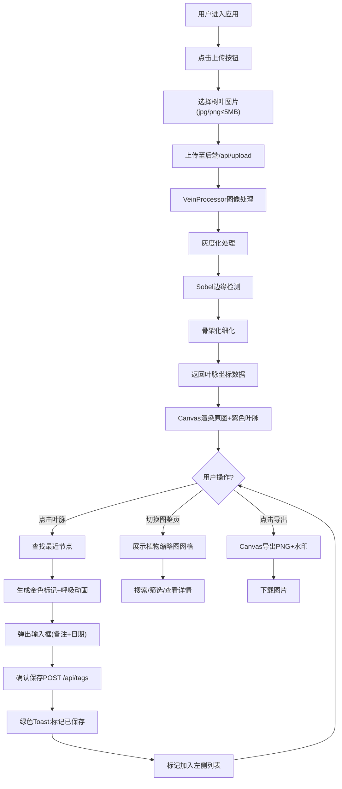

## 1. 产品概述

「叶脉时光」是一个面向自然观察爱好者的互动Web工具，用户可上传真实树叶照片，系统自动提取叶脉纹路并支持在脉络节点上标记观察日期与备注，形成可动态生长的数字植物图鉴。

- 目标用户：自然观察爱好者、植物学研究者、学生及教育工作者
- 产品价值：将物理世界的植物观察数字化，通过叶脉艺术化呈现与时空标记，打造沉浸式的自然记录体验

## 2. 核心功能

### 2.1 用户角色
| 角色 | 注册方式 | 核心权限 |
|------|----------|----------|
| 普通用户 | 无需注册（本地存储） | 上传图片、添加/查看标记、浏览图鉴、导出分享 |

### 2.2 功能模块
1. **叶脉提取画布页**：图片上传、Canvas图像处理、叶脉渲染、节点标记、标记列表
2. **植物图鉴页**：缩略图展示、搜索筛选、详情查看
3. **导出分享**：PNG导出、水印添加

### 2.3 页面详情
| 页面名称 | 模块名称 | 功能描述 |
|----------|----------|----------|
| 叶脉提取画布页 | 图片上传模块 | 支持jpg/png，最大5MB，上传触发叶脉提取 |
| 叶脉提取画布页 | 叶脉可视化模块 | 灰度化→Sobel边缘检测→骨架化，紫色半透明细线覆盖 |
| 叶脉提取画布页 | 节点标记模块 | 点击叶脉附近生成金色标记点，弹窗输入备注与日期 |
| 叶脉提取画布页 | 标记列表模块 | 左侧卡片式列表，按日期倒序，点击跳转高亮 |
| 叶脉提取画布页 | 页签切换模块 | 画布页/图鉴页切换 |
| 植物图鉴页 | 缩略图网格 | 200x200圆角缩略图，阴影效果，按时间排序 |
| 植物图鉴页 | 搜索筛选 | 按植物种类名称搜索 |
| 植物图鉴页 | 详情弹窗 | 显示全图与所有标记点 |
| 全局 | Toast反馈 | 成功/失败提示，叶脉提取闪光动画 |
| 全局 | 导出模块 | PNG导出含水印「叶脉时光」+日期 |

## 3. 核心流程

用户上传树叶照片 → 系统灰度化处理 → Sobel边缘检测 → 骨架化提取叶脉 → 紫色线条覆盖原图 → 用户点击叶脉节点 → 弹出输入框(备注+日期) → 保存金色标记点 → 标记加入左侧列表 → 切换至图鉴页浏览 / 导出PNG

## 4. 用户界面设计

### 4.1 设计风格
- **主色调**：深绿色 HSL(140, 30%, 20%) 背景
- **辅助色**：米白色 HSL(40, 10%, 95%) 文字/控件
- **叶脉色**：紫色 HSL(270, 60%, 80%) 半透明细线（线宽1.5px）
- **标记色**：金色圆点（半径6px，呼吸动画）
- **点缀色**：暖橙色 HSL(30, 80%, 85%) 上传按钮
- **分隔线**：浅绿色 HSL(140, 40%, 80%) 渐变
- **按钮风格**：圆形上传按钮（48px→悬停52px），圆角12px卡片
- **字体**：使用"Noto Serif SC"衬线字体（标题）+"Noto Sans SC"无衬线（正文）
- **布局风格**：左侧可折叠侧边栏(280px) + 右侧Canvas主区域，桌面优先
- **图标**：lucide-react线性图标风格

### 4.2 页面设计概览
| 页面名称 | 模块名称 | UI元素 |
|----------|----------|---------|
| 叶脉提取画布页 | 全局布局 | 深绿背景、280px侧边栏(浅绿渐变分隔)、右上圆形上传按钮 |
| 叶脉提取画布页 | 标记列表卡片 | 高60px、半透明白(0.1)、圆角12px、hover→透明度0.3+高64px、ease-out 300ms |
| 叶脉提取画布页 | 标记点 | 金色6px半径、0.8s淡入呼吸、确认后光波扩散0.5s、高亮时白色边框闪烁 |
| 叶脉提取画布页 | 闪光动画 | 叶脉完成时白色遮罩中心扩散0.3s |
| 植物图鉴页 | 缩略图网格 | 200x200正方形、圆角8px、阴影、按上传时间排序 |
| 全局 | Toast | 右上绿色成功/红色失败提示、持续2s |

### 4.3 响应式
- 采用桌面优先（Desktop-first）设计
- 断点768px：宽度小于时侧边栏自动收起为汉堡菜单
- Canvas区域自适应剩余宽度，保持图像比例
- 平板(768-1024px)：侧边栏可折叠，标记列表卡片紧凑化

### 4.4 动画规范
- 所有过渡：CSS ease-out 300ms
- 标记点呼吸：0.8s循环淡入
- 光波扩散：0.5s后消失
- 闪光遮罩：0.3s中心扩散
- Toast提示：2秒后淡出
