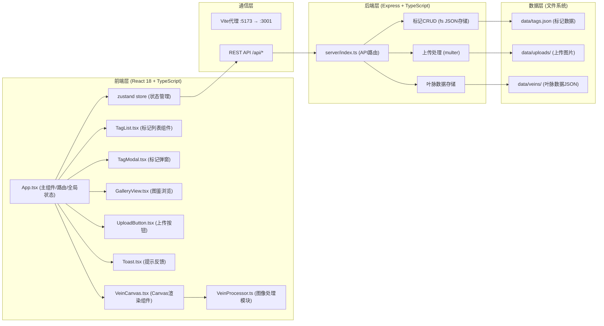
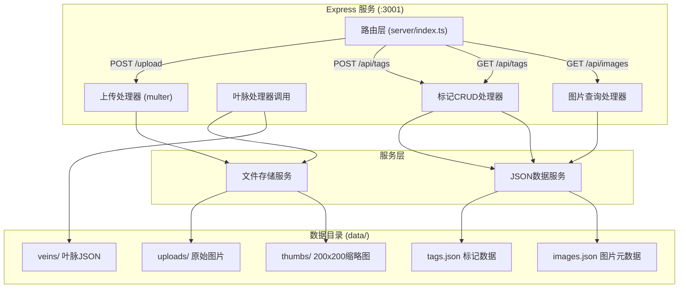
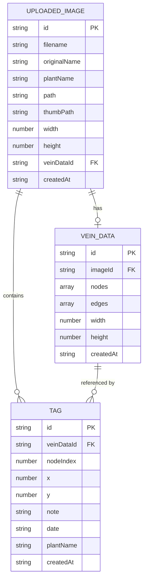

## 1. 架构设计



## 2. 技术说明

- **前端框架**：React 18 + TypeScript (target ES2020, 严格模式)
- **构建工具**：Vite（前端端口5173，代理/api到3001）
- **状态管理**：zustand（轻量级全局状态）
- **后端框架**：Express 4 + TypeScript（端口3001）
- **文件上传**：multer（jpg/png，最大5MB）
- **图像处理**：Canvas 2D API + 自定义算法（前端处理，3秒内完成）
- **数据存储**：JSON文件（tags.json、uploads目录、veins目录）
- **路由**：React Router DOM（两个页签视图）
- **图标**：lucide-react

## 3. 路由定义

| 路由 | 用途 |
|------|------|
| / | 默认页（叶脉画布视图） |
| /canvas | 叶脉提取与标记画布页 |
| /gallery | 植物图鉴浏览页 |

## 4. API 定义

### TypeScript 类型定义

```typescript
// 叶脉节点坐标
interface VeinNode {
  x: number;
  y: number;
}

// 叶脉连线数据
interface VeinData {
  id: string;
  imageId: string;
  nodes: VeinNode[];
  edges: [number, number][]; // [nodeIndexA, nodeIndexB]
  width: number;
  height: number;
  createdAt: string;
}

// 标记点
interface Tag {
  id: string;
  veinDataId: string;
  nodeIndex: number;
  x: number;
  y: number;
  note: string;
  date: string; // ISO date
  plantName: string;
  createdAt: string;
}

// 上传图片记录
interface UploadedImage {
  id: string;
  filename: string;
  originalName: string;
  plantName: string;
  path: string;
  thumbPath: string;
  width: number;
  height: number;
  veinDataId: string;
  createdAt: string;
}

// API响应
interface ApiResponse<T> {
  success: boolean;
  data?: T;
  error?: string;
}
```

### API接口

| 方法 | 路径 | 请求 | 响应 | 说明 |
|------|------|------|------|------|
| POST | /api/upload | multipart/form-data: file(图片), plantName(可选) | ApiResponse<{imageId, veinDataId, veinData, imageUrl}> | 上传图片并提取叶脉 |
| GET | /api/images | - | ApiResponse<UploadedImage[]> | 获取所有上传图片列表 |
| GET | /api/images/:id | - | ApiResponse<UploadedImage & {veinData: VeinData, tags: Tag[]}> | 获取单张图片详情+叶脉+标记 |
| GET | /api/tags | query: imageId?, plantName?, dateFrom?, dateTo? | ApiResponse<Tag[]> | 获取标记列表（支持筛选） |
| POST | /api/tags | body: {veinDataId, nodeIndex, x, y, note, date, plantName} | ApiResponse<Tag> | 保存新标记 |
| DELETE | /api/tags/:id | - | ApiResponse<{id: string}> | 删除标记 |
| GET | /api/veins/:id | - | ApiResponse<VeinData> | 获取叶脉数据 |

## 5. 服务端架构图



## 6. 数据模型

### 6.1 实体关系图



### 6.2 JSON文件结构

**data/images.json:**
```json
{
  "images": [
    {
      "id": "uuid-xxx",
      "filename": "abc123.jpg",
      "originalName": "枫树叶.jpg",
      "plantName": "枫树",
      "path": "/uploads/abc123.jpg",
      "thumbPath": "/uploads/thumbs/abc123.jpg",
      "width": 1920,
      "height": 1080,
      "veinDataId": "vein-uuid-xxx",
      "createdAt": "2026-06-09T10:00:00.000Z"
    }
  ]
}
```

**data/tags.json:**
```json
{
  "tags": [
    {
      "id": "tag-uuid-xxx",
      "veinDataId": "vein-uuid-xxx",
      "nodeIndex": 42,
      "x": 456,
      "y": 789,
      "note": "观察到叶脉分叉处有微小虫洞",
      "date": "2026-06-09",
      "plantName": "枫树",
      "createdAt": "2026-06-09T10:30:00.000Z"
    }
  ]
}
```

**data/veins/{id}.json:**
```json
{
  "id": "vein-uuid-xxx",
  "imageId": "uuid-xxx",
  "nodes": [
    {"x": 100, "y": 200},
    {"x": 105, "y": 210}
  ],
  "edges": [[0, 1], [1, 2]],
  "width": 1920,
  "height": 1080,
  "createdAt": "2026-06-09T10:00:05.000Z"
}
```

## 7. 文件结构与调用关系

```
auto298/
├── package.json                    # 项目依赖与脚本
├── vite.config.js                  # Vite配置 + API代理
├── tsconfig.json                   # TS严格模式配置
├── index.html                      # 入口HTML + 全局样式
├── src/
│   ├── App.tsx                     # 主组件：路由+全局状态+布局
│   │   ├── 调用 VeinProcessor.processImage()
│   │   ├── 调用 useStore (zustand)
│   │   └── 渲染 VeinCanvas / TagList / GalleryView
│   ├── main.tsx                    # React入口
│   ├── VeinProcessor.ts            # 图像处理：灰度→Sobel→骨架化
│   │   ├── toGrayScale()           # 灰度化
│   │   ├── sobelEdgeDetect()       # Sobel边缘检测
│   │   ├── skeletonize()           # 骨架化细化
│   │   └── extractVeinGraph()      # 提取节点与连线
│   ├── store.ts                    # zustand全局状态
│   ├── components/
│   │   ├── VeinCanvas.tsx          # Canvas渲染：原图+叶脉+标记点
│   │   │   └── 接收 imageData, veinData, tags → 绘制
│   │   ├── TagList.tsx             # 左侧标记列表卡片
│   │   ├── TagModal.tsx            # 标记输入弹窗(备注+日期)
│   │   ├── GalleryView.tsx         # 图鉴缩略图网格+搜索
│   │   ├── ImageDetailModal.tsx    # 图片详情弹窗
│   │   ├── UploadButton.tsx        # 右上圆形上传按钮
│   │   ├── Toast.tsx               # Toast提示组件
│   │   ├── Sidebar.tsx             # 可折叠侧边栏
│   │   └── TabSwitcher.tsx         # 页签切换
│   ├── services/
│   │   └── api.ts                  # API请求封装(fetch)
│   ├── types/
│   │   └── index.ts                # 共享类型定义
│   └── styles/
│       └── globals.css             # 全局样式+动画关键帧
├── server/
│   └── index.ts                    # Express后端：API路由
│       ├── POST /api/upload        → multer + 调用VeinProcessor + 存JSON
│       ├── GET  /api/images        → 读images.json
│       ├── GET  /api/images/:id    → 读image + vein + tags
│       ├── GET  /api/tags          → 读tags.json(筛选)
│       ├── POST /api/tags          → 写tags.json
│       └── DELETE /api/tags/:id    → 删tags.json
└── data/                           # JSON数据存储目录
    ├── images.json
    ├── tags.json
    ├── uploads/                    # 原始图片
    ├── thumbs/                     # 200x200缩略图
    └── veins/                      # 叶脉数据JSON
```

## 8. 性能优化策略

- **图像处理性能**：使用ImageData直接像素操作，分块处理，Worker化可选
- **Canvas渲染**：使用requestAnimationFrame，标记点分层离屏Canvas缓存
- **状态管理**：zustand浅比较，避免不必要重渲染
- **图片缩略图**：后端预生成200x200缩略图，减少图鉴页加载
- **懒加载**：图鉴页缩略图IntersectionObserver懒加载
