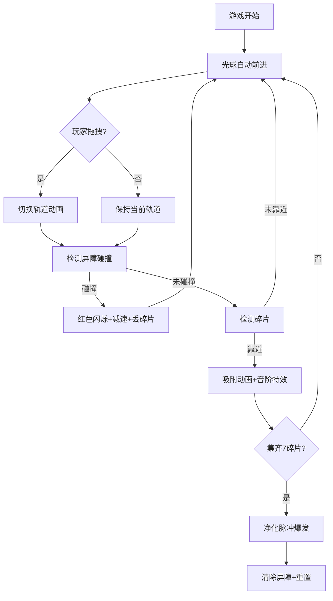

## 1. 产品概述

「音轨捕手」是一款霓虹赛博朋克风格的音乐节奏躲避类网页游戏。玩家操控一枚由声波驱动的光球，在光轨构成的立体网格上穿梭，躲避暗色声波屏障并收集音符碎片，集齐7个音阶后触发净化脉冲。

- 目标用户：休闲游戏爱好者、音乐游戏玩家、赛博朋克美学追随者
- 产品价值：通过视觉与听觉的沉浸式结合，提供轻松治愈的碎片化娱乐体验

## 2. 核心特性

### 2.1 功能模块
1. **主游戏场景**：光轨系统、光球控制、屏障生成、碎片分布、粒子特效
2. **UI交互层**：音符收集进度、实时得分、背景氛围、响应式适配
3. **音效系统**：Web Audio API合成音阶音效、碰撞/收集反馈音

### 2.2 页面详情
| 页面名称 | 模块名称 | 功能描述 |
|---------|---------|----------|
| 游戏主界面 | 光轨系统 | 生成多条平行光轨，支持轨道切换平滑动效与切换光带 |
| 游戏主界面 | 光球控制 | 鼠标/触摸拖拽切换轨道，自动前进，碰撞反馈 |
| 游戏主界面 | 屏障系统 | 从两端生成向中心挤压的深紫色声波屏障 |
| 游戏主界面 | 碎片系统 | 7种音阶碎片分布于轨道，自动吸附与收集特效 |
| 游戏主界面 | 脉冲净化 | 集齐7碎片触发彩色脉冲，清除大范围屏障 |
| 游戏主界面 | UI面板 | 右上角音符进度图标、右下角实时得分 |
| 游戏主界面 | 粒子系统 | 各类交互触发的粒子爆发特效 |

## 3. 核心流程

玩家进入游戏后，光球自动沿当前光轨前进。玩家通过按住鼠标左键上下拖拽切换轨道，躲避从两端挤压的暗色屏障，同时收集轨道上的音符碎片。每收集一个碎片触发对应音阶的视觉与听觉反馈，集齐7个碎片后光球爆发净化脉冲，清除屏幕上的屏障并获得高分奖励。游戏全程自动计分，每秒+1分，收集碎片额外+50分。

## 4. 用户界面设计

### 4.1 设计风格
- **主色调**：深蓝(#0a0e27) → 深紫(#1a0a2e) 垂直渐变背景
- **强调色**：亮青色(#00ffff)光轨、白色光球、渐变蓝色光晕
- **屏障色**：半透明深紫(#3d0066)矩形，边缘脉动光晕
- **碎片色**：7个音阶对应红橙黄绿青蓝紫彩虹色系
- **字体**：选用Orbitron（科技感）或Share Tech Mono（赛博朋克风）作为数字显示字体
- **视觉风格**：霓虹发光、半透明叠加、粒子消散、脉冲光晕

### 4.2 页面设计概览
| 页面名称 | 模块名称 | UI元素 |
|---------|---------|--------|
| 游戏主界面 | 背景氛围 | 垂直渐变 + 扫描线纹理 + 微弱星点粒子 |
| 游戏主界面 | 光轨渲染 | 亮青色半透明线条 + 外发光模糊效果 |
| 游戏主界面 | 光球渲染 | 白色核心 + 渐变蓝色光晕(外层透明度0.3) |
| 游戏主界面 | 屏障渲染 | 深紫半透明矩形 + 脉动边缘光晕 |
| 游戏主界面 | 碎片渲染 | 彩色小圆点 + 呼吸缩放动画 |
| 游戏主界面 | 音符进度 | 右上角7个圆形图标，灰色→彩色点亮 |
| 游戏主界面 | 得分显示 | 右下角白色描边数字，科技感字体 |

### 4.3 响应式适配
- **桌面端**：画布居中显示，轨道间距60px，光球速度150px/s，鼠标拖拽操作
- **移动端**：轨道间距缩小50%(30px)，速度缩小50%(75px/s)，支持触摸拖拽，画布自适应屏幕宽度
- **适配策略**：通过window.innerWidth判断设备类型，所有数值按比例缩放

### 4.4 性能要求
- 帧率：全程60FPS不掉帧
- 粒子：峰值不超过200个，超出自动回收最早的粒子
- 内存：对象池管理屏障、碎片、粒子对象，避免频繁GC
