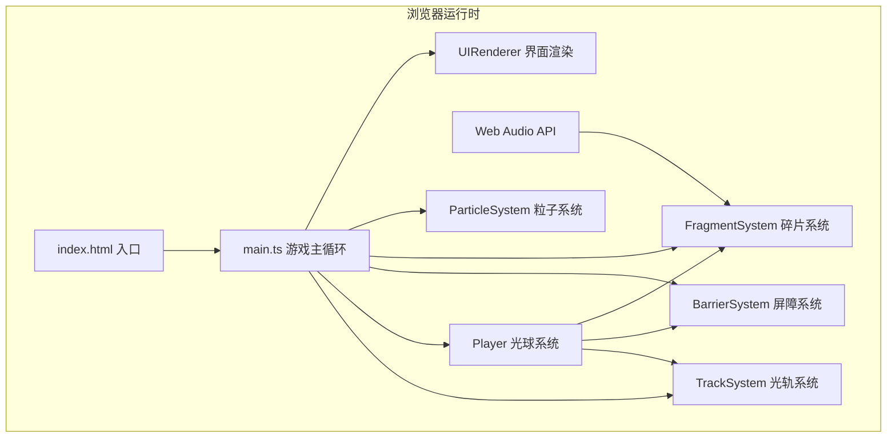

## 1. 架构设计



## 2. 技术描述

- **前端框架**：原生 TypeScript + Canvas 2D API（无React/Vue，追求极致性能）
- **构建工具**：Vite@5
- **类型系统**：TypeScript@5（严格模式，target ES2020）
- **音效**：Web Audio API（OscillatorNode + GainNode 合成电子音阶）
- **动画**：requestAnimationFrame 主循环，deltaTime 时间步长

## 3. 文件组织

| 文件路径 | 职责定义 |
|---------|---------|
| package.json | 依赖声明：vite、typescript；脚本：dev/build |
| tsconfig.json | TS配置：strict模式，ES2020 target，模块解析bundler |
| vite.config.js | Vite配置：开发端口3000，构建优化 |
| index.html | 入口HTML：Canvas容器、视口meta、加载main.ts |
| src/main.ts | 游戏主循环：初始化Canvas、系统调度、RAF循环、UI渲染 |
| src/track.ts | 光轨系统：轨道生成、切换逻辑、平滑动效、轨道绑定方法 |
| src/player.ts | 光球系统：输入处理、轨道切换动画、碰撞检测、粒子爆发 |
| src/barrier.ts | 屏障系统：屏障生成、移动逻辑、碰撞检测、移除回收 |
| src/fragment.ts | 碎片系统：碎片分布、吸附逻辑、收集动画、音效触发 |
| src/types.ts | 类型定义：全局接口、枚举、常量（内嵌于各文件中） |

## 4. 核心类型定义

```typescript
// 轨道系统
interface Track {
  index: number;
  y: number;
  xStart: number;
  xEnd: number;
}

// 光球
interface PlayerState {
  x: number;
  y: number;
  currentTrack: number;
  targetTrack: number;
  switchProgress: number; // 0~1 切换动画进度
  speed: number;           // 基础速度 150px/s
  speedMultiplier: number; // 减速倍率
  hitFlashTime: number;    // 碰撞闪烁剩余时间
  collectedNotes: Set<number>; // 已收集的音阶 0~6
  score: number;
}

// 屏障
interface Barrier {
  id: number;
  x: number;
  y: number;
  trackIndex: number;
  direction: 1 | -1;   // 1=从左向右挤压，-1=从右向左
  width: number;
  height: number;
  speed: number;       // 80px/s
  pulsePhase: number;  // 脉动相位
  active: boolean;
}

// 碎片
interface Fragment {
  id: number;
  x: number;
  y: number;
  trackIndex: number;
  noteIndex: number;   // 0~6 对应7音阶
  color: string;
  frequency: number;   // 对应频率
  collected: boolean;
  collectProgress: number; // 吸附动画进度 0~1
  pulsePhase: number;
}

// 粒子
interface Particle {
  x: number;
  y: number;
  vx: number;
  vy: number;
  life: number;
  maxLife: number;
  size: number;
  color: string;
}
```

## 5. 核心算法

### 5.1 轨道切换动画
```
当前Y = 当前轨道Y + (目标轨道Y - 当前轨道Y) × easeOutCubic(progress)
progress = min(1, elapsedTime / 0.3s)
easeOutCubic(t) = 1 - (1-t)³
```

### 5.2 碰撞检测 (AABB)
```
光球包围盒 = [x-12, y-12, 24, 24]
屏障包围盒 = [x, y, 200, 40]
碰撞判定 = AABB交集非空
```

### 5.3 碎片吸附
```
距离 = sqrt((px-fx)² + (py-fy)²)
若距离 < 60px：启动吸附动画
位置插值 = lerp(碎片位置, 光球位置, easeInQuad(progress))
```

### 5.4 净化脉冲
```
脉冲半径 = max(画布宽, 画布高) × 1.2
脉冲扩张时间 = 0.8秒
屏障距离脉冲中心 < 当前半径 → 销毁屏障
```

## 6. 性能优化策略

1. **对象池模式**：屏障、碎片、粒子均使用对象池复用，避免频繁GC
2. **脏矩形渲染**：UI面板采用局部重绘（非每帧全部重绘）
3. **离屏Canvas**：背景渐变、光轨静态内容预渲染到离屏Canvas
4. **粒子上限**：全局粒子池最大200个，超出采用FIFO淘汰
5. **分层渲染**：背景层 → 光轨层 → 屏障层 → 碎片层 → 光球层 → UI层，顺序绘制
6. **节流优化**：屏障生成间隔≥1.5s，碎片生成间隔≥2s
