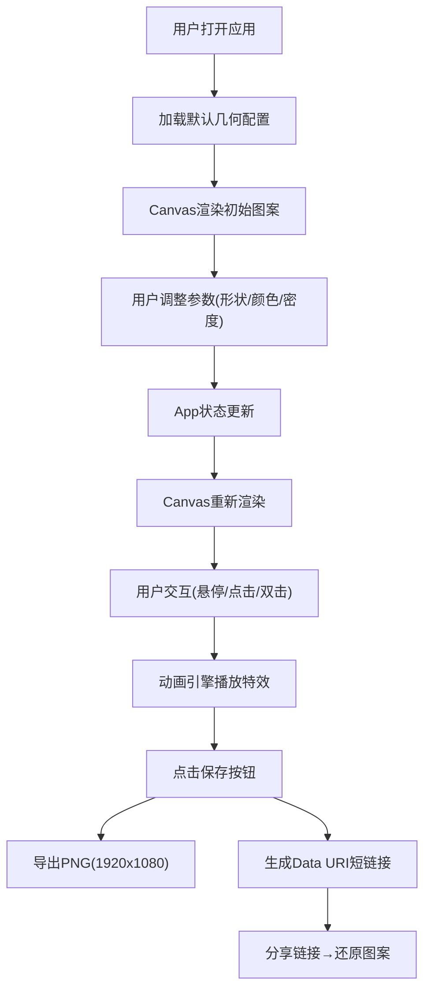

## 1. 产品概述
「碎彩几何」是一款面向极简主义和几何艺术爱好者的浏览器端动态壁纸生成工具。用户可自定义基础几何形状，系统以美学规律拼接成马赛克风格图案，并支持悬停拆散、点击爆裂、双击重组等交互式视觉体验。
- 核心价值：让普通用户无需专业设计技能，即可创作永不重复的万花筒式几何艺术壁纸
- 目标用户：数字艺术家、壁纸爱好者、极简主义追求者、创意工作者

## 2. 核心功能

### 2.1 用户角色
| 角色 | 注册方式 | 核心权限 |
|------|----------|----------|
| 创作者用户 | 无需注册，直接使用 | 自定义几何参数、交互操作、保存与分享图案 |

### 2.2 功能模块
1. **主画布区域**：Canvas 2D渲染动态几何图形、粒子特效、重组动画
2. **侧边控制面板**：形状选择、颜色主题切换、密度调节、保存导出
3. **几何生成引擎**：网格排列算法、颜色渐变/互补计算
4. **交互系统**：悬停高亮、点击爆裂、双击全屏重组
5. **导出分享模块**：PNG导出(1920x1080)、Data URI短链接分享还原

### 2.3 页面详情
| 页面名称 | 模块名称 | 功能描述 |
|-----------|-------------|---------------------|
| 主应用页 | 几何图案生成 | 根据形状类型和密度生成网格状马赛克图案，相邻形状颜色互补或渐变(色相差30-60度) |
| 主应用页 | 悬停交互 | 鼠标悬停形状时外移+旋转15-30度(0.3秒)，饱和度提升20% |
| 主应用页 | 点击爆裂 | 单击形状爆裂为8-12个随机飞散粒子(半径2-4px)，1.5秒淡出消失 |
| 主应用页 | 双击重组 | 双击空白区域触发全屏贝塞尔曲线回归重组动画(0.5-2秒错落) |
| 主应用页 | 颜色主题切换 | 极光/熔岩/深海/花海4种预设主题，0.8秒平滑颜色过渡 |
| 主应用页 | 保存导出 | 导出1920x1080 PNG，生成Data URI短链接可还原完整图案状态 |

## 3. 核心流程
用户打开应用 → 默认显示初始几何图案 → 通过侧边栏调整形状/颜色/密度参数 → 实时预览Canvas渲染效果 → 悬停/点击/双击进行交互 → 满意后点击保存按钮导出PNG → 复制短链接分享 → 他人打开链接自动还原图案

## 4. 用户界面设计

### 4.1 设计风格
- **主色调**：深色背景#0D0D0D，突出几何形状鲜艳色彩
- **按钮样式**：圆角8px，悬停上浮translateY(-2px) + 阴影加深
- **字体**：等宽字体monospace，14px标签文字颜色#CCCCCC
- **布局风格**：左侧固定280px毛玻璃Sidebar(#1A1A1A+blur10px)，右侧自适应Canvas
- **视觉细节**：Canvas极淡网格辅助线(#FFFFFF 0.05透明度，50px间距)，交互时短暂变半透明

### 4.2 页面设计概述
| 页面名称 | 模块名称 | UI元素 |
|-----------|-------------|-------------|
| 主应用页 | Sidebar控制面板 | 毛玻璃半透明背景、圆角控件、等宽字体标签、主题色联动微调 |
| 主应用页 | Canvas画布区域 | 深色背景、淡网格辅助线、动态几何体、粒子特效、所有动画ease-in-out缓动 |

### 4.3 响应式
桌面端优先设计，Sidebar固定宽度280px，Canvas区域自适应填充。Canvas内部使用固定逻辑坐标(1920x1080导出尺寸)，CSS缩放适配视口。

### 4.4 性能约束
- Canvas渲染帧率≥55fps
- 同时存在飞散粒子≤60个
- 拆散/重组动画不阻塞主线程
- 几何生成算法≤50ms
