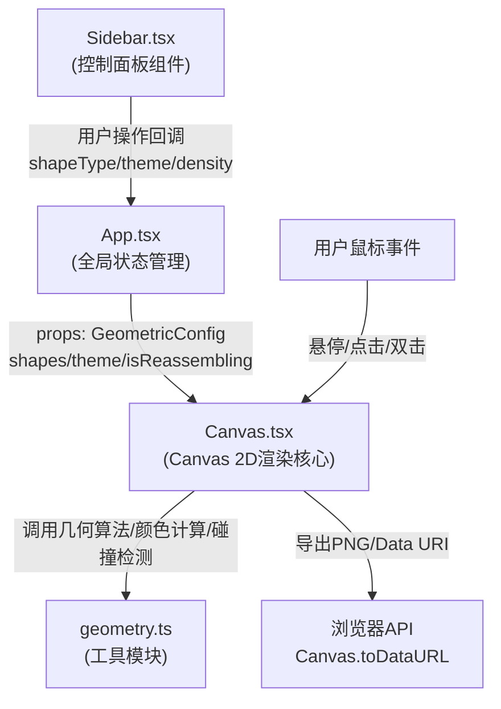

## 1. 架构设计


## 2. 技术描述
- **前端框架**：React 18 + TypeScript (严格模式)
- **构建工具**：Vite + @vitejs/plugin-react
- **渲染引擎**：Canvas 2D API（原生，无需额外图形库）
- **状态管理**：React Hooks (useState/useRef/useEffect/useCallback)
- **动画方案**：requestAnimationFrame循环 + 自定义缓动函数(ease-in-out)
- **不引入额外依赖**：保持轻量，使用原生Canvas实现所有特效

## 3. 核心数据结构定义
```typescript
// 形状类型
type ShapeType = 'triangle' | 'square' | 'hexagon';

// 颜色主题
type ColorTheme = 'aurora' | 'lava' | 'deepsea' | 'flower';

// 单个几何形状数据
interface GeometricShape {
  id: string;
  type: ShapeType;
  gridX: number;      // 网格X坐标
  gridY: number;      // 网格Y坐标
  baseX: number;      // 原始渲染X
  baseY: number;      // 原始渲染Y
  currentX: number;   // 当前渲染X
  currentY: number;   // 当前渲染Y
  size: number;       // 形状尺寸
  rotation: number;   // 当前旋转角度(弧度)
  baseRotation: number; // 原始旋转角度
  baseColor: HSLColor;  // 原始HSL颜色
  currentColor: HSLColor; // 当前HSL颜色(动画过渡)
  targetColor: HSLColor;  // 目标HSL颜色
  isHovered: boolean;  // 悬停状态
  isExploded: boolean; // 是否已爆裂
  reassembling: boolean; // 是否在重组中
  reassembleStartTime: number; // 重组开始时间
  reassembleDuration: number;  // 重组持续时间
}

// HSL颜色模型(便于色相渐变/饱和度调整)
interface HSLColor {
  h: number; // 色相0-360
  s: number; // 饱和度0-100
  l: number; // 亮度0-100
  a: number; // 透明度0-1
}

// 飞散粒子
interface Particle {
  id: string;
  x: number;
  y: number;
  vx: number;
  vy: number;
  radius: number;
  color: HSLColor;
  startTime: number;
  duration: number;
  shapeId: string; // 所属形状ID(用于重组)
}

// 全局几何配置
interface GeometricConfig {
  shapeTypes: ShapeType[];  // 启用的形状类型(可多选)
  colorTheme: ColorTheme;   // 当前颜色主题
  density: number;          // 密度1-10 → 每行列3-12个
}

// 主题色阶定义
interface ThemePalette {
  name: ColorTheme;
  baseHues: number[];  // 基础色相位(2-3个基准色)
  minSaturation: number;
  maxSaturation: number;
  minLightness: number;
  maxLightness: number;
  sidebarTint: number; // Sidebar背景色相位偏转
}
```

## 4. 文件职责与调用关系

| 文件路径 | 职责 | 被调用方/调用方 |
|----------|------|-----------------|
| `src/App.tsx` | 全局状态管理(GeometricConfig)，整合Sidebar与Canvas，处理回调 | 调用Sidebar/Canvas组件；接收Sidebar回调更新配置并传给Canvas |
| `src/components/Sidebar.tsx` | 渲染形状选择/颜色主题/密度滑块/保存按钮，触发回调 | 被App渲染；通过props回调通知App状态变更 |
| `src/components/Canvas.tsx` | Canvas 2D渲染核心：动画循环、鼠标交互、形状绘制、粒子管理、导出功能 | 被App渲染；调用geometry.ts工具；调用Canvas原生API |
| `src/utils/geometry.ts` | 几何算法：形状顶点计算、HSL颜色运算、碰撞检测(点-多边形)、贝塞尔曲线插值 | 被Canvas.tsx调用(纯函数，无副作用) |
| `index.html` | 入口HTML，挂载#root容器，全局基础样式 | Vite构建入口 |
| `vite.config.js` | Vite构建配置，启用React插件 | Vite读取 |
| `tsconfig.json` | TypeScript严格模式配置 | tsc/Vite读取 |
| `package.json` | 依赖声明与dev启动脚本 | npm读取 |

## 5. 数据流向

**参数设置流**：
用户操作Sidebar控件 → Sidebar触发onChange回调 → App更新GeometricConfig状态 → 以props传递给Canvas → Canvas调用geometry生成新shapes数组 → requestAnimationFrame重绘

**悬停交互流**：
鼠标移动 → Canvas的mousemove事件 → 遍历shapes调用pointInShape检测 → 命中则设置isHovered=true → 动画循环中插值计算currentX/Y/rotation/saturation → 渲染高亮效果

**点击爆裂流**：
单击shape → 创建8-12个Particle(随机方向初速度) → 加入particles数组(若>60则移除最早的) → 标记shape.isExploded=true(不再绘制主形状) → 动画循环中更新粒子位置并渐变透明度至0

**双击重组流**：
双击空白区域 → 遍历所有shapes设置reassembling=true + 随机startTime/duration(0.5-2s) → 动画循环中按进度调用cubicBezier插值恢复baseX/Y/baseRotation/baseColor → 重置isExploded并清空关联particles

**颜色过渡流**：
切换主题 → 为每个shape计算新targetColor → 动画循环中在0.8秒窗口内对baseHSL→targetHSL逐帧插值 → 平滑过渡

**导出流程**：
点击保存 → 创建临时canvas设置1920x1080 → 将所有shapes以base状态(无动画偏移)绘制到导出canvas → toDataURL('image/png') → 触发a标签download下载；同时生成包含shapes序列化状态的Data URI（压缩编码）→ 显示复制按钮
