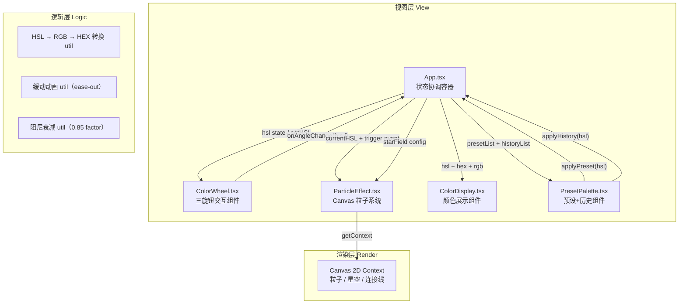

# 旋光调色盘 技术架构文档

## 1. 架构设计



---

## 2. 技术栈说明

| 层级 | 技术选型 | 版本 | 用途 |
|-----|---------|------|------|
| **前端框架** | React | ^18.3.1 | 组件化 UI |
| **语言** | TypeScript | ^5.4.0 | 严格类型检查，target ES2020 |
| **构建工具** | Vite | ^5.2.0 | 开发服务器 + 打包 |
| **Vite 插件** | @vitejs/plugin-react | ^4.2.1 | React JSX 支持 |
| **DOM** | react-dom | ^18.3.1 | 渲染到 #root |
| **渲染** | Canvas 2D API | 原生 | 粒子、星空、连接线 |
| **状态管理** | React useState/useRef | 内置 | 轻量协调，无需 zustand |
| **动画** | requestAnimationFrame | 原生 | 全部循环驱动 |
| **样式** | 原生 CSS (styles.css) | — | 全局布局、毛玻璃、响应式 |

---

## 3. 文件结构与职责

```
auto30/
├── index.html                  # 入口 HTML，挂载 #root
├── package.json                # 依赖+脚本（npm run dev）
├── vite.config.js              # Vite 配置
├── tsconfig.json               # TS 严格模式，target ES2020
└── src/
    ├── main.tsx                # React 入口，挂载 App
    ├── App.tsx                 # ★ 主组件：HSL 状态、事件协调、布局
    ├── ColorWheel.tsx          # 三圆环旋钮：拖拽旋转、阻尼、光点、角度→HSL 映射
    ├── ParticleEffect.tsx      # Canvas 覆盖层：粒子引擎 + 星空 + 连接线
    ├── ColorDisplay.tsx        # 色块 + 三组数值 + 复制按钮（含反馈动画）
    ├── PresetPalette.tsx       # 8 预设 + 12 历史色块网格
    ├── utils/
    │   ├── color.ts            # HSL↔RGB↔HEX 转换、clamp、映射函数
    │   └── animation.ts        # easeOutCubic、lerp、阻尼衰减
    └── styles.css              # 全局样式、深色渐变、响应式、毛玻璃
```

### 调用关系与数据流

| 文件 | 入参（来自） | 出参（去向） | 关键事件 |
|-----|------------|------------|---------|
| **App.tsx** | — | HSL→CW/PE/CD/Palette | onWheelRotate / onPresetClick / onHistoryClick / onCopy |
| **ColorWheel.tsx** | `h:number, s:number, l:number`（App） | `onChange(type:'h'|'s'|'l', angle:number)`（→App） | `onParticleBurst(wheelType, centerX, centerY)`（→PE via App） |
| **ParticleEffect.tsx** | `currentHSL`, `triggers[]`（App），`canvasRef` | 直接绘制到 Canvas | `spawnWheelParticles()` / `spawnPresetParticles()` / `renderStars()` / `renderConnector()` |
| **ColorDisplay.tsx** | `hex, hslStr, rgbStr`（App） | `onCopy()`（→App toast） | 复制按钮回弹动画 |
| **PresetPalette.tsx** | `history[]`（App） | `onApplyPreset(idx)` / `onApplyHistory(idx)`（→App） | 预设触发粒子事件 |
| **utils/color.ts** | — | 纯函数导出：`hslToRgb / rgbToHex / hslToHex / rgbToHsl / mapAngleToValue` | — |
| **utils/animation.ts** | — | 纯函数：`easeOutCubic / lerp / dampFactor` | — |

---

## 4. 状态模型（TypeScript 类型）

```typescript
// 核心 HSL 状态（App.tsx 持有）
interface HSL {
  h: number; // 0-360
  s: number; // 0-100
  l: number; // 0-100
}

// 单个旋钮状态（ColorWheel 内部）
interface WheelState {
  angle: number;      // 当前角度 0-360
  angularVel: number; // 角速度（阻尼用）
  isDragging: boolean;
  lastAngle: number;  // 拖拽中对比用
}

// 粒子对象（ParticleEffect）
interface Particle {
  x: number; y: number;
  vx: number; vy: number;
  life: number;        // 剩余生命 0~1
  maxLife: number;     // 总生命 ms
  size: number;
  color: string;       // rgba
  trail: {x:number;y:number}[]; // 拖尾点
}

// 星点（ParticleEffect）
interface Star {
  x: number; y: number;
  size: number;        // 1-2px
  phase: number;       // 0~2π
  period: number;      // 3000-5000 ms
  baseAlpha: number;   // 0.1-0.3
}

// 历史记录项
interface HistoryItem {
  hsl: HSL;
  hex: string;
  timestamp: number;
}
```

---

## 5. 关键算法

### 5.1 旋钮角度 ↔ 颜色维度映射

```
色相旋钮:   angle(0~360°)  →  H = angle                        （1:1）
饱和度旋钮: angle(0~360°)  →  S = clamp(angle / 360 * 100, 0-100)
明度旋钮:   angle(0~360°)  →  L = clamp(angle / 360 * 100, 0-100)
```

### 5.2 拖拽旋转计算

```
1. mousedown 在旋钮范围内 → 记录 startAngle = atan2(y-cy, x-cx)
2. mousemove → newAngle = atan2(...)，delta = newAngle - startAngle
3. wheel.angle = (prev + delta + 360) % 360，angularVel = delta
4. mouseup → 进入阻尼循环：
   while |angularVel| > 0.01:
       wheel.angle += angularVel
       angularVel *= 0.85
```

### 5.3 粒子生成规则

| 触发源 | 数量 | 初始位置 | 运动方向 | 速度 | 生命 |
|-------|------|---------|---------|------|------|
| 旋钮旋转 | 12 个均匀分布 | 旋钮圆周 | 径向向外 + 切线偏移 | 80 px/s | 2s |
| 预设点击 | 20 个 | 预设块中心 | 四周均匀 | 60 px/s（60px 半径） | 1.2s |

### 5.4 HSL 转换公式

遵循标准 W3C HSL ↔ RGB 转换算法，颜色微调：
- 粒子色相：`h ± rand(0,10)`
- 粒子饱和度：`s ± rand(0,15)`，明度保持当前 L

---

## 6. 性能优化策略

1. **Canvas 分层**：星空使用低频更新（每帧仅更新透明度），粒子高频更新但局部清除
2. **粒子池**：数组最大长度 200，超量时淘汰最老粒子（FIFO）
3. **RAF 循环复用**：所有动画（阻尼、粒子、星空、缓动）共享单一 requestAnimationFrame 循环
4. **DOM 最小化**：旋钮位置/角度通过 CSS transform 旋转，避免回流
5. **防抖节流**：历史记录写入采用 300ms 防抖；mousemove 原生节流由浏览器保证
6. **离屏计算**：颜色转换使用预查表缓存常见 HSL 值
