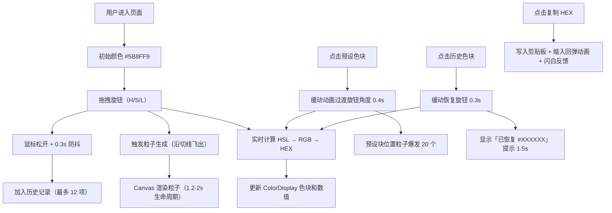

# 旋光调色盘 PRD 产品需求文档

## 1. 产品概述

「旋光调色盘」是一款面向视觉设计师和创意工作者的交互式色彩探索工具。用户通过旋转三个彩色几何旋钮（分别控制色相、饱和度、明度）来混合独特配色方案，旋钮旋转时带动周围粒子产生流光拖尾效果，打造沉浸式色彩创作体验。

- **核心价值**：将抽象的 HSL 颜色维度转化为可触觉感知的旋钮交互，配合粒子特效增强创作乐趣
- **目标用户**：UI 设计师、插画师、前端开发者、配色爱好者
- **产品定位**：工具类 + 创意体验类 Web 应用，霓虹科技感深色主题

---

## 2. 核心功能

### 2.1 功能模块总览

1. **三旋钮交互控制区**：色相 (H) / 饱和度 (S) / 明度 (L) 三个独立圆环旋钮，拖拽旋转
2. **实时颜色混合与展示**：色块展示 + HEX/HSL/RGB 三组数值 + 一键复制 HEX
3. **粒子流光反馈系统**：旋钮旋转时生成彩色流光粒子，拖尾效果
4. **快速调色板预设**：8 种标准色预设块，点击自动带动画切换旋钮
5. **历史记录与恢复**：自动记录最近 12 个配色，点击恢复

### 2.2 页面详情

| 页面名称 | 模块名称 | 功能描述 |
|---------|---------|---------|
| 主界面 | 三旋钮控制区 | 三个堆叠圆环旋钮，拖拽旋转，阻尼衰减，光点指示 |
| 主界面 | 颜色展示区 | 200x200 圆角色块，三组颜色数值，复制按钮带反馈动画 |
| 主界面 | 粒子画布层 | Canvas 2D 覆盖全页，渲染粒子特效和星空背景 |
| 主界面 | 预设调色板 | 底部 8 个标准色方块，点击带动画切换 + 粒子爆发 |
| 主界面 | 历史记录网格 | 5 列多行，最多 12 项，点击恢复 + 恢复提示 |
| 主界面 | 动态连接线 | 旋钮与色块间半透明曲线，颜色随当前色渐变 |

---

## 3. 核心流程

---

## 4. 用户界面设计

### 4.1 设计风格

- **主题**：深色霓虹科技感（Dark Neon / Cyberpunk）
- **主色调背景**：`#0f0f1a → #1c1c3a` 星空渐变，叠加 50 个星点呼吸闪烁
- **配色原则**：深色底 + 当前混合色作为霓虹高光点缀，整体高对比度
- **毛玻璃效果**：按钮和交互区域使用 `backdrop-filter: blur(8px)`
- **字体**：系统无衬线（body）+ monospace（颜色数值）

### 4.2 页面设计要素

| 区域 | 设计要素 |
|-----|---------|
| **旋钮（100px）** | 圆环描边 4px，内圈渐变，边缘拖尾光点 6px + box-shadow 12px 发光 |
| **悬停/拖拽态** | hover 放大 1.05（0.2s），拖拽光标 `grabbing` |
| **阻尼衰减** | 松开后角速度 *= 0.85，约 0.5s 内停止 |
| **色块 200x200** | 圆角 16px，box-shadow 内发光 |
| **颜色数值** | 16px monospace，浅灰色 #ccc，三组垂直排列 |
| **复制按钮** | 毛玻璃，hover 亮度 +20%（0.2s），点击 0.3s 缩放 1→0.85→1，闪白 0.15s |
| **预设块 48x48** | 圆角 6px，间距 10px，hover 放大 |
| **历史块 36x36** | 圆角 4px，1px 深灰边框，5 列网格 |
| **连接线** | 2px 半透明曲线，颜色随当前色渐变，曲率由旋钮角度决定 |
| **星点背景** | 50 个随机位置 1-2px 圆点，透明度 0.1-0.3 呼吸，周期 3-5s |

### 4.3 响应式设计

- **桌面端（≥768px）**：左右两栏布局，左栏三旋钮堆叠（中心距 70px），右栏色块+数值+历史
- **移动端（<768px）**：纵向单列，旋钮在上，色块在下，所有间距缩小为 80%

---

## 5. 性能约束

| 指标 | 要求 |
|-----|------|
| 拖拽帧率 | ≥ 55fps |
| 粒子峰值 | ≤ 200 个 |
| 动画驱动 | 全部 `requestAnimationFrame`，禁止 `setTimeout/setInterval` 驱动循环 |
| Canvas 策略 | 单 Canvas 2D 上下文覆盖全屏，脏矩形局部重绘 |
