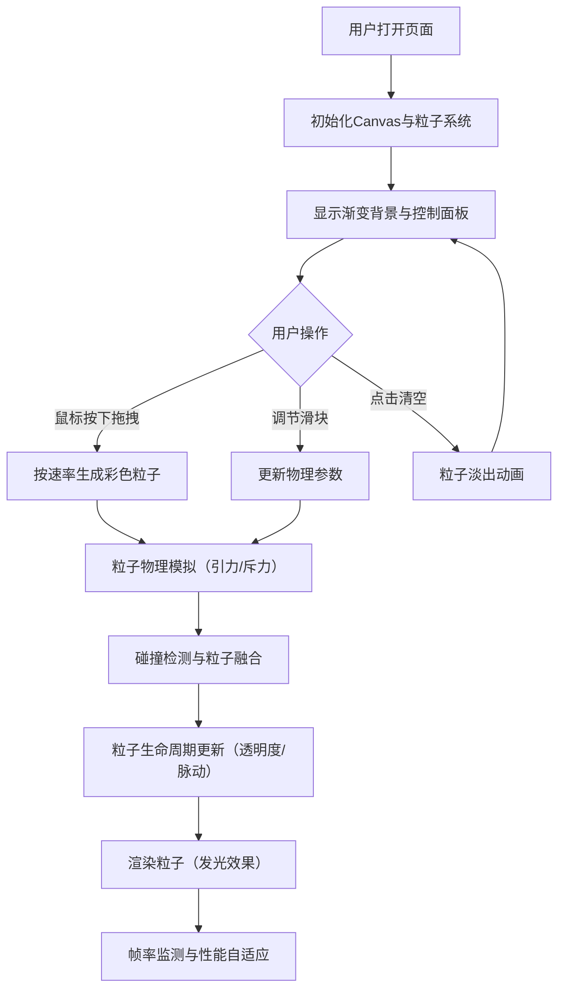

## 1. 产品概述

「光河绘」是一款基于Canvas的交互式数字艺术创作Web应用，用户通过鼠标/触摸拖拽在画布上绘制由彩色光点组成的流动光河，粒子遵循物理规则（引力、斥力、融合）相互影响，呈现不断演变的动态光画效果。

- 核心价值：为数字艺术展览、创意互动场景提供沉浸式的粒子流体绘画体验
- 目标用户：艺术展览参观者、创意爱好者、教育场景的学生

## 2. 核心功能

### 2.1 功能模块

1. **粒子生成与运动系统**：鼠标拖拽生成彩色粒子，粒子按随机初始速度运动
2. **物理交互引擎**：粒子间引力/斥力计算、碰撞检测与融合逻辑
3. **粒子生命周期管理**：存活时间、透明度渐变、半径脉动效果
4. **用户交互反馈**：鼠标光晕提示、粒子数量自动限制
5. **实时控制面板**：引力/斥力强度、生成速率调节、清空画布功能
6. **性能自适应系统**：帧率监测与自动降级策略

### 2.2 页面详情

| 页面名称 | 模块名称 | 功能描述 |
|-----------|-------------|---------------------|
| 主画布页 | 全屏Canvas | 承载粒子渲染，深蓝到深紫径向渐变背景，响应式全屏适配 |
| 主画布页 | 控制面板 | 亚克力毛玻璃效果，3个参数滑块 + 清空按钮，桌面悬浮顶部/移动置底横向 |
| 主画布页 | 鼠标光晕 | 拖拽时显示半径15px彩色光晕，松开消失 |

## 3. 核心流程

用户打开页面 → 看到渐变夜空背景与控制面板 → 鼠标按下并拖拽 → 系统以设定速率沿轨迹生成彩色粒子 → 粒子按物理规则运动、相互吸引/排斥/融合 → 形成流动的光河效果 → 用户可通过滑块实时调节物理参数 → 点击清空按钮粒子淡出消失

## 4. 用户界面设计

### 4.1 设计风格

- **整体风格**：梦幻流动、深邃宇宙感，数字艺术画廊气质
- **主色调**：深蓝 (#0a0a2e) → 深紫 (#1a0a3e) 径向渐变（中心偏左上）
- **强调色**：粒子色相0°~360°循环渐变，饱和度80%，亮度90%
- **控制面板**：亚克力毛玻璃效果，`rgba(255,255,255,0.1)`背景 + `rgba(255,255,255,0.2)`边框 + 12px圆角 + `backdrop-filter: blur(8px)`
- **粒子效果**：`shadowBlur = 10px` 柔光发光（性能降级时5px）
- **滑块样式**：渐变滑道，颜色与当前粒子色相联动
- **字体**：使用无衬线字体，现代简洁

### 4.2 页面设计概述

| 页面名称 | 模块名称 | UI元素 |
|-----------|-------------|-------------|
| 主画布页 | 背景区域 | 深蓝→深紫径向渐变，全屏铺满 |
| 主画布页 | 粒子层 | 彩色发光圆点，半径3-8px，脉动效果，半透明渐变生命期 |
| 主画布页 | 光晕层 | 鼠标按下时显示15px半径彩色光晕，透明度0.3 |
| 主画布页 | 控制面板（桌面） | 顶部居中悬浮，横向排列滑块和按钮 |
| 主画布页 | 控制面板（移动） | 底部固定，横向排列，紧凑布局 |

### 4.3 响应式设计

- **桌面优先设计**：控制面板顶部居中，宽度约600px
- **平板适配**：控制面板宽度自适应，保持顶部布局
- **移动设备**：控制面板移至屏幕底部，改为横向排列（flex-wrap），控件宽度缩小
- **触摸优化**：支持触摸事件（touchstart/touchmove/touchend）替代鼠标事件
- **Canvas自适应**：监听resize事件，实时调整canvas尺寸与粒子边界

### 4.4 动效与交互细节

- **粒子入场**：新生成粒子透明度从0渐增至目标值（前3秒内）
- **粒子退场**：生命最后2秒透明度渐降至0
- **粒子脉动**：半径±20%范围正弦波动，周期2秒
- **清空动画**：0.5秒内所有粒子透明度线性淡出
- **滑块反馈**：hover时滑块轨道亮度增强
- **按钮反馈**：点击时轻微缩放与边框高亮
