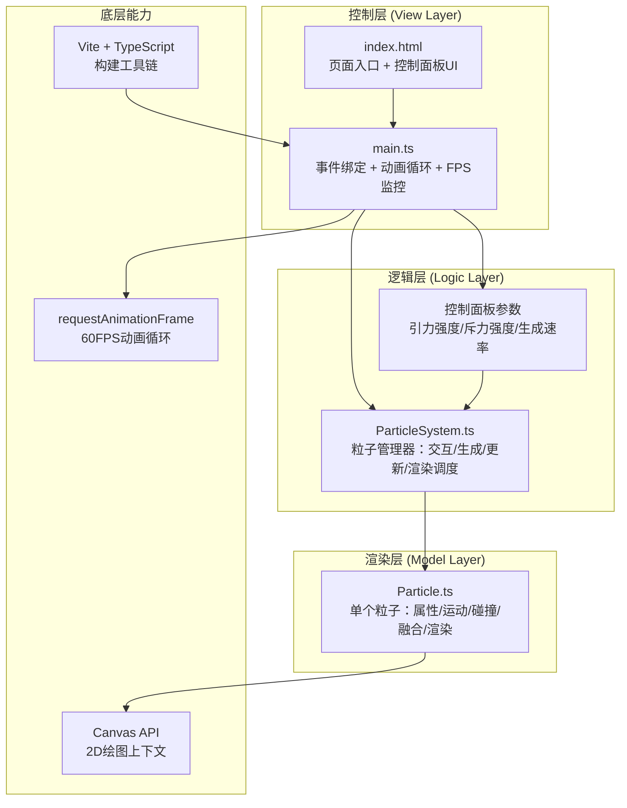
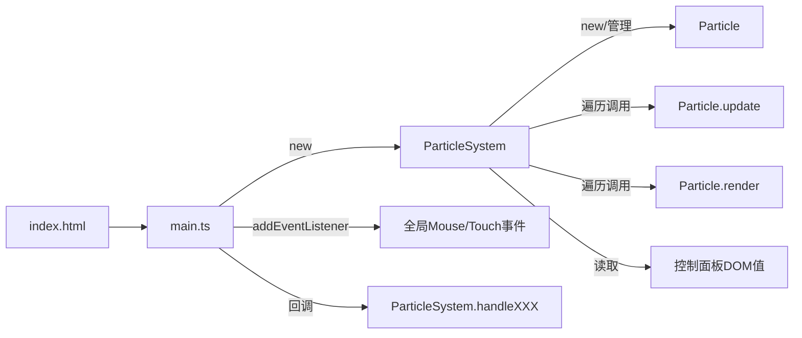

## 1. 架构设计

本项目为纯前端Canvas应用，采用「单页应用 + 面向对象模块化」架构，按职责分离为三层：渲染层、逻辑层、控制层。



**数据流向**：
```
用户事件(mousedown/move/up) 
  → main.ts事件监听 
  → ParticleSystem.handleMouseXXX() 
  → 生成/更新Particle实例 
  → Particle.update() 物理计算
  → ParticleSystem.render() 批量绘制
  → Canvas 2D Context 呈现
```

## 2. 技术栈描述

- **构建工具**：Vite 5.x（开发热更新，端口3000）
- **语言**：TypeScript 5.x（严格模式 strict: true，target ES2020）
- **渲染引擎**：原生 HTML5 Canvas 2D API
- **动画驱动**：`requestAnimationFrame` + Delta Time 时间步长
- **样式方案**：原生CSS（内联于index.html的<style>标签）
- **包管理器**：npm

**选型理由**：
- 纯Canvas + 原生实现，无额外UI框架依赖，包体最小，性能最优
- TypeScript严格模式保证粒子系统的类型安全
- Vite开发体验流畅，HMR毫秒级响应

## 3. 模块与文件结构

| 文件路径 | 职责定义 | 被谁调用 | 调用谁 |
|----------|----------|----------|--------|
| `package.json` | 项目依赖、scripts声明 | Vite / npm | - |
| `vite.config.js` | Vite配置（端口3000） | Vite启动时读取 | - |
| `tsconfig.json` | TS编译配置（strict, ES2020） | tsc / Vite | - |
| `index.html` | 页面入口：Canvas容器 + 控制面板DOM + 引入main.ts | 浏览器加载 | - |
| `src/main.ts` | 应用入口：Canvas初始化、事件监听、rAF主循环、FPS监测、性能自适应 | 浏览器（通过index.html） | ParticleSystem |
| `src/particleSystem.ts` | 粒子系统类：管理粒子数组、处理用户交互生成粒子、批量更新与渲染、参数控制、性能清理 | main.ts | Particle |
| `src/particle.ts` | 粒子类：封装单个粒子属性、运动物理、碰撞检测、融合逻辑、透明度生命周期、脉动、渲染 | ParticleSystem | Canvas API |

**调用关系图**：


## 4. 核心数据模型

### 4.1 Particle 粒子类字段

```typescript
interface Particle {
  x: number;              // 位置X（像素）
  y: number;              // 位置Y（像素）
  vx: number;             // 速度X（像素/秒）
  vy: number;             // 速度Y（像素/秒）
  baseRadius: number;     // 基础半径（3-8px随机）
  radius: number;         // 当前半径（含脉动）
  hue: number;            // 色相（0-360）
  saturation: number;     // 饱和度（固定80%）
  lightness: number;      // 亮度（固定90%）
  alpha: number;          // 当前透明度（0-1）
  birthTime: number;      // 出生时间戳（ms）
  lifespan: number;       // 总存活时长（8000-15000ms随机）
  pulsePhase: number;     // 脉动相位偏移
  markedForRemoval: boolean; // 待删除标记
  mass: number;           // 质量（半径平方，用于引力计算权重）
}
```

### 4.2 ParticleSystem 系统类字段

```typescript
interface ParticleSystemConfig {
  gravityStrength: number;     // 引力强度 0.01-0.1
  repulsionStrength: number;   // 斥力强度 0.01-0.1
  spawnRate: number;           // 每秒生成速率 10-50
}

interface ParticleSystem extends ParticleSystemConfig {
  particles: Particle[];       // 粒子数组
  isMouseDown: boolean;        // 鼠标是否按下
  mouseX: number;              // 当前鼠标X
  mouseY: number;              // 当前鼠标Y
  currentHue: number;          // 当前生成粒子色相
  spawnAccumulator: number;    // 生成计数器
  canvasWidth: number;
  canvasHeight: number;
  shadowBlur: number;          // 阴影模糊半径（10或5）
  maxParticles: number;        // 最大粒子数（500）
}
```

## 5. 核心算法说明

### 5.1 引力-斥力计算（O(n²)，两两粒子对）
```
for each particle pair (i, j):
  dx = j.x - i.x
  dy = j.y - i.y
  dist = sqrt(dx² + dy²)
  
  // 引力（120px内，与距离成反比）
  if dist < 120 and dist > 0:
    forceG = gravityStrength * (120 - dist) / dist
    i.vx += (dx/dist) * forceG * dt
    i.vy += (dy/dist) * forceG * dt
    j.vx -= (dx/dist) * forceG * dt
    j.vy -= (dy/dist) * forceG * dt
  
  // 斥力（40px内，与距离平方成反比）
  if dist < 40 and dist > 0:
    forceR = repulsionStrength * (40 - dist)² / dist²
    i.vx -= (dx/dist) * forceR * dt
    i.vy -= (dy/dist) * forceR * dt
    j.vx += (dx/dist) * forceR * dt
    j.vy += (dy/dist) * forceR * dt
```

### 5.2 粒子融合算法
```
if dist < (i.radius + j.radius):
  newRadius = (i.radius + j.radius) * 0.7
  weightedHue = (i.hue * i.mass + j.hue * j.mass) / (i.mass + j.mass)
  保留i，更新i的radius/baseRadius/hue/mass
  j.markedForRemoval = true
```

### 5.3 生命周期透明度曲线
```
elapsed = now - birthTime
ratio = elapsed / lifespan
if elapsed < 3000:
  alpha = 0.2 + (elapsed / 3000) * 0.7  // 0.2 → 0.9
elif elapsed > lifespan - 2000:
  fadeTime = lifespan - elapsed
  alpha = 0.9 * (fadeTime / 2000)       // 0.9 → 0
else:
  alpha = 0.9
```

### 5.4 FPS性能自适应
```
每帧记录时间戳，计算最近10帧平均FPS
if particleCount > 300 and avgFPS < 30:
  spawnRate = max(10, spawnRate / 2)  // 生成速率减半
  shadowBlur = 5                      // 降低发光质量
```

## 6. 性能预算与约束

| 指标 | 目标值 | 降级阈值 | 降级策略 |
|------|--------|----------|----------|
| 帧率 | 60 FPS | < 30 FPS（粒子数>300时） | 生成速率减半，shadowBlur从10→5 |
| 粒子数上限 | 500 | 超过500 | FIFO移除最早生成的粒子 |
| 单帧耗时 | < 16ms | > 33ms | 同上性能降级 |
| 包体大小 | < 50KB（gzip） | - | 不引入第三方库 |
