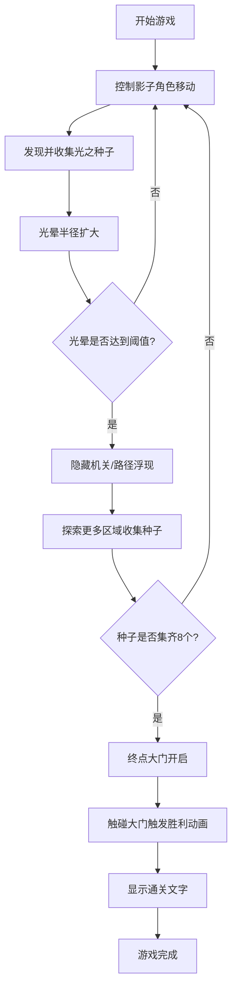

## 1. 产品概述

「流光影迹」是一款以光影探索为核心玩法的2D平台跳跃游戏。玩家控制由发光粒子构成的影子角色，在黑白剪影风格的关卡中移动、跳跃、攀爬，通过收集光之种子扩大光晕范围，照亮隐藏机关，最终到达终点通关。

- 核心玩法：光影探索 + 平台跳跃 + 种子收集 + 机关解谜
- 目标用户：休闲游戏玩家、独立游戏爱好者

## 2. 核心功能

### 2.1 功能模块

1. **游戏主场景**：地图生成、物理碰撞、光照系统、粒子特效
2. **玩家控制系统**：A/D左右移动、W跳跃、W攀爬墙壁
3. **光之种子系统**：8个金色种子、脉动动画、收集反馈、光晕扩大
4. **隐藏机关系统**：半透明平台（250px阈值）、紫色传送门（320px阈值）
5. **胜利结算系统**：终点大门开启、通关动画、胜利文字展示

### 2.2 功能详情

| 模块名称 | 子功能 | 功能描述 |
|-----------|--------|----------|
| 玩家控制 | 移动 | A/D键左右移动，速度平滑过渡 |
| 玩家控制 | 跳跃 | W键跳跃，支持二段感觉的流畅抛物线 |
| 玩家控制 | 攀爬 | 靠近垂直墙壁时按W键向上攀爬 |
| 玩家控制 | 拖尾光效 | 路径留下3秒内逐渐熄灭的发光粒子 |
| 光照系统 | 玩家光晕 | 初始半径250px，收集种子扩大15px，最大400px |
| 光照系统 | 阴影遮罩 | 背景深灰，仅光晕区域内平台显示石纹纹理 |
| 种子系统 | 种子生成 | 8个金色发光球体，半径8px，脉动动画（0.5秒循环，7-9px变化） |
| 种子系统 | 收集效果 | 膨胀消失动画 + 20个金色粒子飞向玩家 + "叮"声效 |
| 隐藏机关 | 浮动台阶 | 光晕>250px时浮现，半透明白色玻璃质感 |
| 隐藏机关 | 传送门 | 光晕>320px时浮现，紫色漩涡，传送至秘密区域 |
| 胜利系统 | 大门开启 | 集齐8个种子后终点门开启，金色粒子喷泉 |
| 胜利系统 | 通关动画 | 玩家化作光点升空 + "通关"文字渐隐2秒 |

## 3. 核心流程

玩家进入游戏 → 控制影子角色在关卡中探索 → 收集光之种子扩大光晕 → 光晕达到阈值后隐藏机关浮现 → 利用机关获取更多种子 → 集齐全部种子 → 终点大门开启 → 触碰大门触发胜利动画 → 游戏完成

## 4. 用户界面设计

### 4.1 设计风格

- **主题色**：黑白剪影风格，深灰背景(#1a1a1a)，纯黑平台(#000000)
- **玩家发光**：淡蓝色（色相200度，饱和度80%，亮度90%，透明度0.8）
- **种子颜色**：金色（色相45度，饱和度100%，亮度90%）
- **关底大门**：纯白色(#ffffff)
- **布局**：极简全屏布局，画布撑满浏览器窗口，保持16:9比例响应式缩放

### 4.2 UI元素

| 元素名称 | 显示位置 | 样式描述 |
|-----------|----------|----------|
| 游戏画布 | 全屏居中 | 800x600像素，等比缩放适配窗口 |
| 操作提示 | 页面底部 | 半透明小字显示"WASD控制" |
| 通关文字 | 屏幕中央 | 白色48px字体，带光芒渐隐动画2秒 |

### 4.3 响应式设计

- 桌面优先设计，画布根据窗口尺寸等比缩放（保持16:9比例）
- 移动端视口适配，支持触摸操作（可选扩展）
- 所有动画和交互在60FPS下流畅运行

### 4.4 动画规范

- 移动/跳跃动画：平滑过渡，持续0.3秒
- 光晕扩散：收集种子后0.3秒平滑扩大
- 种子收集：0.3秒膨胀消失动画
- 通关动画：2秒光芒渐隐效果
- 粒子效果：寿命3秒，平滑淡出
