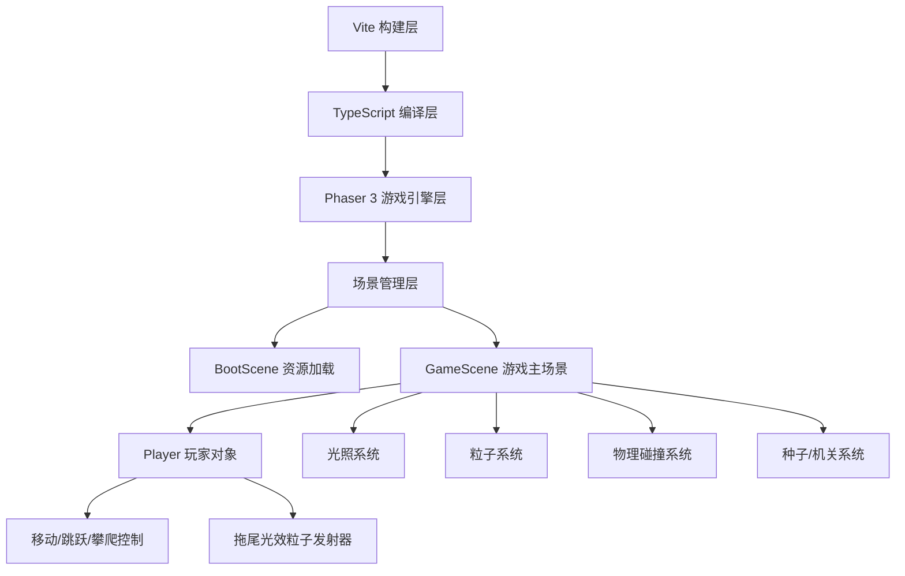

## 1. 架构设计



## 2. 技术描述

- **游戏引擎**：Phaser 3.x
- **编程语言**：TypeScript（严格模式，target ES2020，module ESNext）
- **构建工具**：Vite（开发服务器端口3000，phaser设为全局变量）
- **物理引擎**：Phaser Arcade Physics（2D平台碰撞）
- **渲染系统**：Canvas 2D + Phaser Light2D光照系统
- **粒子系统**：Phaser Particle Manager（限制同时500个粒子）

## 3. 项目文件结构

| 文件路径 | 功能描述 |
|----------|----------|
| `package.json` | 项目依赖（phaser、vite、typescript），dev启动脚本 |
| `vite.config.js` | Vite构建配置，端口3000，phaser全局变量 |
| `tsconfig.json` | TS配置，严格模式，ES2020 |
| `index.html` | 入口页面，视口适配，16:9画布 |
| `src/main.ts` | 游戏入口，创建Phaser.Game，800x600画布，Arcade物理，场景列表 |
| `src/scenes/BootScene.ts` | 启动场景，资源预加载，场景跳转 |
| `src/scenes/GameScene.ts` | 游戏主场景，地图/玩家/光照/粒子/碰撞/机关/胜利逻辑 |
| `src/objects/Player.ts` | 玩家类，继承Arcade.Sprite，移动跳跃攀爬，拖尾光效 |

## 4. 核心数据结构

### 4.1 玩家状态

```typescript
interface PlayerState {
  x: number;
  y: number;
  velocityX: number;
  velocityY: number;
  isJumping: boolean;
  isClimbing: boolean;
  facingRight: boolean;
  glowRadius: number;       // 光晕半径，初始250，最大400
  glowRadiusTarget: number; // 光晕目标半径（平滑过渡）
  seedsCollected: number;   // 已收集种子数 0-8
  isAlive: boolean;
}
```

### 4.2 光之种子

```typescript
interface LightSeed {
  id: number;
  x: number;
  y: number;
  collected: boolean;
  pulsePhase: number;  // 脉动相位 0-1
  pulseRadius: number; // 当前显示半径
}
```

### 4.3 隐藏机关

```typescript
interface HiddenPlatform {
  id: number;
  x: number;
  y: number;
  width: number;
  height: number;
  requiredGlow: number;   // 250 或 320
  opacity: number;        // 0-0.6 平滑过渡
  type: 'platform' | 'portal';
  active: boolean;
}
```

## 5. 核心算法

### 5.1 光照计算优化

- 使用Phaser Light2D系统，每帧只更新一次光照纹理
- 玩家光晕位置跟随更新，光照边缘使用Lanczos平滑采样
- 平台设置为受光物体（receive light），被光晕覆盖时显示石纹纹理

### 5.2 粒子数量控制

- 拖尾粒子：每秒60个，寿命3秒，总计最多180个
- 种子收集粒子：每次20个，寿命1秒
- 传送/胜利粒子：每次50个，寿命2秒
- 全局粒子池：最多500个，超出时淘汰最早生成的粒子

### 5.3 光晕平滑过渡

```
glowRadius += (glowRadiusTarget - glowRadius) * 0.08  // 每帧
```

### 5.4 墙壁攀爬检测

1. 检测玩家左右两侧是否与垂直墙壁碰撞
2. 玩家按下W键且接触墙壁时，切换为攀爬状态
3. 攀爬速度固定，不应用重力
4. 离开墙壁或松开W键时恢复正常状态

## 6. 性能优化方案

1. **帧率控制**：Phaser游戏循环锁定60FPS，使用requestAnimationFrame
2. **粒子池化**：Particle Manager复用粒子对象，避免频繁GC
3. **光照批处理**：合并光照计算为单次渲染pass
4. **静态平台批处理**：静态地形合并为单个Tilemap渲染
5. **离屏裁剪**：视口外的游戏对象暂停更新与渲染
6. **动画节流**：种子脉动动画使用sin函数计算，不逐帧创建Tween
