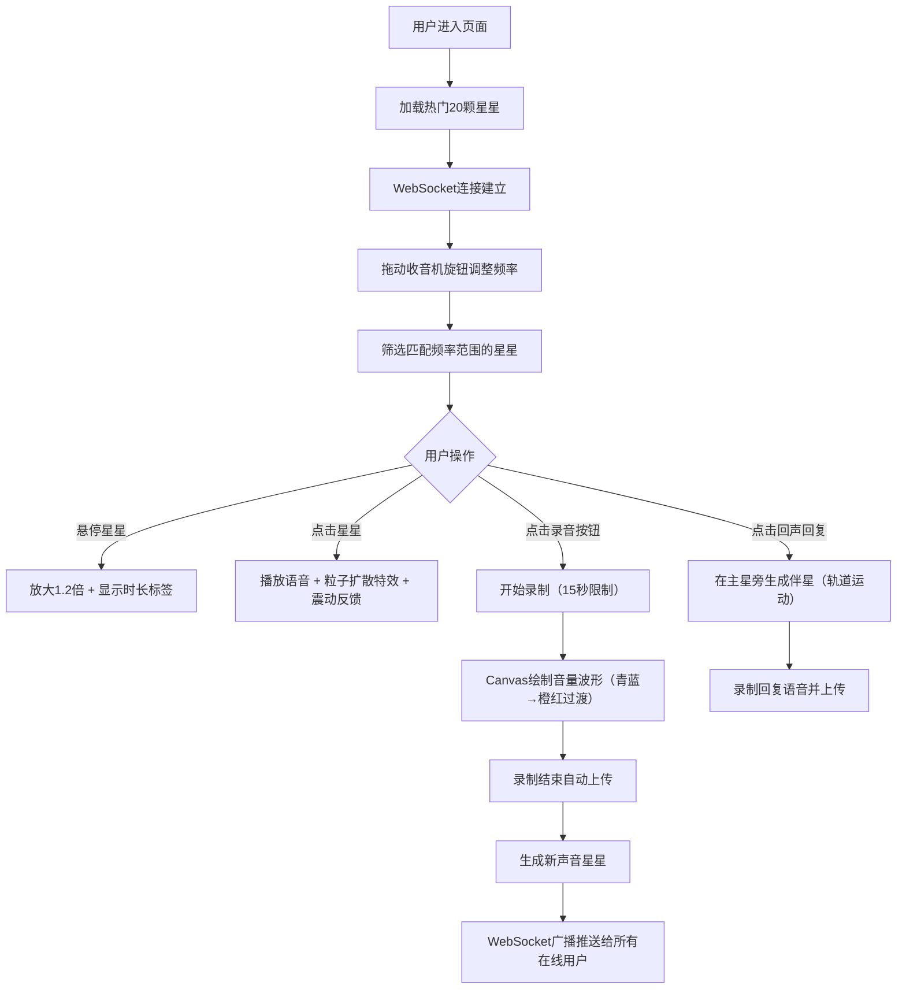

## 1. 产品概述

「星语电台」是一个以复古收音机为界面载体的匿名语音留言分享Web应用，让用户在浩瀚星空背景中通过旋转旋钮扫描"声音星星"，聆听来自陌生人的温暖语音留言。

- 主要目的：创造一个沉浸式、富有情感温度的匿名语音社交体验
- 目标用户：追求情感共鸣、喜欢发现陌生人故事的年轻互联网用户
- 产品价值：在快节奏的数字时代中，提供一个慢节奏、有温度的声音交流空间

## 2. 核心功能

### 2.1 用户角色
| 角色 | 注册方式 | 核心权限 |
|------|----------|----------|
| 匿名用户 | 无需注册，进入即使用 | 收听语音、录制最多5条语音、发送回声回复 |

### 2.2 功能模块
1. **收音机面板**：可旋转旋钮频率扫描、猫眼信号指示灯、喇叭网罩、录音按钮及实时波形显示
2. **星空区域**：3D自转星空背景、声音星星展示（大小/颜色/光晕）、悬停时长标签、点击播放粒子特效
3. **回声回复系统**：伴星轨道运动、颜色色相偏移、独立回复播放
4. **后端服务**：语音文件存储、元数据管理、REST API、WebSocket实时推送

### 2.3 页面详情
| 页面名称 | 模块名称 | 功能描述 |
|-----------|-------------|---------------------|
| 首页主界面 | 收音机面板 | 银色旋钮拖动旋转（频率0-100），绿色猫眼指示灯随信号脉动，喇叭纹理噪点，录音按钮控制MediaRecorder，Canvas实时波形绘制 |
| 首页主界面 | 星空背景层 | 深蓝渐变(#0a0a2e→#1a1a3e)，3D CSS transform自转（周期120s），Canvas粒子星空装饰 |
| 首页主界面 | 声音星星层 | 随机坐标分布，大小3-15px（能量映射），色相270-45度渐变（频谱映射），柔和光晕box-shadow，悬停1.2倍放大+圆角半透明时长标签 |
| 首页主界面 | 播放交互层 | 点击星星播放语音，60个星云粒子扩散特效（2s消散），0.3s震动反馈动画 |
| 首页主界面 | 回声伴星层 | 伴星0.7倍半径，色相偏移15度，椭圆轨道（周期8s，长轴20px短轴10px），独立点击播放 |

## 3. 核心流程

## 4. 用户界面设计

### 4.1 设计风格
- **主色调**：霓虹蒸汽波风格 - 深蓝星空背景(#0a0a2e/#1a1a3e)，紫色(#9b59ff)到金色(#ffd700)星星光谱，青蓝(#00ffff)到橙红(#ff5500)录音波形
- **按钮风格**：实体拟物化，激活时6px霓虹光晕box-shadow，最小触摸目标44px
- **字体**：使用Orbitron（显示字体）搭配Noto Sans SC（正文字体），营造复古未来主义氛围
- **布局风格**：桌面端左右分栏（左400px固定收音机+右侧自适应星空），移动端上下布局（顶部折叠收音机+全屏星空）
- **视觉装饰**：噪点纹理overlay、扫描线效果、CRT显示器暗角、霓虹文字glow

### 4.2 页面设计概述
| 页面名称 | 模块名称 | UI元素 |
|-----------|-------------|-------------|
| 首页 | 收音机面板容器 | 木纹边框渐变、金属质感倒角、内阴影凹陷效果、固定宽度400px |
| 首页 | 频率旋钮 | 银色径向渐变金属质感、CSS transform rotate旋转、拖动光标grabbing、刻度指示线 |
| 首页 | 猫眼指示灯 | 底部向上渐变绿色发光、呼吸脉动动画、亮度绑定信号强度值 |
| 首页 | 喇叭网罩 | 重复径向渐变点阵、噪点纹理叠加、录音按钮中心位置 |
| 首页 | 录音按钮 | 红色实体凸起、按下时凹陷+霓虹红光晕、Canvas波形显示区域 |
| 首页 | 星空容器 | perspective透视+preserve-3d、animation自转120s线性无限 |
| 首页 | 星星节点 | 圆角div+box-shadow光晕、transition悬停放大、position绝对定位 |
| 首页 | 时长标签 | 半透明黑色背景、圆角4px、白字、transform居中上浮 |
| 首页 | 粒子特效 | 绝对定位圆形div、CSS animation向外扩散+淡出 |

### 4.3 响应式设计
- **设计策略**：桌面优先（Desktop-first），移动端自适应
- **断点设置**：768px为分界点
- **桌面端（≥768px）**：左右flex布局，左400px收音机，右flex-1星空
- **移动端（<768px）**：上下flex布局，顶部80px折叠收音机条（可展开），下方全屏星空
- **触摸优化**：旋钮和按钮最小44×44px触摸区域，增加touch-action:none防止滚动干扰

### 4.4 性能要求
- 星空Canvas绘制刷新率稳定≥30fps
- 星星DOM节点使用transform定位（GPU加速），避免reflow
- 语音上传到首帧播放延迟≤2秒（Base64预加载+音频预加载）
- 音频波形Canvas使用requestAnimationFrame节流绘制
- 粒子特效使用硬件加速transform+opacity动画
