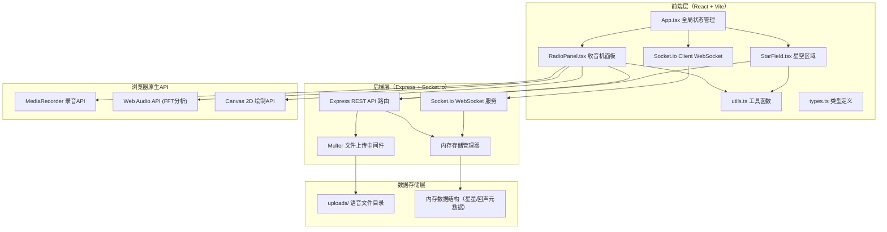
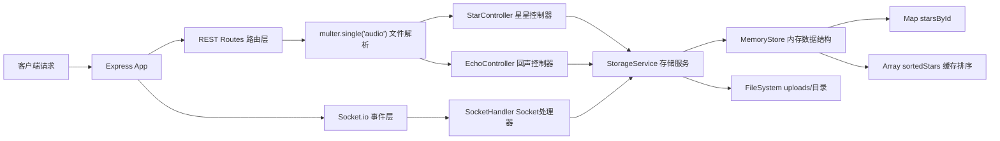
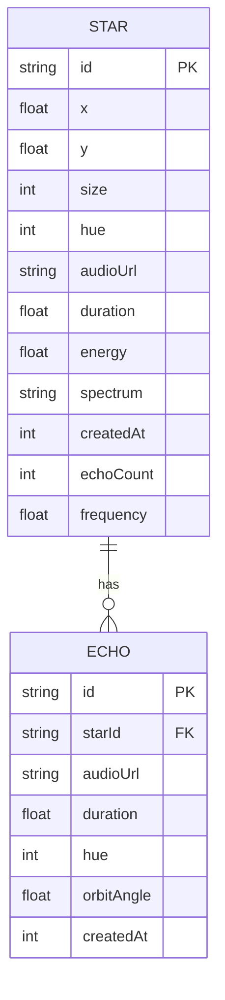

## 1. 架构设计



## 2. 技术栈说明

| 层级 | 技术选型 | 版本说明 | 用途 |
|------|----------|----------|------|
| 前端框架 | React 18 | ^18.2.0 | 组件化UI开发 |
| 前端语言 | TypeScript | ^5.0.0 | 类型安全开发 |
| 构建工具 | Vite | ^5.0.0 | 开发服务器+打包构建 |
| 后端框架 | Express | ^4.18.0 | REST API服务 |
| 实时通信 | Socket.io + Client | ^4.7.0 | WebSocket双向推送 |
| 文件上传 | Multer | ^1.4.5 | 处理multipart/form-data语音上传 |
| 画布辅助 | canvas-sketch | ^0.7.0 | Canvas绘制辅助工具 |
| 状态管理 | React useState/useEffect | - | 轻量全局状态（无需zustand） |

## 3. 路由定义

| 路由路径 | HTTP方法 | 用途 |
|----------|----------|------|
| `/api/stars` | GET | 获取星星列表（默认按回复数排序的前20条） |
| `/api/stars/:id` | GET | 获取单个星星详情（含回复链） |
| `/api/stars` | POST | 创建新星星（上传语音文件+元数据） |
| `/api/stars/:id` | DELETE | 删除指定星星 |
| `/api/stars/:id/echoes` | POST | 创建回声回复（上传回复语音） |
| `/api/stars/:id/echoes/:echoId` | DELETE | 删除指定回声 |
| `/uploads/:filename` | GET | 静态访问语音文件 |

## 4. API 请求响应定义

### 4.1 类型定义

```typescript
// 星星核心接口
interface Star {
  id: string;
  x: number;           // 0-100 百分比坐标
  y: number;           // 0-100 百分比坐标
  size: number;        // 3-15 像素半径
  hue: number;         // 270-45 色相值
  audioUrl: string;    // 语音文件路径
  duration: number;    // 音频时长（秒）
  energy: number;      // 音频能量值 0-1
  spectrum: number[];  // FFT频谱数据 用于颜色生成
  createdAt: number;   // 时间戳
  echoes: Echo[];      // 回声回复列表
  echoCount: number;   // 回复数量（排序用）
  frequency: number;   // 关联频率值 0-100
}

// 回声回复接口
interface Echo {
  id: string;
  starId: string;      // 所属主星ID
  audioUrl: string;
  duration: number;
  hue: number;         // 主星星色相+15度偏移
  orbitAngle: number;  // 轨道初始角度
  createdAt: number;
}

// 创建星星请求体
interface CreateStarRequest {
  audio: File;         // multipart file
  duration: number;
  energy: number;
  spectrum: string;    // JSON序列化的number数组
  frequency: number;
}

// 创建回声请求体
interface CreateEchoRequest {
  audio: File;
  duration: number;
  hue: number;
}
```

### 4.2 响应格式
```typescript
// 统一响应结构
interface ApiResponse<T> {
  success: boolean;
  data?: T;
  error?: string;
}

// GET /api/stars 响应
type StarsListResponse = Star[];

// WebSocket事件
interface SocketEvents {
  'star:created': (star: Star) => void;
  'star:deleted': (starId: string) => void;
  'echo:created': (echo: Echo, starId: string) => void;
  'echo:deleted': (echoId: string, starId: string) => void;
}
```

## 5. 后端服务架构



### 后端模块职责
- **server.ts**：Express应用初始化、multer配置、Socket.io挂载、路由注册、静态文件服务
- **路由层**：定义REST端点路径、参数校验、调用控制器
- **控制器层**：业务逻辑编排（生成ID/坐标/颜色、关联关系维护）
- **存储服务**：统一封装数据读写、文件持久化、排序缓存维护
- **内存存储**：运行时数据结构，启动时可加载持久化JSON

## 6. 数据模型

### 6.1 ER关系图



### 6.2 数据约束
- 每个用户IP最多创建5个Star（内存记录IP计数）
- 语音文件大小限制：≤ 5MB，时长 ≤ 15秒
- Star坐标：x和y均限制在 5-95 范围内（避免边缘溢出）
- Star.size 范围：3-15，由 energy * 12 + 3 计算
- Star.hue 范围：频谱平均值映射 270(紫) → 45(金)
- Echo.hue = 主星.hue + 15（模360）

### 6.3 初始Mock数据
后端启动时自动生成8-10条示例星星数据（内置占位语音或静音文件），确保首次进入页面有内容可展示。
