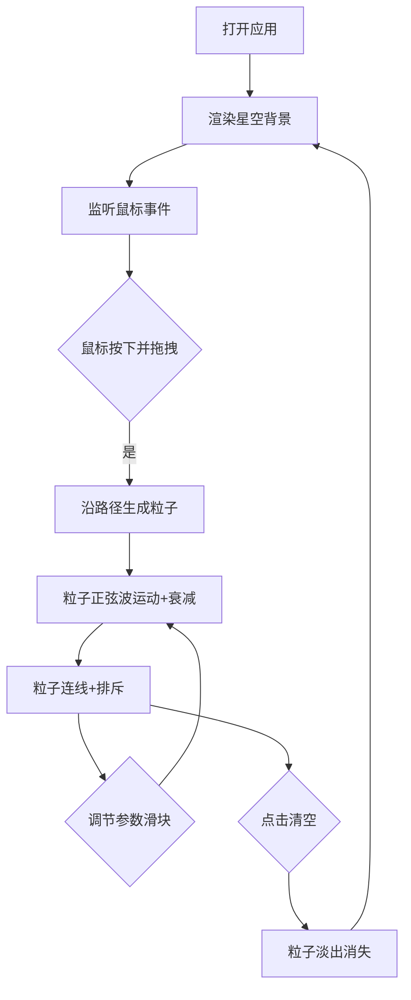

## 1. 产品概述

「光痕织梦」是一款基于 Canvas 的交互式粒子艺术创作应用。用户通过鼠标拖拽在动态星空画布上绘制发光粒子图案，粒子沿路径运动并留下轨迹，形成不断演化的光之梦境。

- 主要用途：供用户进行创意绘画、放松解压、视觉艺术创作
- 目标用户：创意爱好者、视觉艺术爱好者、普通用户
- 产品价值：提供沉浸式的粒子绘画体验，带来视觉艺术创作

## 2. 产品价值
## 2. 核心功能

### 2.1 用户角色
| 角色 | 注册方式 | 核心权限 |
|------|----------|----------|
| 普通用户 | 无需注册，直接使用 | 绘制粒子图案、调节参数、清空画布 |

### 2.2 功能模块
1. **主画布页面：星空背景、粒子绘制、控制面板

### 2.3 页面详情
| 页面名称 | 模块名称 | 功能描述 |
|---------|----------|----------|
| 主画布 | 星空背景 | 深蓝到紫色渐变背景 + 600颗闪烁星星 |
| 主画布 | 粒子绘制系统 | 鼠标拖拽生成粒子流，正弦波运动，粒子连线，粒子排斥 |
| 主画布 | 控制面板 | 粒子密度滑块、速度滑块、清空按钮 |

## 3. 核心流程

用户打开应用 → 看到动态星空背景 → 鼠标左键按下并拖拽 → 沿拖拽路径生成发光粒子流 → 粒子做正弦波运动并衰减 → 近距离粒子连线并产生排斥效果 → 用户可通过控制面板调节参数 → 点击清空按钮清除所有粒子

## 4. 用户界面设计

### 4.1 设计风格
- 主色调：深蓝（色相240度）到紫罗兰（色相280度）渐变背景
- 粒子颜色：蓝紫色（色相200-300度）为主，混合粉紫色（色相300-340度）和淡金色（色相50度）
- 星星颜色：白色带微弱蓝色（色相220度，饱和度20%）
- 控制面板：半透明毛玻璃效果（背景rgba(255,255,255,0.1)，边框1px solid rgba(255,255,255,0.3)）
- 圆角矩形
- 过渡：所有交互0.2s过渡动画

### 4.2 页面设计概览
| 页面名称 | 模块名称 | UI元素 |
|---------|----------|--------|
| 主画布 | 星空背景 | 渐变背景、闪烁星星、全屏布局 |
| 主画布 | 粒子系统 | 发光粒子、轨迹、连线、光晕shadowBlur=8 |
| 主画布 | 控制面板 | 两个滑块、清空按钮、圆角矩形面板 |

### 4.3 响应式
- 桌面端：画布16:9比例，黑边填充，控制面板固定右下角
- 移动端（<600px）：控制面板移至底部居中，字体缩小至12px
- 触摸：画布尺寸自适应窗口大小

### 4.4 性能要求
- 帧率：稳定30FPS以上
- 粒子上限：2000个
