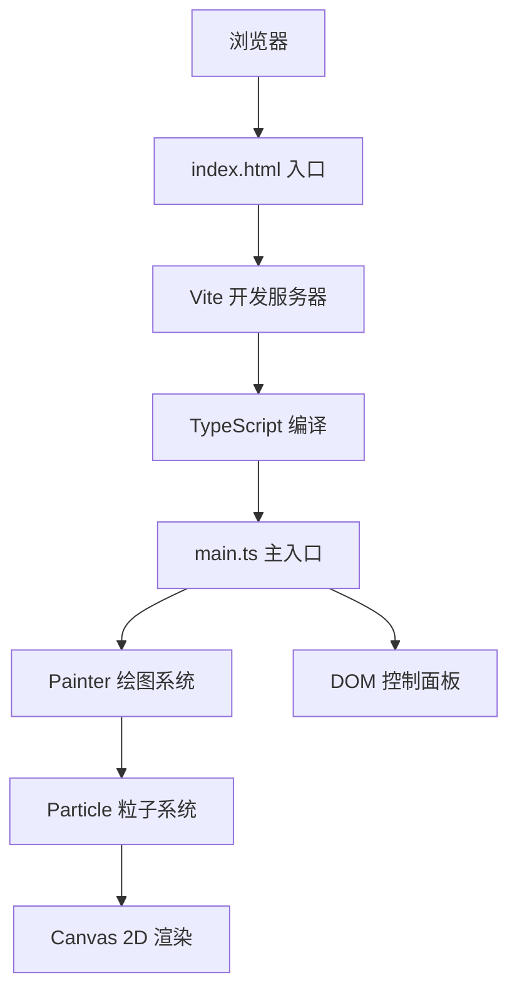

## 1. 架构设计



## 2. 技术说明

- 前端框架：原生 TypeScript + Canvas 2D API
- 构建工具：Vite 5.x
- 语言：TypeScript（严格模式，target ES2020）
- 无后端、无数据库、纯前端应用

## 3. 路由定义

| 路由 | 用途 |
|------|------|
| / | 主画布页面，应用唯一入口 |

## 4. 核心模块设计

### 4.1 文件结构
```
/
├── package.json          # 项目配置与依赖
├── vite.config.js        # Vite 配置（端口3000）
├── tsconfig.json         # TypeScript 配置
├── index.html            # 入口HTML
└── src/
    ├── main.ts           # 应用入口，协调系统
    ├── particle.ts       # Particle 粒子类
    └── painter.ts        # Painter 绘图系统
```

### 4.2 Particle 类（particle.ts）
```typescript
interface ParticleState {
  x: number; y: number;          // 位置
  vx: number; vy: number;        // 速度
  baseX: number; baseY: number;  // 基准位置（正弦波锚点）
  angle: number;                 // 正弦波相位
  radius: number;                // 半径(2-4)
  hue: number;                   // 色相
  alpha: number;                 // 透明度
  life: number;                  // 已存活时间
  maxLife: number;               // 最大生命周期(3s)
  amplitude: number;             // 正弦波振幅
  frequency: number;             // 正弦波频率
  isClearing: boolean;           // 是否在清空中
  clearStartTime: number;        // 清空开始时间
}
```

### 4.3 Painter 类（painter.ts）
```typescript
interface PainterState {
  canvas: HTMLCanvasElement;
  ctx: CanvasRenderingContext2D;
  particles: Particle[];          // 粒子集合(上限2000)
  stars: Star[];                  // 星星数组(600)
  connections: Connection[];      // 粒子连线
  mouseX: number; mouseY: number;
  isDrawing: boolean;
  lastSpawnX: number; lastSpawnY: number;
  spawnDistance: number;          // 生成间隔(1-10, 默认5)
  speedMultiplier: number;        // 速度系数(0.1-1.0, 默认0.5)
  maxParticles: number;           // 2000
}
```

### 4.4 核心算法
1. **粒子生成**：拖拽路径上每隔 `spawnDistance` 像素生成
2. **正弦运动**：`x = baseX + sin(angle) * amp, y = baseY + cos(angle) * amp`
3. **距离检测**：每帧 O(n²) 两两距离检测（<20px连线，<10px排斥）
4. **颜色混合**：两粒子色相取平均
5. **画布适配**：16:9比例，letterbox黑边填充
