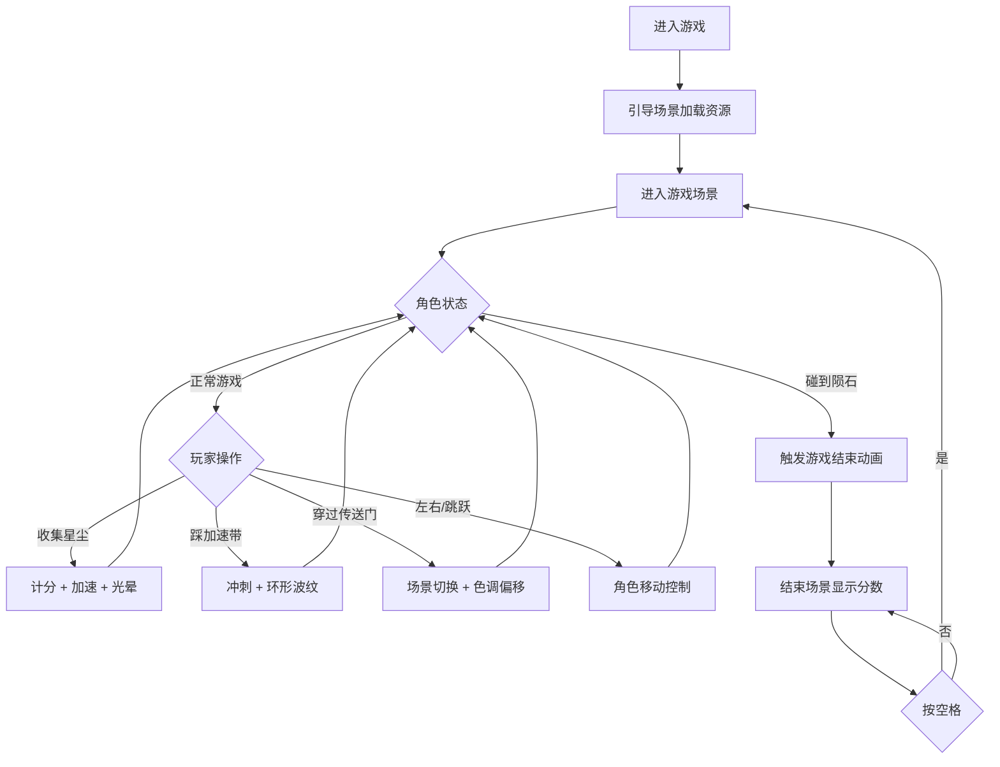

## 1. 产品概述

「星轨踏浪」是一款基于HTML5 Canvas的2D无尽跑酷游戏。玩家控制一名踩着发光滑板的角色，在动态星光轨道构成的星际公路上不断前进，通过左右移动和跳跃躲避陨石障碍、收集能量星尘并穿越传送门切换场景，体验不断变化的星际冒险。

- **核心目标**：在无尽的星际轨道上尽可能跑得更远，收集星尘获得高分，通过传送门解锁新场景
- **目标用户**：休闲游戏玩家，喜欢科幻题材和视觉效果的用户
- **市场价值**：提供沉浸式的跑酷体验，配合动态视觉效果和流畅的操作手感

## 2. 核心特性

### 2.1 用户角色

| 角色 | 注册方式 | 核心权限 |
|------|----------|----------|
| 玩家 | 无需注册 | 游戏体验、分数记录 |

### 2.2 功能模块

1. **引导场景**：资源加载进度显示，版本号展示
2. **游戏场景**：角色控制、轨道生成、碰撞检测、分数系统、视觉效果
3. **结束场景**：分数展示、重新开始

### 2.3 页面详情

| 页面名称 | 模块名称 | 功能描述 |
|----------|----------|----------|
| 引导场景 | 加载进度条 | 显示资源加载百分比，版本号 |
| 游戏场景 | 角色控制 | 方向键左右移动，空格键跳跃，落地冲击波 |
| 游戏场景 | 动态轨道 | 分段拼接轨道，发光边线，随机星尘，无限循环复用 |
| 游戏场景 | 陨石障碍 | 不规则多边形陨石，近距放大，碰撞判定 |
| 游戏场景 | 加速带 | 金色脉动加速带，冲刺效果，环形波纹 |
| 游戏场景 | 传送门 | 发光双圆环，场景切换动画，色调偏移 |
| 游戏场景 | 分数连击 | 星尘收集计分，连击倍率，传送门奖励 |
| 游戏场景 | 视觉效果 | 拖尾光效，光晕闪烁，星空装饰 |
| 结束场景 | 分数展示 | 最终分数，游戏结束遮罩，重新开始提示 |

## 3. 核心流程

玩家进入游戏后，引导场景加载资源，完成后自动进入游戏场景。角色自动向前移动，玩家通过键盘控制左右移动和跳跃来躲避陨石、收集星尘、踩上加速带获得冲刺，每跑一段距离进入传送门切换场景色调。碰到陨石即游戏结束，进入结束场景显示分数，按空格键可重新开始。

## 4. 用户界面设计

### 4.1 设计风格

- **主色调**：深空蓝紫渐变背景（色相220°→280°，亮度10%→20%），配合蓝紫→洋红发光轨道（色相200°→300°循环）
- **辅助色**：金色加速带（色相45°，亮度70%→100%脉动），传送门蓝紫渐变（色相200°→280°），熔岩红场景→冰蓝场景切换
- **危险色**：深灰陨石+暗红光晕，碰撞红色闪烁
- **按钮/提示风格**：半透明遮罩+发光文字，游戏结束画面金色渐变标题
- **字体**：系统无衬线字体，分数白色带发光效果（字号24px），标题金色渐变（字号48px）
- **布局风格**：全屏自适应，轨道居中，上下各80px星空装饰区
- **视觉特效**：拖尾光效、冲击波扩散、环形波纹、屏幕闪烁、震动、白屏切换

### 4.2 页面设计概览

| 页面名称 | 模块名称 | UI元素 |
|----------|----------|--------|
| 引导场景 | 加载界面 | 深空背景，居中进度条，白色百分比文字，角落版本号 |
| 游戏场景 | 星空背景 | 深空渐变，上下各80px星空装饰区（200颗闪烁星星） |
| 游戏场景 | 轨道区域 | 居中轨道，两条发光边线（宽2px，色相循环），中间菱形星尘 |
| 游戏场景 | 角色 | 像素风滑板人（32x48px），拖尾10个圆形渐变 |
| 游戏场景 | HUD | 左上角分数（白色发光，24px），连击倍率显示 |
| 结束场景 | 遮罩层 | 半透明黑色（0.6）全屏覆盖 |
| 结束场景 | 信息区 | 居中"游戏结束"金色渐变标题，最终分数，空格重玩闪烁提示 |

### 4.3 响应式设计

- 桌面端优先，全屏自适应布局
- Canvas尺寸根据窗口大小自动调整
- 键盘操作（方向键+空格），无需移动端触控适配
- 游戏画面始终保持居中，背景填充整个窗口

### 4.4 性能要求

- 全程保持60FPS流畅运行
- 陨石同时存在不超过5个，星尘同时存在不超过15个
- 轨道段对象池复用，超出屏幕左侧自动回收到右侧
- 粒子数量合理控制，拖尾使用透明度递减圆形，避免内存泄漏
