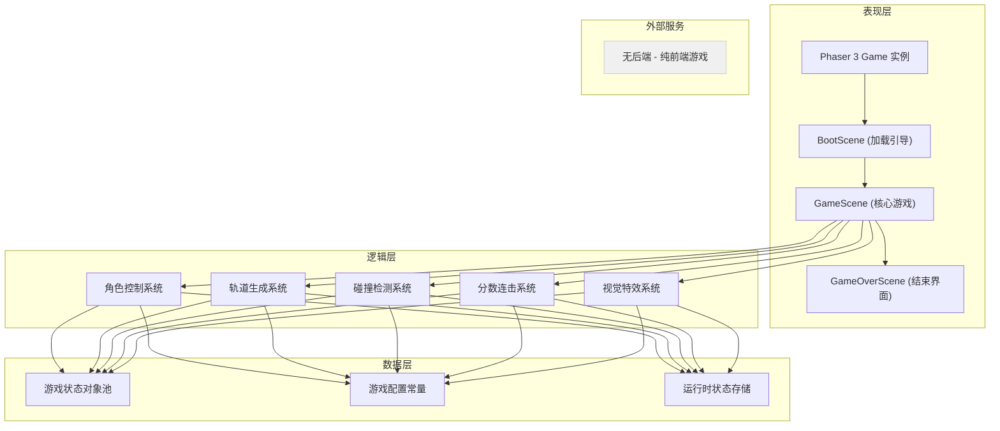

## 1. 架构设计



## 2. 技术说明

- **前端框架**: Phaser@3.70.0 + TypeScript@5.3.0
- **构建工具**: Vite@5.0.0（开发服务器端口3000，phaser设为全局）
- **渲染引擎**: HTML5 Canvas（Phaser 3 内置Canvas渲染器）
- **代码组织**: 场景化架构（BootScene → GameScene → GameOverScene）
- **后端服务**: 无，纯前端单机游戏
- **存储**: 运行时内存存储，无持久化需求

### 技术选型理由

- **Phaser 3**: 成熟的HTML5 2D游戏引擎，内置物理引擎、场景管理、输入处理，适合快速开发跑酷类游戏
- **TypeScript**: 提供类型安全，避免动态类型错误，提升代码可维护性
- **Vite**: 极速冷启动，HMR热更新，开发体验优秀，构建产物轻量

## 3. 文件结构

| 文件路径 | 作用 |
|----------|------|
| `/package.json` | 项目依赖与启动脚本定义 |
| `/vite.config.js` | Vite构建配置，端口3000，phaser全局化 |
| `/tsconfig.json` | TypeScript严格模式，target ES2020 |
| `/index.html` | 入口页面，全屏黑底无滚动 |
| `/src/main.ts` | Phaser Game配置入口，场景注册初始化 |
| `/src/scenes/BootScene.ts` | 场景0：资源加载，进度条，版本号 |
| `/src/scenes/GameScene.ts` | 场景1：核心游戏循环，所有游戏逻辑 |
| `/src/scenes/GameOverScene.ts` | 场景2：结束界面，分数展示，重玩 |

## 4. 路由/场景定义

| 场景名称 | 场景键 | 触发时机 | 核心功能 |
|----------|--------|----------|----------|
| BootScene | `BootScene` | 游戏启动时默认加载 | 显示加载进度条，加载完成后跳转GameScene |
| GameScene | `GameScene` | BootScene加载完成后，或GameOverScene重玩时 | 核心游戏循环：角色、轨道、陨石、加速带、传送门、分数、特效 |
| GameOverScene | `GameOverScene` | GameScene角色碰到陨石后触发 | 半透明遮罩、分数展示、按空格重玩跳回GameScene |

## 5. 核心数据模型

### 5.1 游戏状态模型

```typescript
interface GameState {
  score: number;
  combo: number;
  lastStardustTime: number;
  distance: number;
  scenePhase: number;
  speedMultiplier: number;
  boostTimer: number;
  dashTimer: number;
  isGameOver: boolean;
}
```

### 5.2 角色对象

```typescript
interface Player {
  x: number;
  y: number;
  vy: number;
  isJumping: boolean;
  isOnGround: boolean;
  width: number;
  height: number;
  trail: TrailParticle[];
}
```

### 5.3 轨道段对象池

```typescript
interface TrackSegment {
  x: number;
  width: number;
  edgeHue: number;
  stardusts: Stardust[];
  boostPads: BoostPad[];
  meteors: Meteor[];
  portal: Portal | null;
}
```

### 5.4 特效对象池

```typescript
interface Effect {
  type: 'shockwave' | 'ring' | 'halo' | 'flash' | 'shake';
  x: number;
  y: number;
  progress: number;
  duration: number;
}
```

## 6. 游戏常量配置

| 常量名称 | 值 | 说明 |
|----------|----|------|
| `PLAYER_MOVE_SPEED` | 300 | 角色水平移动速度（像素/秒） |
| `JUMP_HEIGHT` | 120 | 跳跃高度（像素） |
| `GRAVITY` | 400 | 下落重力（像素/秒²） |
| `TRACK_SCROLL_SPEED` | 8 | 轨道每帧左移像素数 |
| `SEGMENT_WIDTH` | 600 | 轨道段长度（像素） |
| `METEOR_SPEED` | 200 | 陨石迎面速度（像素/秒） |
| `MAX_METEORS` | 5 | 同屏陨石上限 |
| `MAX_STARDUSTS` | 15 | 同屏星尘上限 |
| `BOOST_DURATION` | 2000 | 加速带冲刺时长（毫秒） |
| `BOOST_SPEED_MULTIPLIER` | 1.5 | 冲刺速度倍率 |
| `STARDUST_BOOST_DURATION` | 500 | 星尘加速时长（毫秒） |
| `COMBO_TIMEOUT` | 2000 | 连击超时（毫秒） |
| `PORTAL_DISTANCE` | 500 | 传送门间隔距离（像素） |
| `SCENE_TRANSITION_DURATION` | 600 | 场景切换动画时长（毫秒） |
| `SHOCKWAVE_DURATION` | 200 | 落地冲击波时长（毫秒） |

## 7. 性能优化策略

1. **对象池复用**: 轨道段、陨石、星尘、特效对象超出屏幕后不销毁，回收重置后复用
2. **数量上限控制**: 陨石≤5，星尘≤15，特效对象按需创建
3. **Canvas批量渲染**: 利用Phaser的渲染管线减少draw call
4. **事件节流**: 碰撞检测按帧间隔而非每帧全量检测
5. **内存清理**: 场景切换时销毁未使用的纹理和对象
