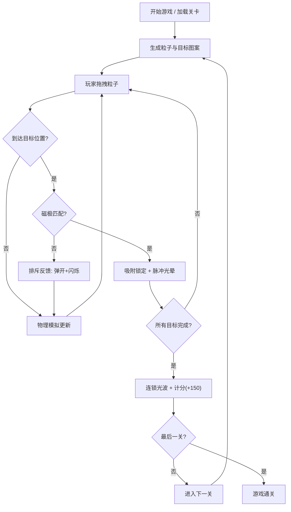

## 1. 产品概述

「磁光拼图」是一款基于浏览器的2D物理益智游戏，玩家通过拖拽彩色磁性粒子到指定区域，利用同极相斥、异极相吸的物理规则，将它们拼合成预设的发光图案。

- 目标用户：休闲游戏爱好者、独立游戏玩家
- 产品价值：提供有趣的物理模拟体验，结合视觉特效打造沉浸式益智玩法

## 2. 核心功能

### 2.1 功能模块
1. **主游戏页面**：Canvas游戏画布、分数显示、关卡编号、重置按钮
2. **粒子系统模块**：磁性粒子生成、磁极模拟、拖拽交互、长按标识
3. **物理引擎模块**：牛顿第二定律运动、磁力计算（斥力/引力）、阻尼、碰撞检测
4. **关卡系统模块**：3个预设关卡（五角星、雪花、心形）、干扰粒子、难度递进
5. **拼合检测模块**：吸附锁定、磁极匹配、脉冲光晕、排斥反馈
6. **特效与得分模块**：连锁光波、得分计算、视觉反馈

### 2.2 页面详情
| 页面名称 | 模块名称 | 功能描述 |
|---------|---------|---------|
| 主游戏页面 | Canvas画布 | 800x600px自适应画布，渲染所有游戏实体和粒子特效 |
| 主游戏页面 | 左上角UI | 白色20px字体显示当前分数和关卡编号 |
| 主游戏页面 | 右上角UI | 蓝色圆形重置按钮（直径30px，悬停35px浅蓝） |
| 主游戏页面 | 粒子系统 | 20个彩色圆形粒子，半径8-15px随机，带N/S磁极 |
| 主游戏页面 | 目标位置 | 半透明灰色光圈（半径20px）带磁极标记 |
| 主游戏页面 | 特效系统 | 脉冲光晕、连锁光波（金色到橙色渐变） |

## 3. 核心流程

玩家进入游戏后，从第一关（五角星）开始，需要从20个粒子中识别出带有正确磁极的粒子（干扰粒子无磁极标记），拖拽到对应目标位置。同极粒子到达目标位置会吸附锁定并发出脉冲光，磁极不匹配则弹开闪烁。当所有目标位置填满后，触发连锁光波反应，获得100分基础分+50分连锁奖励，自动进入下一关。玩家可随时点击重置按钮重新开始当前关卡。

## 4. 用户界面设计

### 4.1 设计风格
- **主色调**：深蓝到黑色径向渐变背景（中心略亮），粒子发光效果
- **强调色**：红色（N极）、蓝色（S极）、金色-橙色渐变（连锁光波）
- **按钮风格**：圆形、悬停弹性过渡（cubic-bezier(0.68, -0.55, 0.27, 1.55)）
- **字体**：无衬线字体，白色，20px（分数）、14px（磁极标识）
- **布局风格**：固定画布尺寸800x600px，居中自适应缩放，黑色填充四周
- **动效风格**：60fps锁定帧率，弹性过渡，发光粒子，渐变色光波

### 4.2 页面设计概述
| 页面名称 | 模块名称 | UI元素 |
|---------|---------|--------|
| 主游戏页面 | 背景 | 深蓝→黑色径向渐变 |
| 主游戏页面 | 粒子 | 半透明彩色发光球体（发光强度0.5），N极红色系/S极蓝色系 |
| 主游戏页面 | 目标位置 | 半透明灰色光圈（半径20px）+ 磁极提示 |
| 主游戏页面 | 分数/关卡 | 左上角，白色20px无衬线字体 |
| 主游戏页面 | 重置按钮 | 右上角，蓝色圆形，悬停浅蓝放大 |
| 主游戏页面 | 脉冲光晕 | 吸附时0.3秒透明度0.8→0 |
| 主游戏页面 | 连锁光波 | 1.5秒半径0→100px，金色#FFD700→橙色#FF8C00渐变 |

### 4.3 响应式
- 桌面优先设计，画布尺寸800x600px
- 自适应窗口缩放，保持4:3宽高比，四周黑色填充
- 支持鼠标拖拽、长按操作
