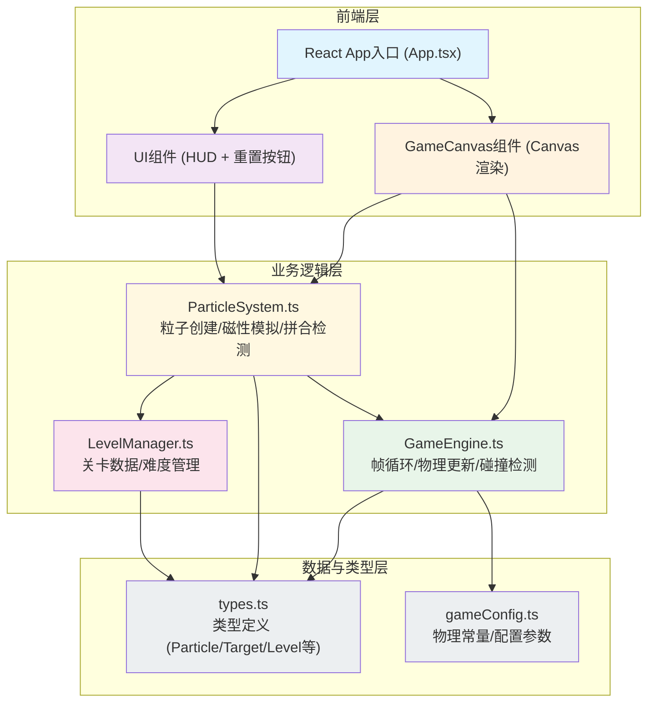

## 1. 架构设计



**数据流向说明：**
1. `App.tsx` 初始化应用，组装 `GameCanvas` + UI 组件
2. 用户交互（拖拽/点击）→ `GameCanvas` DOM 事件 → `ParticleSystem` 处理
3. `ParticleSystem` 管理粒子状态，每帧将粒子数组传递给 `GameEngine`
4. `GameEngine` 执行物理计算（磁力、运动、碰撞）→ 将更新后的数据返回给渲染层
5. `LevelManager` 提供关卡目标数据，`ParticleSystem` 进行拼合检测
6. 检测成功 → 触发特效状态变化 → Canvas 渲染层读取状态并绘制光效

## 2. 技术描述
- **前端框架**：React@18 + TypeScript@5 + Vite@5
- **Vite插件**：@vitejs/plugin-react@4
- **渲染技术**：Canvas 2D API（requestAnimationFrame 60fps锁定）
- **状态管理**：React useState/useRef（游戏状态用 ref 避免重渲染，UI状态用 state）
- **初始化工具**：Vite (react-ts 模板)
- **后端**：无（纯前端游戏）
- **数据库**：无（内存状态）

## 3. 文件结构与职责

```
src/
├── types.ts               # 全局类型定义 (Particle, Target, Level, GameState)
├── gameConfig.ts          # 物理常量 & 游戏配置
├── GameEngine.ts          # 游戏主循环引擎: 帧循环, 物理更新, 碰撞检测
├── ParticleSystem.ts      # 粒子系统: 创建, 磁性模拟, 拼合检测, 拖拽处理
├── LevelManager.ts        # 关卡数据管理 (五角星/雪花/心形)
├── App.tsx                # React入口, 组件组装
├── components/
│   ├── GameCanvas.tsx     # Canvas渲染组件, 绑定事件, 调用渲染
│   └── HUD.tsx            # UI组件: 分数, 关卡编号, 重置按钮
└── main.tsx               # React DOM挂载入口
```

**调用关系：**
- `GameCanvas.tsx` → `GameEngine` (start/stop), `ParticleSystem` (handleDragStart/Move/End)
- `GameEngine.ts` → 每帧调用 `ParticleSystem.updateParticles()` 并接收粒子数组
- `ParticleSystem.ts` → `LevelManager` (getLevelData), `GameEngine` (physics step)
- `HUD.tsx` → 通过 props 接收 score/level, 回调重置事件

## 4. 核心类型定义

```typescript
// types.ts
export type Pole = 'N' | 'S' | null;  // N红, S蓝, null=干扰粒子

export interface Particle {
  id: number;
  x: number;
  y: number;
  vx: number;
  vy: number;
  radius: number;        // 8-15px随机, 质量=radius²
  pole: Pole;            // 磁极
  color: string;         // 粒子颜色
  isDragging: boolean;
  isLocked: boolean;     // 是否拼合锁定
  lockedTargetId: number | null;
  flashRedUntil: number; // 排斥闪烁截止时间
  showPoleUntil: number; // 长按磁极标识截止时间
  pulseStart: number | null; // 吸附脉冲光起始时间
}

export interface Target {
  id: number;
  x: number;
  y: number;
  pole: 'N' | 'S';
  filledBy: number | null; // 填充的粒子ID
}

export interface Shockwave {
  cx: number;
  cy: number;
  startTime: number;
  duration: number;        // 1500ms
  maxRadius: number;       // 100px
}

export interface Level {
  id: number;
  name: string;
  targets: Target[];       // 5/6/8个
  particleCount: number;   // 图案粒子数×3
}

export interface GameState {
  score: number;
  levelIndex: number;
  particles: Particle[];
  targets: Target[];
  shockwaves: Shockwave[];
  isLevelComplete: boolean;
}
```

## 5. 物理常量配置 (gameConfig.ts)

```typescript
export const CONFIG = {
  CANVAS_WIDTH: 800,
  CANVAS_HEIGHT: 600,
  FPS: 60,
  DAMPING: 0.98,                    // 阻尼系数
  MAX_REPEL_DIST: 200,              // 最大排斥距离(px)
  MAX_ATTRACT_DIST: 150,            // 最大吸引距离(px)
  REPEL_STRENGTH: 8000,             // 排斥力强度 (平方衰减)
  ATTRACT_STRENGTH: 0.08,           // 吸引力强度 (线性增加)
  SNAP_DISTANCE: 15,                // 吸附判定距离
  REJECT_BOUNCE: 20,                // 排斥弹开距离
  FLASH_DURATION: 100,              // 闪烁时长(ms)
  PULSE_DURATION: 300,              // 脉冲光晕时长(ms)
  SHOCKWAVE_DURATION: 1500,         // 光波时长(ms)
  SHOCKWAVE_MAX_RADIUS: 100,        // 光波最大半径
  CHAIN_ACCELERATION: 50,           // 连锁加速度(px/s²)
  LONG_PRESS_DURATION: 1000,        // 长按触发时长(ms)
  DISTURBANCE_SPEED: 2,             // 干扰粒子随机速度上限
  LOCK_THRESHOLD: 15,               // 拼合判定距离(px)
  BASE_SCORE: 100,                  // 基础得分
  CHAIN_BONUS: 50,                  // 连锁奖励
  GLOW_INTENSITY: 0.5,              // 发光强度
  TARGET_RADIUS: 20,                // 目标光圈半径
};
```
