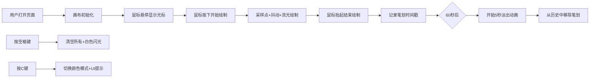

## 1. 产品概述

「流光便签」是一款基于Canvas的交互式自由书写Web应用，让用户在无限纵横的虚拟纸面上用鼠标自由书写文字或绘制涂鸦，每一笔划都带有渐变的动态流光效果，笔划会在1分钟后逐渐淡出消失，形成不断更新的光之画卷。

- 主要用途：创意书写、涂鸦创作、情绪表达、临时记事
- 目标用户：所有喜欢创意书写、涂鸦爱好者

## 2. 核心功能

### 2.1 功能模块
1. **画布页面**：全屏画布、流光笔刷、笔划淡出、快捷键操作、UI指示器

### 2.2 功能详情

| 页面名称 | 模块名称 | 功能描述 |
|-----------|-------------|---------------------|
| 画布页面 | 流光笔刷绘制 | 鼠标按住绘制连续笔划，每笔由密集采样点构成，相邻点直线段连接，线宽6像素 |
| 画布页面 | 流光渐变动画 | 光带（宽3像素，HSL色相渐变，透明度0.8）沿笔划60fps滑动，前端高亮后端渐隐 |
| 画布页面 | 笔划淡出机制 | 笔划创建60秒后开始淡出，持续5秒从起点向终点线性淡出，完成后移除 |
| 画布页面 | 笔划历史管理 | 维护绘制历史数组，每10帧清理超生命周期笔划，超200条时提前清理超45秒笔划 |
| 画布页面 | 空格键清空 | 按空格键清空所有笔划，触发0.3秒全屏白色闪光动画 |
| 画布页面 | C键颜色切换 | 按C键切换循环/单色模式，0.5秒UI提示从中央向上浮出淡出 |
| 画布页面 | 笔触抖动效果 | 拖拽时Simplex噪声偏移（幅度2px，频率0.1）模拟手写质感 |
| 画布页面 | 自定义光标 | 悬停显示白色半透明小圆点，绘制时十字准星 |
| 画布页面 | 颜色指示器 | 右上角圆形迷你指示器，中心脉动圆点2Hz脉动显示当前笔刷颜色 |
| 画布页面 | 操作提示文本 | 左下角显示操作说明文本 |

## 3. 核心流程

用户打开应用 → 鼠标悬停画布（显示小圆点光标） → 按住鼠标拖拽绘制（十字准星+抖动笔触+流光渐变） → 笔划绘制完成（记录时间戳） → 60秒后开始淡出 → 5秒淡出完成（从历史移除

## 4. 用户界面设计

### 4.1 设计风格
- 主色调：深灰蓝背景（#1a1a2e）
- 强调色：HSL高饱和度流光色彩（色相0-360度循环）
- 字体：12px小号字体用于提示文本
- 布局：全屏无边框无滚动条
- 光带动画：60fps流畅动画

### 4.2 页面设计概述

| 页面名称 | 模块名称 | UI元素 |
|-----------|-------------|-------------|
| 画布页面 | 全屏背景 | #1a1a2e深灰蓝，占满视口 |
| 画布页面 | 光标系统 | 悬停：4px半径白色半透明圆点；绘制：十字准星 |
| 画布页面 | 流光笔划 | 6px线宽，3px流光带，HSL渐变，前端高亮 |
| 画布页面 | 颜色指示器 | 右上角半径20px圆形，半透明黑背景，中心4px脉动圆点2Hz |
| 画布页面 | 提示文本 | 左下角两行12px #888文本 |
| 画布页面 | 清空闪光 | 0.3秒全屏白色闪光 |
| 画布页面 | 模式切换提示 | 半透明文字从中央向上浮出淡出0.5秒 |

### 4.3 响应式
- 全屏自适应视口尺寸，画布随窗口resize自动调整
- 像素比适配（DPR）
