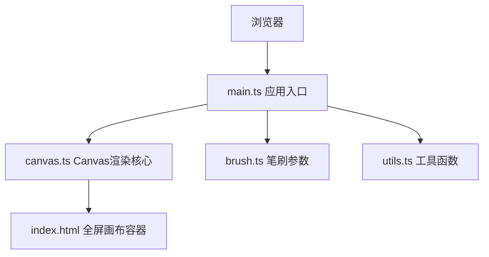

## 1. 架构设计



## 2. 技术说明

- 前端：TypeScript + Canvas API + Vite构建
- 构建工具：Vite（端口3000）
- 语言：TypeScript（严格模式，target ES2020）
- 无后端，纯前端应用

### 2.1 文件结构

```
项目根目录/
├── package.json          # 依赖配置（vite、typescript）
├── vite.config.js      # Vite构建配置
├── tsconfig.json      # TypeScript配置
├── index.html        # 入口页面
└── src/
    ├── main.ts       # 应用初始化，事件绑定，渲染循环
    ├── canvas.ts   # Canvas渲染核心
    ├── brush.ts    # 笔刷参数定义
    └── utils.ts  # 工具函数
```

## 3. 核心模块职责

### 3.1 src/main.ts
- 应用初始化入口
- 绑定鼠标事件（mousedown/mousemove/mouseup）
- 键盘事件（空格键/C键）
- 协调数据流和渲染循环（requestAnimationFrame 60fps）
- 管理UI状态（绘制中/颜色模式/闪光动画等）

### 3.2 src/canvas.ts
- Canvas尺寸管理、分辨率、像素比适配
- 绘制方法：流光渐变绘制
- 淡出动画管理
- 绘制历史数组维护
- 生命周期清理逻辑（每10帧清理）
- 性能优化（超200条提前清理）

### 3.3 src/brush.ts
- 笔刷参数定义：
  - 默认笔宽：6像素
  - 颜色渐变方向：HSL 0-360循环
  - 流光速度：每帧偏移2像素
  - 淡出计时器：60秒后开始，持续5秒

### 3.4 src/utils.ts
- 两点间渐变颜色计算
- 随机起始色生成
- 贝塞尔曲线坐标截取
- Simplex噪声实现（笔触抖动）

## 4. 数据结构

### 4.1 笔划结构（Stroke）
```typescript
interface Point {
  x: number;
  y: number;
  timestamp: number;
}

interface Stroke {
  points: Point[];
  createdAt: number;      // 创建时间戳
  startHue: number;  // 起始色相
  endHue: number;      // 终点色相
  flowOffset: number;  // 流光偏移量
  colorMode: 'cycle' | 'single';
  isFading: boolean;
}
```

## 5. 性能策略
- requestAnimationFrame 60fps渲染
- 每10帧执行一次历史清理
- 活跃笔划>200条时，提前移除>45秒的笔划
- Canvas像素比适配避免模糊
- 批量渲染优化
