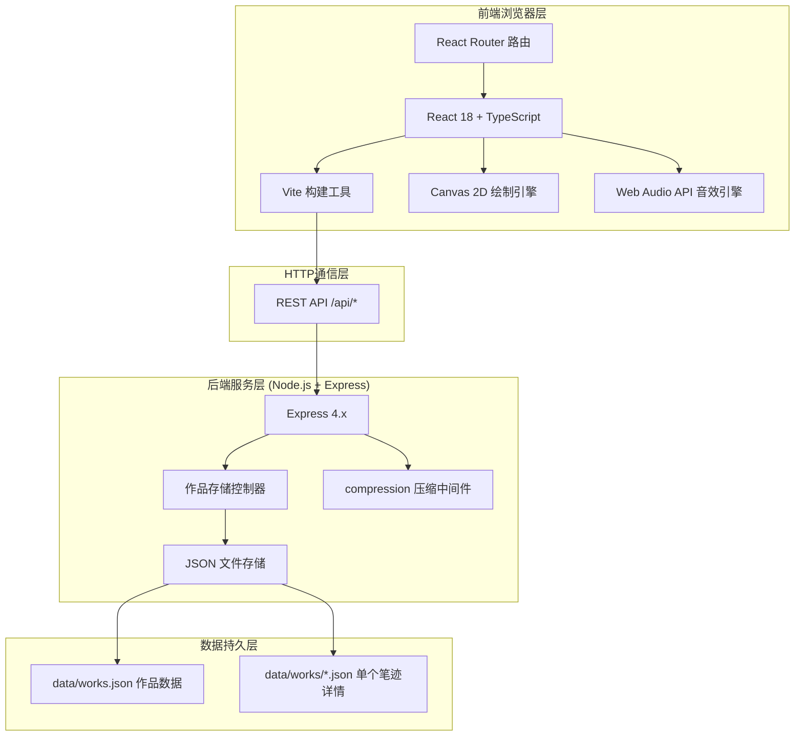
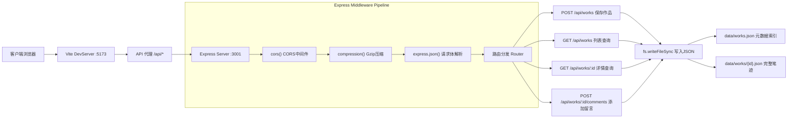
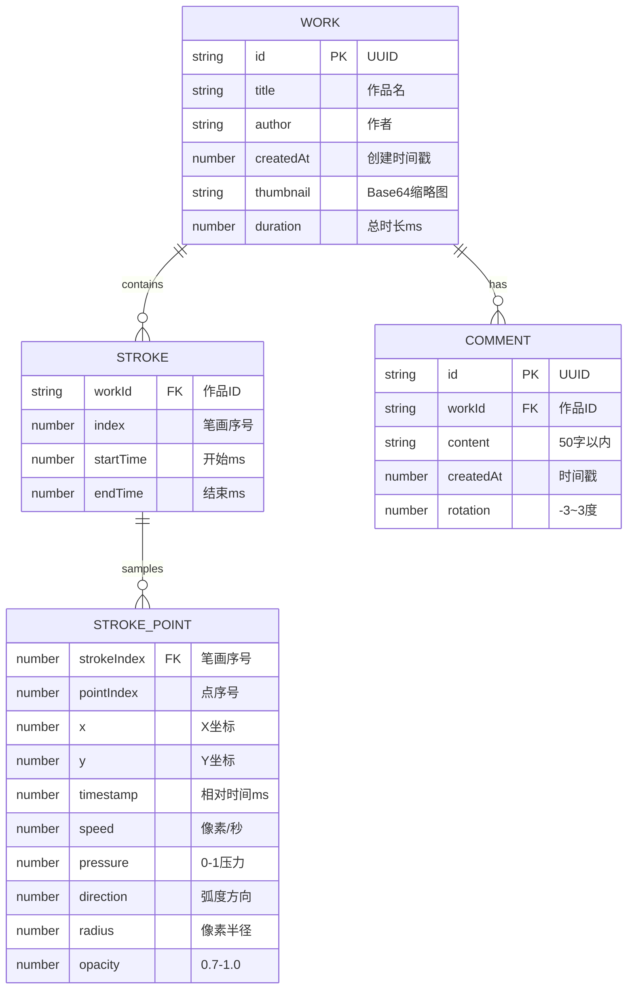

## 1. 架构设计



## 2. 技术描述

- **前端框架**: React@18 + ReactDOM@18 + TypeScript@5（严格模式，target ES2020）
- **构建工具**: Vite@5 + @vitejs/plugin-react（开发端口5173，代理/api到后端3001端口）
- **后端框架**: Express@4 + compression中间件（Gzip压缩）
- **数据存储**: 本地JSON文件系统（无需数据库，作品元数据存入data/works.json，笔迹详情存入data/works/{id}.json）
- **路由管理**: React Router DOM（hash模式，无需后端路由支持）
- **Canvas绘制**: 原生HTML5 Canvas 2D Context API（requestAnimationFrame驱动，60FPS目标）
- **音效合成**: 原生Web Audio API（AudioContext + OscillatorNode + GainNode + AudioBufferSourceNode + BiquadFilterNode）

## 3. 路由定义

| 路由路径 | 页面用途 |
|----------|----------|
| / | 首页 - 作品墙瀑布流展示 + 导航入口 |
| /create | 创作页 - 700x600宣纸画布 + 实时音效合成 + 保存按钮 |
| /work/:id | 详情页 - 笔迹回放 + 音效同步 + 作品信息 + 竖排便签留言 |

## 4. API 定义

### 4.1 类型定义（TypeScript）

```typescript
// 单个笔迹采样点
interface StrokePoint {
  x: number;           // X坐标（0-700）
  y: number;           // Y坐标（0-600）
  timestamp: number;   // 时间戳（ms，相对于书写开始）
  speed: number;       // 瞬时速度（像素/秒）
  pressure: number;    // 计算压力值（0-1，基于速度与按压时间）
  direction: number;   // 运动方向（弧度，0-2π）
  radius: number;      // 实际笔触半径（4-12px）
  opacity: number;     // 笔触透明度（0.7-1.0）
}

// 单笔画（一次鼠标按下到抬起）
interface Stroke {
  points: StrokePoint[];
  startTime: number;   // 相对于作品开始的ms
  endTime: number;
}

// 作品完整数据
interface Work {
  id: string;                    // UUID v4
  title: string;                 // 作品名（1-30字）
  author: string;                // 作者签名（1-20字）
  createdAt: number;             // 创建时间戳ms
  thumbnail: string;             // Base64 PNG缩略图
  duration: number;              // 总时长ms
  strokes: Stroke[];             // 所有笔画数据
  comments: Comment[];           // 留言列表
}

// 作品摘要（列表用）
interface WorkSummary {
  id: string;
  title: string;
  author: string;
  createdAt: number;
  thumbnail: string;
  duration: number;
  commentCount: number;
}

// 留言
interface Comment {
  id: string;
  content: string;               // 最长50字纯文本
  createdAt: number;
  rotation: number;              // -3到3度随机旋转
}
```

### 4.2 REST API 规范

**POST /api/works** - 保存新作品
- 请求体: `{ title: string, author: string, thumbnail: string, duration: number, strokes: Stroke[] }`
- 响应: `{ success: true, work: WorkSummary }`

**GET /api/works** - 获取作品列表
- 查询参数: 可选 `limit: number`
- 响应: `{ works: WorkSummary[] }`

**GET /api/works/:id** - 获取作品详情
- 响应: `{ work: Work }` 或 `{ error: "作品不存在" }`（404）

**POST /api/works/:id/comments** - 添加留言
- 请求体: `{ content: string }`
- 响应: `{ success: true, comment: Comment }`

## 5. 服务器架构图



## 6. 数据模型

### 6.1 ER 关系图



### 6.2 文件存储结构

```
data/
├── works.json          # 所有作品摘要索引
└── works/
    ├── {uuid-1}.json   # 作品1完整数据（笔画点+留言）
    ├── {uuid-2}.json   # 作品2完整数据
    └── ...
```

### 6.3 data/works.json 示例结构

```json
{
  "works": [
    {
      "id": "550e8400-e29b-41d4-a716-446655440000",
      "title": "宁静致远",
      "author": "墨客",
      "createdAt": 1717900000000,
      "thumbnail": "data:image/png;base64,iVBORw0KGgoAAAANS...",
      "duration": 8532,
      "commentCount": 3
    }
  ]
}
```
