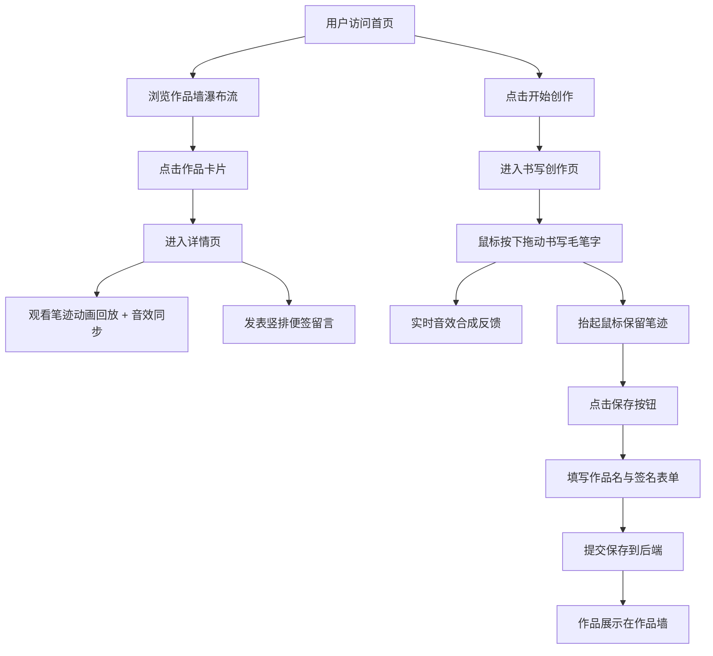

## 1. 产品概述

「墨香回声」是一款将中国传统书法艺术与现代声音艺术融合的创意Web应用，用户在虚拟宣纸上书写汉字时，笔迹的速度、压力与方向会实时映射为独特的音效，形成"音墨合一"的艺术作品。

- 核心价值：让用户在书写中体验墨色与声音的联动美感，创作独一无二的"音墨"作品
- 目标用户：书法爱好者、艺术创作者、对东方美学感兴趣的年轻人
- 市场定位：创意艺术工具类Web应用，融合传统文化与数字艺术

## 2. 核心功能

### 2.1 用户角色

| 角色 | 注册方式 | 核心权限 |
|------|----------|----------|
| 访客用户 | 无需注册 | 浏览作品墙、观看作品回放、欣赏音效 |
| 创作用户 | 无需注册 | 书写作品、保存作品、发布留言 |

### 2.2 功能模块

1. **首页（作品墙）**：瀑布流布局的作品展示、缩略图悬停放大、作品详情入口
2. **书写创作页**：700x600宣纸画布、毛笔笔触效果、实时音效合成、作品保存
3. **作品详情页**：笔迹动画回放、音效同步播放、作品信息展示、竖排便签留言

### 2.3 页面详情

| 页面名称 | 模块名称 | 功能描述 |
|----------|----------|----------|
| 首页 | 顶部导航栏 | 细长条半透明深色导航，展示品牌Logo「墨香回声」与「开始创作」入口 |
| 首页 | 作品墙瀑布流 | 卡片宽度200px、高度自适应，展示Canvas缩略图，悬停1秒缓慢放大至1.1倍并显示作品名与作者 |
| 书写创作页 | 宣纸画布 | 700x600像素米白色背景、细微纤维纹理、毛笔笔触（4-12px动态半径、速度越慢笔触越浓、边缘灰色晕染、透明度0.7-1.0） |
| 书写创作页 | 实时音效合成 | 分析最近0.2秒速度/方向/压力数据，映射为正弦波(慢=低频100-300Hz)、方波叠加(压力大)、白噪声颗粒(方向变化大)，抬起后0.5秒淡出 |
| 书写创作页 | 保存按钮 | 画布右下角圆形古铜色带光泽按钮，点击弹出表单输入作品名与简短签名 |
| 作品详情页 | 笔迹回放区 | 左侧700x600全尺寸画布、带铜色环播放按钮（点击环顺时针旋转）、左上角细金色进度条匀速前进 |
| 作品详情页 | 作品信息 | 右侧显示作品名称、作者、创作时间 |
| 作品详情页 | 留言区 | 最长50字纯文本输入、留言以竖排显示在淡黄色便签条上、每张便签随机旋转-3到3度堆叠排列 |

## 3. 核心流程

用户进入首页浏览作品墙，点击任意作品卡片进入详情页，观看笔迹回放与音效同步播放；用户点击「开始创作」进入书写页，在宣纸上按下鼠标拖动书写毛笔字，同时听到实时音效反馈，完成后点击保存按钮填写作品名与签名提交，作品即可在作品墙展示；其他用户可在详情页发表竖排便签留言。

## 4. 用户界面设计

### 4.1 设计风格

- **主色调**：米白（#F5F0E6）、墨黑（#2C2C2C）、古铜（#B87333）、朱红（#CC4444，按钮高亮）
- **背景**：粗糙纹理的宣纸色背景，营造宋代文人书房氛围
- **卡片风格**：1像素深描边模拟宣纸毛边效果
- **按钮样式**：圆形古铜色带淡淡光泽，平滑0.3秒ease-in-out过渡动画
- **字体**：标题采用思源宋体（Google Fonts引入），正文使用衬线字体
- **图标风格**：极简线性风格，铜色线条，与宋代文人审美呼应

### 4.2 页面设计概览

| 页面名称 | 模块名称 | UI元素 |
|----------|----------|--------|
| 首页 | 导航栏 | 细长条半透明深色背景、左对齐「墨香回声」思源宋体标题、右对齐「开始创作」朱红按钮 |
| 首页 | 作品墙 | 瀑布流多列布局、200px宽卡片、米白底1px墨黑描边、悬停1s放大至1.1倍+作品信息淡入 |
| 书写创作页 | 画布容器 | 居中700x600画布、米白底纤维纹理、右下角圆形古铜保存按钮（带光泽渐变） |
| 书写创作页 | 保存弹窗 | 半透明黑色遮罩、米白色宣纸弹窗、1px描边、思源宋体表单标签、朱红提交按钮 |
| 作品详情页 | 主容器 | 左右两栏布局、左侧回放区700px宽、右侧信息留言区自适应 |
| 作品详情页 | 播放控制 | 中央圆形播放按钮（带铜色环）、点击后环顺时针旋转、左上角细金色进度条 |
| 作品详情页 | 便签留言 | 淡黄色便签纸样式、竖排文字、每张随机-3°到3°旋转、轻微阴影堆叠效果 |

### 4.3 响应式设计

- 桌面端优先设计（1280px以上），瀑布流展示4列
- 平板端（768-1280px）瀑布流显示3列，详情页左右布局保持
- 移动端（768px以下）瀑布流2列，详情页上下堆叠，画布缩小至100%宽度
- 画布触摸事件适配，支持移动端手写笔压感

### 4.4 动效细节

- 作品卡片悬停：1秒内缓慢scale(1.1)，作品信息overlay从底部淡入
- 播放按钮：点击后铜色环以2秒/圈匀速旋转，播放完成后停止
- 保存按钮：hover时轻微scale(1.05) + 光泽从左至右扫过，active时scale(0.95)
- 便签留言：新增便签以rotate(0) + scale(0.8)淡入，过渡到随机旋转角度与scale(1)
- 页面切换：0.4秒opacity淡入淡出过渡
