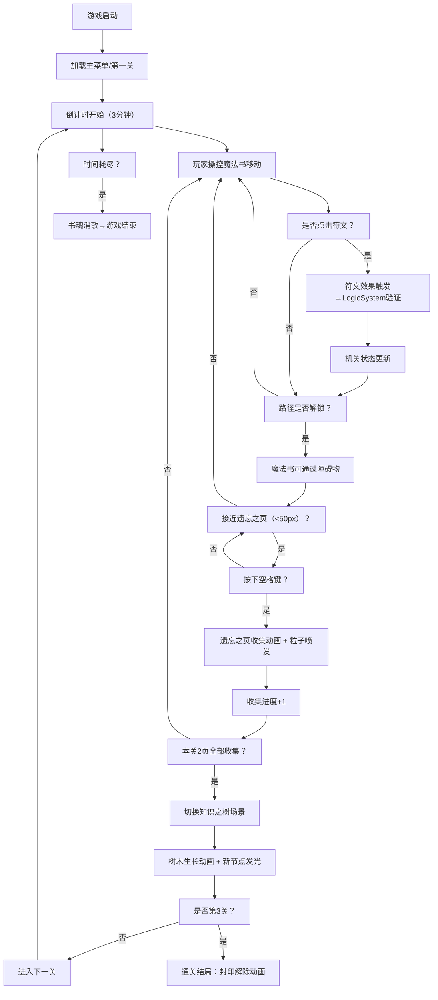

## 1. 产品概述

「书魂迷踪」是一款2D解谜游戏，玩家在被神秘力量侵蚀的古老图书馆中操控一本浮空魔法书，通过点击古代符文解开机关、收集「遗忘之页」来修复知识之树，最终解除封印。
- 核心玩法：魔法书移动操控 + 符文交互解谜 + 遗忘之页收集
- 目标用户：休闲解谜游戏爱好者、喜爱神秘图书馆题材的玩家

## 2. 核心功能

### 2.1 功能模块

1. **主游戏场景（BookScene）**：魔法书操控、符文交互、遗忘之页收集、地图元素渲染
2. **谜题逻辑系统（LogicSystem）**：世界观状态管理、符文组合规则验证、机关解锁条件判定
3. **知识之树场景（TreeScene）**：通关后知识之树生长动画、发光节点展示、粒子群效果
4. **关卡流程系统**：3关递进难度、3分钟倒计时、游戏结束判定
5. **粒子系统**：符文光晕扩散、遗忘之页收集粒子喷发、知识之树周围粒子群
6. **UI系统**：顶部倒计时、收集进度显示、游戏状态提示

### 2.2 功能详情

| 模块名称 | 子功能 | 功能描述 |
|---------|--------|---------|
| 魔法书操控 | 移动 | 键盘WASD/方向键控制，velocity驱动最大300px/s，平滑加减速 |
| 魔法书操控 | 浮空倾斜 | 移动时与方向相反倾斜-5°~5°，默认浮空上下浮动 |
| 魔法书操控 | 开合切换 | 点击书本切换封面/打开状态，打开时显示已收集页数 |
| 符文交互 | 6色符文 | 红橙黄绿蓝紫各对应不同解谜效果（红：石墙消失3秒；蓝：平台升降等） |
| 符文交互 | 点击反馈 | 闪烁2次（200ms/次，透明度1→0.2→1）+ 颜色光晕扩散（40px半径，0.5s） |
| 符文交互 | 悬停指示 | 柔光光圈脉动（1.2x→1.4x尺寸） |
| 遗忘之页收集 | 外观 | 40x50像素半透明发光纸张，2秒/圈旋转动画 |
| 遗忘之页收集 | 收集条件 | 距离<50像素 + 按下空格键 |
| 遗忘之页收集 | 收集动画 | 0.5秒缓动飞入书本 + 上升音阶粒子喷发 |
| 知识之树展示 | 生长 | 初始200px高度，每关+40px，末端发光节点 |
| 知识之树展示 | 节点渐变 | 暖橙（树根）→蓝紫（树梢）渐变 |
| 知识之树展示 | 粒子群 | 初始20个，每关+5个，缓慢旋转环绕 |
| 关卡流程 | 3关递进 | 1关：2障碍+1符文；2关：4障碍+2符文组合；3关：6障碍+3符文组合 |
| 关卡流程 | 倒计时 | 每关3分钟，耗尽显示「书魂消散」动画结束 |
| 视觉风格 | 背景 | 深紫→深蓝渐变，昏暗图书馆氛围 |
| 视觉风格 | 地图元素 | 低饱和度棕褐色墙壁/平台/机关 |
| 视觉风格 | 视差滚动 | 前景墙壁快、背景书架慢 |
| 视觉风格 | 字体 | Google Fonts Cinzel 哥特风格粗体 |

## 3. 核心流程

## 4. 用户界面设计

### 4.1 设计风格

- **主色调**：深紫（#1a0a2e）→深蓝（#0a1628）径向渐变背景
- **地图色**：低饱和棕褐系（#5a4a3a, #7a6a5a, #4a3a2a）
- **高亮色**：
  - 魔法书：金色发光（#ffd700, #ffaa00）
  - 符文：红（#ff4444）、橙（#ff8844）、黄（#ffdd44）、绿（#44dd44）、蓝（#4488ff）、紫（#aa44ff）
  - 遗忘之页：淡蓝白（#aaddff, #ffffff）
  - 知识之树：暖橙（#ff8844）→蓝紫（#6644aa）渐变
- **按钮/交互反馈**：点击缩放至0.9x再恢复，悬停柔光脉动
- **字体**：Cinzel（Google Fonts哥特风格粗体）
- **动画缓动**：全部使用EaseInOut曲线

### 4.2 页面布局

| 场景 | 区域 | 元素 | 样式说明 |
|------|------|------|---------|
| 游戏场景 | 顶部UI栏 | 倒计时 | Cinzel 24px粗体，白色，左对齐 |
| 游戏场景 | 顶部UI栏 | 收集进度（x/2） | Cinzel 24px粗体，金色，右对齐 |
| 游戏场景 | 中部 | 魔法书 | 60x80px，居中，浮空上下浮动 |
| 游戏场景 | 中部 | 地图元素 | 棕褐墙壁、平台、机关，视差滚动 |
| 游戏场景 | 中部 | 符文 | 30x30px，六色圆形，发光 |
| 游戏场景 | 中部 | 遗忘之页 | 40x50px，半透明旋转，发光 |
| 知识之树 | 全屏 | 知识之树 | 底部居中，向上生长 |
| 知识之树 | 全屏 | 发光节点 | 树枝末端，渐变发光 |
| 知识之树 | 全屏 | 粒子群 | 周围20+5n个，缓慢旋转 |
| 游戏结束 | 全屏 | 书魂消散文字 | Cinzel 48px，暗红渐变消散动画 |
| 通关 | 全屏 | 封印解除文字 | Cinzel 48px，金光发散动画 |

### 4.3 响应式设计

- 采用桌面端优先，Canvas全屏自适应
- 支持鼠标和触摸操作（移动端触摸等效点击）
- 键盘操控仅桌面端支持
