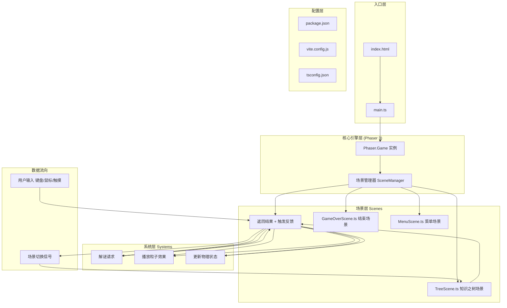

## 1. 架构设计



## 2. 技术说明

- **前端框架**：Phaser 3.80.x（2D游戏引擎，内置物理/粒子/场景管理）
- **开发语言**：TypeScript 5.x（严格模式，target ES2020）
- **构建工具**：Vite 5.x（开发服务器端口3000，HMR热更新）
- **物理引擎**：Phaser Arcade Physics（轻量AABB碰撞，velocity-based移动）
- **粒子系统**：Phaser ParticleManager（最大300粒子上限）
- **字体**：Google Fonts Cinzel（通过CSS预加载）
- **后端**：无（纯前端单页游戏）
- **数据存储**：内存状态（LogicSystem单例）

## 3. 文件结构与调用关系

```
project-root/
├── package.json          # 依赖声明+脚本
├── vite.config.js        # Vite配置（端口3000）
├── tsconfig.json         # TS配置（严格模式，ES2020）
├── index.html            # 入口页面（全屏深色渐变，加载Cinzel字体）
└── src/
    ├── main.ts           # ← 入口：创建Phaser.Game，注册所有场景
    │                     #     数据流向：接收用户输入→分发至各场景
    ├── scenes/
    │   ├── BookScene.ts  # ← 主场景：魔法书/符文/遗忘之页/UI
    │   │                 #     调用：LogicSystem（验证解谜）、Physics（移动碰撞）、Particles（特效）
    │   ├── TreeScene.ts  # ← 通关场景：知识之树生长动画
    │   ├── GameOverScene.ts  # ← 失败场景：书魂消散
    │   └── MenuScene.ts  # ← 开始菜单：标题+开始按钮
    ├── systems/
    │   └── LogicSystem.ts  # ← 谜题引擎：关卡状态/符文规则/机关解锁
    │                       #     被调用：BookScene传递解谜事件，返回状态变更
    └── types/
        └── index.ts      # ← 全局类型：符文/关卡/游戏状态接口
```

**调用链路**：
1. `index.html` 加载 `main.ts`
2. `main.ts` 实例化 `Phaser.Game` → 注册4个Scene → 启动 `MenuScene`
3. `MenuScene` 点击开始 → 切换到 `BookScene(level=1)`
4. `BookScene` 每帧：
   - 读取键盘输入 → 调 `physics.velocity` 移动魔法书
   - 监听鼠标点击 → 检测点击符文/书本
   - 点击符文 → 调用 `LogicSystem.activateRune(runeId)` → 返回解锁结果 → 触发粒子/机关动画
   - 监听空格 → 调 `LogicSystem.tryCollectPage()` → 返回是否可收集 → 播放收集动画
   - 收集2页 → 调 `scene.start('TreeScene')` 传参 level
5. `TreeScene` 播放生长动画 → 完成后切换到 `BookScene(level+1)` 或通关
6. 倒计时归零 → 切换到 `GameOverScene`

## 4. 核心数据模型

### 4.1 类型定义

```typescript
// 符文类型
enum RuneColor { RED='red', ORANGE='orange', YELLOW='yellow', GREEN='green', BLUE='blue', PURPLE='purple' }

interface Rune {
  id: string;
  color: RuneColor;
  x: number;
  y: number;
  activated: boolean;
  linkedObstacleIds: string[];  // 关联的障碍物ID
  combinationWith?: string[];    // 需与哪些符文组合触发
}

// 障碍物/机关
interface Obstacle {
  id: string;
  type: 'wall' | 'platform' | 'gate';
  x: number; y: number; width: number; height: number;
  unlocked: boolean;
  temporary?: boolean;           // 红色符文：临时消失3秒
  moveable?: boolean;            // 蓝色符文：可升降
  moveRange?: {minY: number, maxY: number};
}

// 遗忘之页
interface ForgottenPage {
  id: string;
  x: number; y: number;
  collected: boolean;
}

// 关卡配置
interface LevelConfig {
  level: number;
  timeLimit: number;  // 180秒
  obstacles: Obstacle[];
  runes: Rune[];
  pages: ForgottenPage[];
  parallaxLayers: {depth: number, speedFactor: number}[];
}

// 全局游戏状态
interface GameState {
  currentLevel: number;
  totalCollectedPages: number;
  treeHeight: number;           // 初始200，每关+40
  treeNodeCount: number;        // = totalCollectedPages
  particleCount: number;        // 初始20，每关+5
}
```

## 5. 性能约束实现方案

| 约束 | 实现方式 |
|------|---------|
| 60FPS稳定 | 1. Phaser Arcade轻量物理；2. 所有物体Sprite批量渲染；3. 粒子池化复用；4. 视差层按深度优化绘制 |
| 粒子≤300 | 1. ParticleManager.setMaxParticles(300)；2. 每类特效复用发射器；3. 粒子寿命≤1s自动回收 |
| 内存 | 1. 场景切换时清理非全局资源；2. 纹理图集预加载；3. LogicSystem单例 |

## 6. 物理与粒子参数

### 6.1 物理参数
- 魔法书body：60×80，无重力（immovable: false, allowGravity: false）
- 最大速度：300 px/s（x/y方向各自限制）
- 加速度：1500 px/s²（键盘按下线性加速）
- 摩擦：0.92（松开按键快速减速但不突兀）
- 倾斜角：Math.max(-5, Math.min(5, -velocity.x * 5 / 300)) 度

### 6.2 粒子参数
- 符文光晕：圆形Emitter，半径40px，生命0.5s，颜色对应符文色，α：0.8→0
- 遗忘之页收集：向上喷射，初速度100px/s，生命0.8s，颜色音阶从蓝→白渐变
- 知识之树粒子：圆周Emitter，半径300px，角速度0.2rad/s，生命∞，颜色随机暖色系
