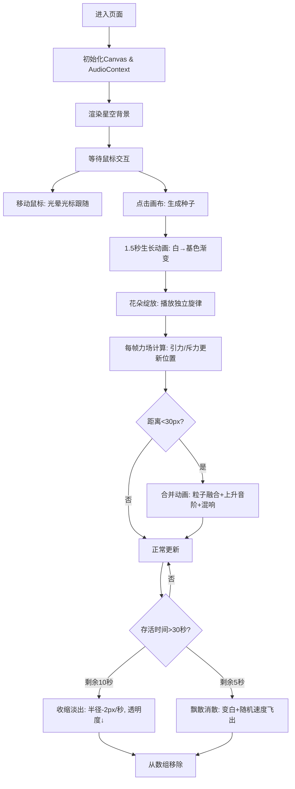

## 1. 产品概述

「音漾花镜」是一款数字艺术与自然交融的交互式Web应用，访客通过鼠标在虚拟花圃上"播种"光之花，体验音乐与视觉的共鸣。每朵花会播放旋律、感应彼此距离，形成一片不断演化、会呼吸的光之花海。

- 核心目标：打造沉浸式的互动艺术体验，融合粒子系统、力场模拟与音乐可视化
- 目标用户：数字艺术爱好者、互动体验探索者、创意设计从业者

## 2. 核心功能

### 2.1 功能模块

1. **播种与生长系统**：鼠标点击生成种子，动态生长为花朵粒子簇
2. **力场互动系统**：花朵间引力/斥力模拟，近距离触发合并动画
3. **音乐共鸣系统**：每朵花关联独立旋律，根据状态调整闪烁频率与音量
4. **生命周期管理**：花朵30秒存活，后期收缩淡出，末期飘散消散
5. **画布控制**：花朵数量上限50，R键重置画布，实时显示花朵数量
6. **鼠标反馈**：光晕光标、点击脉冲波纹、播种径向模糊

### 2.2 页面详情

| 页面名称 | 模块名称 | 功能描述 |
|---------|---------|---------|
| 主画布 | 星空背景层 | 深蓝紫黑渐变 + 四角径向光晕 + 随机星点闪烁 |
| 主画布 | 粒子渲染层 | 双缓冲Canvas绘制1250+粒子，时间线性模糊 |
| 主画布 | 力场交互层 | 150px作用范围，距离<30px触发合并 |
| 主画布 | 音频控制层 | Howler.js管理每花独立音效，合并时混响叠加 |
| 主画布 | HUD信息层 | 左上角14px白色花朵计数文本 |

## 3. 核心流程

访客进入全屏画布 → 移动鼠标显示光晕光标 → 点击位置生成种子 → 种子1.5秒内生长为粒子花 → 花朵播放旋律并闪烁 → 花朵间通过力场相互牵引/排斥 → 近距离花朵合并融合 → 30秒生命周期结束收缩消散 → 达50朵自动删除最旧花 → 按R键清空重置。

## 4. 用户界面设计

### 4.1 设计风格
- **主色调**：深度夜空渐变（#0b0c1a → #1a0a2e）
- **花朵配色**：HSB模式，色相0-360随机，饱和度70-90%，亮度80%
- **字体**：Google Fonts Playfair Display（标题）+ sans-serif（HUD文本）
- **视觉语言**：高饱和度发光粒子、光晕叠加、时间模糊拖尾、呼吸般的频率变化
- **交互反馈**：半透明光晕光标 + 脉冲波纹 + 径向模糊播种动效

### 4.2 页面设计概述

| 区域 | 模块 | UI元素 |
|-----|-----|-------|
| 全局背景 | 星空层 | 垂直渐变背景 + 四角径向光晕 + 20px间隔星点(0.5px, 0.2透明度, 缓慢闪烁) |
| 花朵渲染 | 粒子层 | 圆形排列粒子 + 正弦波抖动 + 每秒闪烁(鼠标悬停×2, 合并×3) |
| HUD | 信息层 | 左上角14px白色"花朵数量: N"文本 |
| 光标 | 交互层 | 24px半透明光晕，色相跟随平均花色 |

### 4.3 响应式

桌面端全屏Canvas优先，适配任意视口尺寸，窗口resize时Canvas同步更新。

### 4.4 视觉特效细节
- **双缓冲渲染**：离屏Canvas预渲染 → 主Canvas绘制，启用时间线性模糊
- **粒子排列**：圆形分布算法，每粒子沿半径方向正弦波轻微抖动（振幅1-2px，频率0.5-1Hz）
- **合并特效**：两花粒子向中心汇聚 → 颜色混合 → 新基色平均值 → 上升音阶(大三度)
- **飘散特效**：最后5秒，每粒子随机方向速度2-5px/帧，线性变白，透明度降至0
