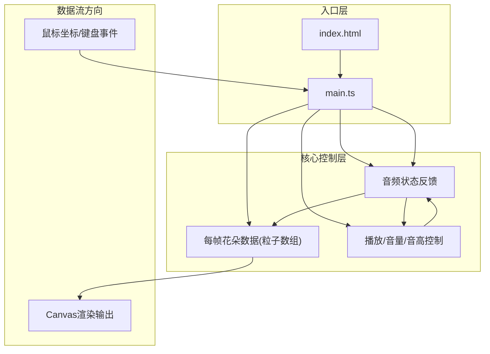

## 1. 架构设计



## 2. 技术说明

| 技术栈 | 版本/说明 | 用途 |
|-------|---------|------|
| Vite | 最新稳定版 | 构建工具，开发服务器端口3000 |
| TypeScript | 5.x | 严格模式，target ES2020 |
| Canvas API | 原生HTML5 | 粒子渲染、双缓冲、特效绘制 |
| Howler.js | 2.2.x | 音频管理、循环旋律、音量/音高控制 |
| Web Audio API | 原生(配合Howler) | 混响效果叠加(ConvolverNode) |

## 3. 模块职责与调用关系

### 3.1 文件结构

```
项目根目录/
├── package.json              # 依赖: vite, typescript, howler
├── vite.config.js            # 端口3000
├── tsconfig.json             # strict: true, target: ES2020
├── index.html                # 入口，全屏暗色，Google Fonts Playfair Display
└── src/
    ├── main.ts               # 初始化协调层
    ├── flowerSystem.ts       # 花朵系统(创建/更新/力场/生命周期)
    ├── renderer.ts           # 渲染层(双缓冲/粒子/特效/模糊)
    └── audioManager.ts       # 音频层(Howler/音色/音量/混响)
```

### 3.2 模块调用关系

| 调用方 | 被调用方 | 触发时机 | 数据传递 |
|-------|---------|---------|---------|
| main.ts | flowerSystem | 鼠标点击 | `{x, y}` 像素坐标 |
| main.ts | flowerSystem | 键盘R键 | 清空指令 `clearAll()` |
| main.ts | flowerSystem | 每帧rAF | `update(dt, mouseX, mouseY)` → `Flower[]` |
| main.ts | renderer | 每帧rAF | `render(flowers, mouseX, mouseY, rippleData)` |
| main.ts | audioManager | 启动时 | `initAudioContext()` |
| flowerSystem | audioManager | 花朵绽放 | `playMelody(flowerId, pitch, volume)` |
| flowerSystem | audioManager | 花朵合并 | `playMergeSound(flowerIds)` + 混响开关 |
| flowerSystem | audioManager | 鼠标悬停 | `setVolume(flowerId, volume * 1.2)` |
| renderer | — | 绘制 | 只读花朵数据，不修改状态 |

## 4. 核心数据模型

### 4.1 花朵数据结构 (Flower)

```typescript
interface Particle {
  angle: number;        // 粒子在圆周上的角度(0-2π)
  radiusOffset: number; // 相对花半径的偏移
  baseColor: HSL;       // 粒子基色
  jitterPhase: number;  // 正弦抖动相位
  jitterAmp: number;    // 抖动振幅(1-2px)
  jitterFreq: number;   // 抖动频率(0.5-1Hz)
  driftVx?: number;     // 飘散阶段x速度
  driftVy?: number;     // 飘散阶段y速度
}

interface Flower {
  id: string;
  x: number;            // 花朵中心x
  y: number;            // 花朵中心y
  vx: number;           // 力场速度x
  vy: number;           // 力场速度y
  baseHue: number;      // 基色色相(0-360)
  baseRadius: number;   // 最终半径(15-25px)
  currentRadius: number; // 当前半径(动画中)
  particleCount: number; // 15-25
  particles: Particle[];
  growthProgress: number; // 0-1, 1.5秒完成
  lifetime: number;     // 已存活毫秒
  maxLifetime: number;  // 30000ms
  isMerged: boolean;    // 是否为合并花
  mergeCount: number;   // 合并次数(影响闪烁×3)
  createdOrder: number; // 创建顺序(用于淘汰最旧)
  melodyPlaying: boolean;
  hovered: boolean;     // 鼠标悬停(闪烁×2)
  opacity: number;      // 1-0淡出
}
```

### 4.2 鼠标反馈数据

```typescript
interface Ripple {
  x: number;
  y: number;
  startTime: number;    // 用于插值0.4秒动画
  duration: number;     // 400ms
}

interface MouseState {
  x: number;
  y: number;
  inCanvas: boolean;
  avgHue: number;       // 所有花平均色相(光标颜色)
}
```

## 5. 关键算法说明

### 5.1 力场模拟 (每帧执行, O(n²))

```
对每对花朵A、B:
  dx = B.x - A.x
  dy = B.y - A.y
  dist² = dx*dx + dy*dy
  dist = √dist²

  若 dist < 150px:
    引力量级 = 0.00015 * dist  (随距离增大)
    斥力量级 = 0.002 / (dist² + ε)  (近距离指数增大)
    合力 = 斥力 - 引力
    A.vx += 合力 * dx/dist
    A.vy += 合力 * dy/dist
    B.vx -= 合力 * dx/dist
    B.vy -= 合力 * dy/dist

  若 dist < 30px 且 双方均非合并动画中:
    触发合并流程:
      新粒子数 = A粒子数 + B粒子数
      新半径 = max(A,B)*1.3
      新色相 = (A.hue + B.hue)/2
      A保留, B标记删除
      A.mergeCount++, A.isMerged=true
```

### 5.2 生长动画插值 (easeOutCubic)

```
t = elapsed / 1500ms  (t ∈ [0,1])
easedT = 1 - (1-t)³   // easeOutCubic

粒子颜色 = lerp(
  HSL(0, 0%, 100%),      // 种子白
  HSL(hue, 80%, 80%),    // 基色
  easedT
)

currentRadius = lerp(2, baseRadius, easedT)
```

### 5.3 生命周期阶段

| 阶段 | 触发条件 | 行为 |
|-----|---------|------|
| 生长期 | growthProgress < 1 | easeOutCubic半径与颜色插值 |
| 绽放期 | lifetime < 20000ms | 正常闪烁(1Hz), 力场更新 |
| 收缩期 | 20000ms ≤ lifetime < 25000ms | radius -= 2px/s, opacity = 1-(t-20s)/5s |
| 飘散期 | lifetime ≥ 25000ms | 每粒子driftVx/Vy ∈ [-5,5]≠0, 颜色渐白, opacity线性至0 |
| 消亡 | lifetime ≥ 30000ms 或 opacity ≤ 0 | 从数组splice删除, 停止音频 |

### 5.4 性能优化策略

1. **双缓冲渲染**：离屏Canvas绘制所有粒子 → 主Canvas一次性绘制，减少状态切换
2. **时间线性模糊**：每帧不清除主Canvas，`fillRect(0,0,w,h, 0.08透明度)`实现拖尾
3. **力场计算剪枝**：按150px网格空间分区，只计算相邻格子的花朵对
4. **淘汰策略**：达50朵时，优先删除`!isMerged && lifetime最小`的花

## 6. 音频音色设计

使用Howler.js合成Web Audio正弦波：
- 每朵花分配D大调音阶随机音符：D4, E4, F#, G4, A4, B4, C#, D5
- 花朵半径越大 → 音高越低(最多降3semitones)
- 粒子越多 → 音量越大(-20dB → -5dB)
- 合并音效：大三度上升琶音(C→E→G) + ConvolverNode混响(impulse response 2s衰减指数)
