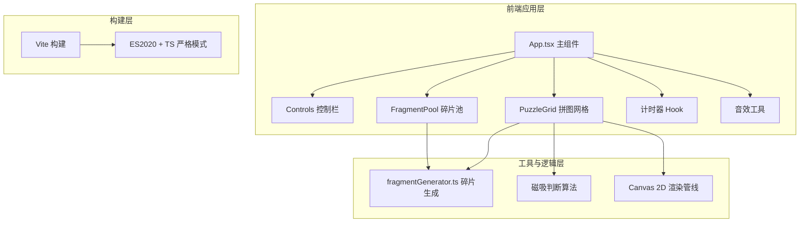

## 1. 架构设计



## 2. 技术栈说明

- **前端框架**：React 18 + TypeScript（严格模式，target ES2020，module ESNext）
- **构建工具**：Vite，配置路径别名 `@` → `src/`
- **渲染引擎**：Canvas 2D API（碎片绘制、裁剪、波纹动画）
- **状态管理**：React useState/useReducer（轻量级，无需额外库）
- **音频**：Web Audio API（OscillatorNode 生成 400Hz 短脉冲）
- **无后端、无数据库，纯前端应用**

## 3. 文件结构与路由

本项目为单页应用，无路由。文件结构如下：

| 文件路径 | 职责说明 |
|----------|----------|
| `package.json` | 依赖：react、react-dom、typescript、vite、@vitejs/plugin-react；脚本：npm run dev |
| `vite.config.js` | 构建配置，别名 @ → src |
| `tsconfig.json` | 严格模式，target ES2020，module ESNext，别名配置 |
| `index.html` | 入口页，标题「碎片重构·拼图工作室」，引入 reset.css |
| `src/reset.css` | 全局样式重置 + CSS 变量定义 |
| `src/App.tsx` | 主组件：上传/难度/开始/重置状态管理、计时器、完成动画、组件编排 |
| `src/components/Controls.tsx` | 文件上传按钮、难度下拉、开始/重置按钮、方格进度条 |
| `src/components/PuzzleGrid.tsx` | 网格背景、Canvas 渲染、拖拽事件、磁吸逻辑（<12px对齐+0.2s缓动）、已拼碎片状态 |
| `src/components/FragmentPool.tsx` | 待拖拽碎片缩略图列表、随机排列、拖拽事件冒泡 |
| `src/utils/fragmentGenerator.ts` | 图片切割为随机多边形（顶点4-7个）、裁剪路径、平均色计算、锯齿边框生成 |
| `src/utils/audio.ts` | Web Audio API 封装，播放 400Hz 短脉冲点击音效 |

## 4. 核心数据模型

```typescript
// 难度配置
type Difficulty = 'easy' | 'normal' | 'hard';
interface DifficultyConfig {
  gridSize: number;       // 4 | 6 | 8
  totalFragments: number; // 16 | 36 | 64
}

// 单个碎片
interface Fragment {
  id: string;
  gridRow: number;        // 原始所在网格行
  gridCol: number;        // 原始所在网格列
  path: Path2D;           // Canvas 裁剪路径（随机多边形）
  vertices: {x:number;y:number}[]; // 多边形顶点
  sourceX: number;        // 原图中对应区域X
  sourceY: number;        // 原图中对应区域Y
  cellWidth: number;
  cellHeight: number;
  averageColor: string;   // 碎片区域平均色（rgba）
  isPlaced: boolean;      // 是否已正确放置
  placedX?: number;       // 拼图区放置位置X（网格中心）
  placedY?: number;       // 拼图区放置位置Y
}

// 拼图整体状态
type GameState = 'idle' | 'uploaded' | 'fragmented' | 'playing' | 'completed';
```

## 5. 关键算法

### 5.1 碎片生成算法
1. 将图片按 N×N 网格等分，确定每个格子的 cellWidth/cellHeight
2. 对每个格子：
   - 以格子中心为基准，在格子内随机生成 4~7 个顶点
   - 每个顶点在原正交边界基础上做 ±15% 的随机偏移，形成不规则多边形
   - 使用离屏 Canvas + getImageData 计算该区域像素平均色
   - 生成 Path2D 对象作为裁剪路径

### 5.2 磁吸对齐算法
1. 拖拽结束时获取碎片中心坐标 (cx, cy)
2. 遍历所有未被占用的网格中心，计算欧氏距离
3. 取最小距离 d_min，若 d_min < 12px：
   - 启动 requestAnimationFrame 缓动：0.2s 内从当前位置插值到网格中心
   - 触发光晕动画：strokeStyle = 淡金色，lineWidth = 2，opacity 做正弦呼吸（0.5s周期）
   - 色相偏移：在临时 Canvas 上调整 hue +20° 并闪烁一次
   - 调用 audio.playClick() 播放 400Hz 短脉冲
   - 标记碎片 isPlaced = true
4. 否则碎片回到当前鼠标位置

### 5.3 波纹完成动画
1. 创建单独的 Canvas 层覆盖整图
2. t ∈ [0, 2000ms]，r(t) = (t/2000) * imageWidth
3. 以图片中心为圆心画圆：
   - radialGradient 从白色 → 原图平均色
   - globalAlpha = 0.8 * (1 - t/2000)
4. t = 2000ms 后移除波纹层
5. t = 1000ms 时开始淡入"拼图完成！"文字（textShadow 发光）

## 6. 性能优化策略

- **Canvas 分层渲染**：背景网格层 + 已放置碎片层 + 当前拖拽碎片层，避免全量重绘
- **requestAnimationFrame 驱动**：所有动画统一走 RAF，节流至 60fps
- **离屏预渲染**：每个碎片在初始化时预渲染到离屏 Canvas，拖拽时直接 drawImage
- **磁吸判断优化**：用网格坐标直接计算目标中心，O(1) 复杂度避免遍历
- **事件节流**：pointermove 使用 passive 监听 + 阈值判断减少状态更新
