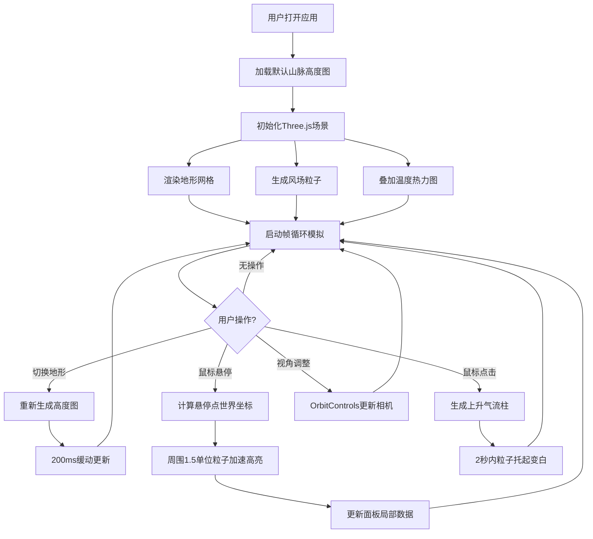

## 1. 产品概述

风温地形·动态气候是一款面向地理气象爱好者的3D交互可视化应用，通过浏览器实时模拟不同地形上方的风场流动与温度分布，让用户直观探索气流如何受地形影响产生湍流、上升气流和涡旋现象。

- 核心目的：提供沉浸式的气象物理模拟体验，帮助用户理解地形-气流-温度的耦合关系
- 目标用户：地理气象爱好者、学生、教育工作者、科研人员
- 市场价值：填补浏览器端3D气象模拟交互教学工具的空白，兼具教育性与观赏性

## 2. 核心功能

### 2.1 用户角色

| 角色 | 注册方式 | 核心权限 |
|------|---------|---------|
| 访客用户 | 无需注册 | 浏览所有地形、交互模拟、查看数据面板 |

### 2.2 功能模块

1. **主场景页面**：3D地形渲染、风场粒子系统、温度热力图叠加
2. **地形切换模块**：三种预置地形（山脉、丘陵、盆地）下拉选择
3. **风场模拟模块**：2000粒子向量场驱动、Perlin湍流噪声、鼠标交互扰动
4. **热力图模块**：海拔递减温度、风速降温效应、半透明颜色叠加
5. **数据面板模块**：实时气象数据展示、悬停点信息
6. **交互控制模块**：OrbitControls视角控制、鼠标悬停加速、点击上升气流

### 2.3 页面详情

| 页面名称 | 模块名称 | 功能描述 |
|---------|---------|---------|
| 主场景 | 3D地形渲染 | 基于Canvas 2D生成256x256灰度高度图，注入PlaneGeometry生成起伏地形 |
| 主场景 | 风场粒子系统 | 0-50高度区间分布2000发光粒子，颜色蓝-白-红渐变映射风速 |
| 主场景 | 温度热力图 | 半透明彩色纹理叠加，海拔每10单位降0.6度，强风区额外降0.3度 |
| 主场景 | 地形切换 | 下拉菜单切换三种预置地形，200ms缓动过渡 |
| 主场景 | 悬停交互 | 悬停点周围1.5单位半径内粒子加速50%，高亮黄色，0.5秒恢复 |
| 主场景 | 点击交互 | 点击产生2秒上升气流柱（半径1，高度10），粒子托起变白 |
| 主场景 | 数据面板 | 10Hz更新：地形名、平均风速、最高/最低温、悬停点海拔与温度 |

## 3. 核心流程

用户打开应用 → 加载默认山脉地形 → 3D场景初始化（地形+风场+热力图）→ 自动开始模拟循环
→ 用户可：
  - 下拉切换地形 → 高度图重新生成 → 地形/风场/热力图平滑过渡更新
  - 鼠标拖拽/滚轮 → OrbitControls调整视角
  - 鼠标悬停地形 → 探测点坐标 → 周围粒子加速高亮 + 数据面板显示局部信息
  - 鼠标点击地形 → 上升气流柱激活 → 粒子被托起变色
  - 观察数据面板 → 实时读取全局与局部气象指标

## 4. 用户界面设计

### 4.1 设计风格

- **主色调**：深空蓝渐变背景（#0a0a2e → #1a1a3e），营造宇宙深空的沉浸感
- **辅助色**：粒子风速渐变蓝(#4A90D9)→白(#FFFFFF)→红(#FF6B6B)，热力图色相180°(蓝)→0°(红)
- **高亮色**：交互悬停黄色(#FFFF00)，上升气流白色(#FFFFFF)
- **字体**：选用科技感无衬线字体，数字等宽显示
- **按钮/控件**：半透明深色玻璃拟态风格，圆角8px，微妙发光边框
- **图标风格**：线性简洁图标，白色描边，配合悬停微动效

### 4.2 页面设计概览

| 页面名称 | 模块名称 | UI元素 |
|---------|---------|--------|
| 主场景 | 3D视口 | 全屏Canvas、深空渐变背景、定向光+环境光阴影 |
| 主场景 | 左上角数据面板 | 半透明深色(#00000080)、圆角8px、白色12-14px字体、5项数据指标 |
| 主场景 | 顶部地形选择器 | 居中悬浮下拉框、玻璃拟态、三种地形选项、200ms展开动画 |
| 主场景 | 风场粒子 | 2-5px随机尺寸、颜色渐变映射、透明度0.6-1.0呼吸动画 |
| 主场景 | 热力图纹理 | 渐变条纹、0.6透明度与Phong材质混合、光洁质感 |
| 主场景 | 交互反馈 | 悬停高亮脉冲、点击气流柱发光扩散动画 |

### 4.3 响应式设计

- **桌面端(>768px)**：2000粒子、左上角数据面板、标准控件布局
- **移动端(≤768px)**：粒子数减半至1000、数据面板移至底部居中、触控优化手势、简化控件尺寸

### 4.4 3D场景指引

- **环境氛围**：深空蓝渐变雾化，营造高空气象观测视角
- **光照设置**：定向光(方向左上，强度0.8)投射斜面阴影 + 环境光(强度0.3)柔和补光
- **相机设置**：PerspectiveCamera初始距离50，俯角45°，OrbitControls限制极角避免穿地
- **构图焦点**：地形居中，粒子流动形成视觉引导线，热力图提供色彩层次
- **交互动画**：地形切换200ms顶点缓动、粒子加速非线性过渡、气流柱渐进出现-消失
- **后期效果**：粒子轻微辉光、热力图颜色插值平滑、整体色调微微泛蓝
- **性能预算**：单帧CPU<16ms、GPU粒子使用BufferGeometry、高度图生成在空闲期预计算
