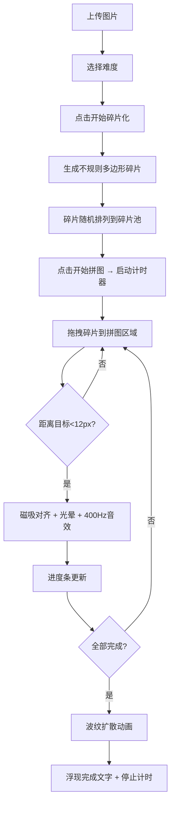

## 1. 产品概述

碎片重构·拼图工作室是一款基于Web的交互式拼图应用，解决传统拼图游戏缺乏动态视觉反馈和创意表达的问题。用户上传任意图片，系统自动将其切割为不规则多边形碎片，通过拖拽磁吸方式拼接复原，全程配以丰富的视觉动效和音效反馈。

- 核心用户：拼图爱好者、创意工作者、休闲游戏玩家
- 核心价值：提供沉浸式拼图体验，结合动态视觉效果与精准交互反馈

## 2. 核心功能

### 2.1 用户角色
| 角色 | 注册方式 | 核心权限 |
|------|----------|----------|
| 普通用户 | 无需注册 | 上传图片、选择难度、进行拼图、查看计时 |

### 2.2 功能模块
1. **控制栏模块**：文件上传、难度选择、开始/重置按钮、进度条展示
2. **碎片池模块**：待拼接碎片的随机排列展示区域
3. **拼图网格模块**：目标拼接区域，处理拖拽交互与磁吸对齐逻辑
4. **计时器模块**：实时计时、停止、重置功能
5. **动画与音效模块**：磁吸光晕、波纹扩散、完成文字、Web Audio音效

### 2.3 页面详情
| 页面名称 | 模块名称 | 功能描述 |
|----------|----------|----------|
| 主页面 | 图片预览区 | 显示用户上传的原图缩略图 |
| 主页面 | 控制栏 | 文件上传（点击/拖拽，≤5MB）、难度下拉（简单4x4/普通6x6/困难8x8）、开始按钮、重置按钮、方格进度条 |
| 主页面 | 碎片池 | 不规则多边形碎片随机排列，支持拖拽出池 |
| 主页面 | 拼图网格 | 4x4/6x6/8x8网格背景线、碎片拖拽目标区、磁吸判断、缓动动画 |
| 主页面 | 计时器 | 右下角MM:SS格式实时显示 |
| 主页面 | 完成动画层 | 中心向外彩色波纹扩散、"拼图完成！"发光文字 |

## 3. 核心流程

用户上传图片 → 选择难度级别 → 点击"开始碎片化"生成碎片 → 碎片随机排列到碎片池 → 点击"开始拼图"启动计时器 → 用户拖拽碎片到拼图区域 → 距离<12px触发磁吸对齐+光晕+400Hz音效 → 进度条逐格填充 → 全部拼接完成 → 波纹扩散动画 → 浮现完成文字 → 计时停止显示总用时

## 4. 用户界面设计

### 4.1 设计风格
- **主色调**：深灰蓝背景 #1A1A2E、拼图区 #16213E、碎片池 #0F3460
- **强调色**：渐变按钮 #4A90D9 → #357ABD、进度条 #4A90D9 → #50E3C2、金色光晕
- **字体**：柔和无衬线字体，文字色 #E0E0E0，完成字 48px 白色发光
- **按钮**：圆角8px，悬停亮度+10%
- **光标**：拖拽时 grabbing，普通状态 grab
- **动效**：磁吸缓动0.2s、光晕脉冲0.5s、波纹2s、完成文字1s

### 4.2 页面设计概述
| 页面名称 | 模块名称 | UI 元素 |
|----------|----------|----------|
| 主页面 | 整体布局 | 深色极简三栏布局（左预览+中控+右碎片池），768px以下垂直排列 |
| 主页面 | 控制栏 | 顶部横向排列，圆角按钮、方格进度条、细线条计时器 |
| 主页面 | 碎片样式 | 半透明锯齿边框2-4px（取自区域平均色，透明度0.3），拖拽时opacity 0.85 + 深灰投影（偏移5px模糊3px透明度0.4） |
| 主页面 | 磁吸反馈 | 2px淡金色光晕呼吸效果（透明→不透明→透明，0.5s周期），色相偏移+20° |
| 主页面 | 完成动画 | 中心→外彩色波纹（半径0→图片宽，白色→原图平均色，2s透明度0.8→0），48px白色发光"拼图完成！" |

### 4.3 响应式设计
- Desktop-first，≥768px 三栏横向布局
- <768px 切换为上下垂直布局，碎片尺寸缩小至70%
- 触控设备支持 pointer 事件拖拽

### 4.4 性能要求
- 36块碎片模式拖拽帧率 ≥ 50fps
- 磁吸对齐判断响应 < 50ms
- Canvas 2D 渲染所有图形，避免频繁 DOM 操作
