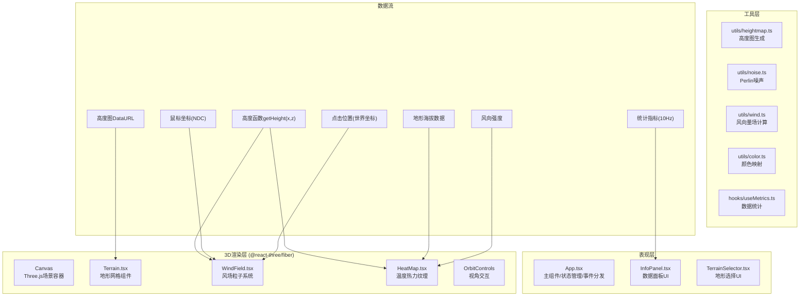

## 1. 架构设计



## 2. 技术描述

- **前端框架**：React@18 + TypeScript@5，严格模式
- **构建工具**：Vite@5 + @vitejs/plugin-react，支持React Refresh热更新
- **3D引擎**：three@0.160 + @react-three/fiber@8 + @react-three/drei@9
  - 选择理由：R3F将Three.js声明式化，与React生命周期无缝结合；drei提供OrbitControls等成熟组件
- **状态管理**：React useState + useRef（局部轻量状态），无需全局store
- **数学计算**：自研Perlin噪声实现、THREE.Vector3向量运算
- **纹理生成**：Canvas 2D API动态生成256x256高度图与热力图纹理
- **初始化方式**：使用vite-init的react-ts模板脚手架初始化

## 3. 目录与文件结构

```
auto32/
├── package.json                     # 项目依赖与脚本
├── vite.config.js                   # Vite配置(React+TS)
├── tsconfig.json                    # TS严格模式配置
├── index.html                       # 入口HTML，深空蓝背景
└── src/
    ├── main.tsx                     # React入口，挂载App
    ├── App.tsx                      # 主组件：Canvas+状态+UI+事件
    ├── styles.css                   # 全局样式：渐变背景、面板样式
    ├── components/
    │   ├── Terrain.tsx              # 地形：高度图→PlaneGeometry→高度函数
    │   ├── WindField.tsx            # 风场：BufferGeometry+Points+帧更新
    │   ├── HeatMap.tsx              # 热力图：Canvas纹理→MeshStandardMaterial
    │   ├── InfoPanel.tsx            # UI：实时数据悬浮面板
    │   └── TerrainSelector.tsx      # UI：地形切换下拉菜单
    ├── utils/
    │   ├── heightmap.ts             # 三种地形高度图生成算法
    │   ├── noise.ts                 # Perlin噪声实现
    │   ├── wind.ts                  # 风向量场计算函数
    │   └── color.ts                 # 风速/温度→颜色映射函数
    └── hooks/
        ├── useMetrics.ts            # 10Hz统计指标计算Hook
        └── useResponsive.ts         # 响应式粒子数/面板位置Hook
```

**文件调用关系与数据流向：**
1. `App.tsx` → 调用 `utils/heightmap.generateHeightmap('mountains')` 生成DataURL → 传入 `Terrain.tsx`
2. `Terrain.tsx` → 解析DataURL → 修改PlaneGeometry顶点Y → 通过forwardRef暴露`getHeight(x,z)`函数 → `App.tsx`中转给`WindField.tsx`和`HeatMap.tsx`
3. `WindField.tsx` → 每帧调用`utils/wind.calculateWindVector(pos, heightFn, time)` → 更新BufferGeometry position属性 → 用`utils/color.speedToColor(speed)`映射颜色
4. `HeatMap.tsx` → 读取海拔+风速 → 用`utils/color.tempToColor(temp)`画Canvas纹理 → 更新mesh材质map
5. `App.tsx` → 用`hooks/useMetrics.ts`每100ms采样 → 传给`InfoPanel.tsx`渲染

## 4. 核心数据结构与类型定义

```typescript
// types/index.ts (共享类型)

/** 地形类型枚举 */
export type TerrainType = 'mountains' | 'hills' | 'basin';

/** 三维向量 */
export interface Vec3 { x: number; y: number; z: number; }

/** 鼠标交互状态 */
export interface InteractionState {
  /** 悬停点世界坐标，null表示未悬停 */
  hoverPoint: Vec3 | null;
  /** 点击产生的上升气流柱列表 */
  updrafts: Updraft[];
}

/** 上升气流柱 */
export interface Updraft {
  id: number;
  center: { x: number; z: number };
  radius: number;       // 1单位
  height: number;       // 10单位
  startTime: number;    // 产生时间戳
  duration: number;     // 2000ms
}

/** 粒子扩展属性（并行数组，与BufferGeometry索引对齐） */
export interface ParticleAttrs {
  baseSpeed: Float32Array;    // 基准速度系数
  hoverBoost: Float32Array;   // 悬停加速剩余时间(ms)，0=无加速
  size: Float32Array;         // 粒子尺寸(2-5px)随机
  phase: Float32Array;        // 呼吸动画相位(0-2π)
}

/** 实时统计指标 */
export interface Metrics {
  terrainName: string;
  avgWindSpeed: number;       // m/s，保留1位小数
  maxTemp: number;            // °C，保留1位小数
  minTemp: number;            // °C，保留1位小数
  hoverElevation: number | null;  // 悬停点海拔
  hoverTemperature: number | null; // 悬停点温度
}

/** 高度查询函数签名 */
export type HeightFn = (x: number, z: number) => number;
```

## 5. 性能优化策略

### 5.1 渲染优化
- **粒子系统**：使用`BufferGeometry` + `Points`，一次draw call渲染2000粒子；position/color属性使用`usage: DynamicDrawUsage`，每帧调用`needsUpdate = true`
- **地形网格**：`PlaneGeometry(30, 30, 128, 128)`顶点数适中；高度图生成使用离屏Canvas一次完成，不阻塞主线程>16ms
- **热力图纹理**：256x256 Canvas纹理，按需更新（地形切换时重绘，帧间不重绘）；使用`CanvasTexture` + `needsUpdate`

### 5.2 计算优化
- **风场向量**：Perlin噪声预计算64x64x64三维查找表，每帧线性插值采样，避免实时noise()开销
- **高度查询**：Bilinear插值采样高度图ImageData，O(1)查询
- **统计指标**：节流到10Hz（setInterval 100ms），不与requestAnimationFrame耦合

### 5.3 内存优化
- 粒子BufferGeometry创建一次，只更新属性数组，不新建TypedArray
- 高度图ImageData缓存复用，切换地形时覆盖写
- 上升气流柱列表自动清理过期项（duration超期splice）

### 5.4 响应式降级
- `window.innerWidth <= 768`时，粒子数从2000→1000，热力图分辨率从256→128
- 使用`matchMedia`监听，一次性重建BufferGeometry，避免运行时缩容扩容

## 6. 关键算法说明

### 6.1 风向量场计算（utils/wind.ts）
```
V_total = V_terrain + V_turbulence + V_interaction
  其中：
  V_terrain = normalize(∇height(x,z) × (0,1,0)) * baseSpeed
    → 沿地形等高线切线方向流动（山谷汇聚、山顶分离）
  V_turbulence = perlin3(x*f, y*f, z*f + t*f) * amplitude
    → f=0.1Hz, amplitude=2单位
  V_interaction = hoverBoost * 1.5 (若粒子在悬停点1.5半径内)
                + updraftLift * (0, lift, 0) (若在气流柱范围内)
```

### 6.2 温度计算（HeatMap.tsx）
```
T_base = 25°C                           (海平面基准温度)
T_elevation = -0.6°C * (elevation / 10) (每10单位降0.6°)
T_wind = -0.3°C * clamp(windSpeed/10, 0, 1) (强风区额外降温)
T_final = T_base + T_elevation + T_wind
颜色映射：HSL(hue = 180 - 180*normalize(T_final, -10, 35), 80%, 55%)
```

### 6.3 三种地形高度图生成算法
- **山脉**：多层Perlin噪声叠加（fractal Brownian motion），主峰偏移+双峰结构
- **丘陵**：低频正弦波叠加中频噪声，圆润起伏，最大高度<50
- **盆地**：中心下凹的高斯函数 + 边缘环形山脉，形成漏斗状地形

## 7. 开发与验证

- **启动命令**：`npm run dev` → 本地Vite开发服务器
- **类型检查**：`npx tsc --noEmit`（TS严格模式零报错）
- **帧率验证**：Chrome DevTools Performance面板录制，目标≥30FPS
- **构建验证**：`npm run build` → 产物<500KB gzip
